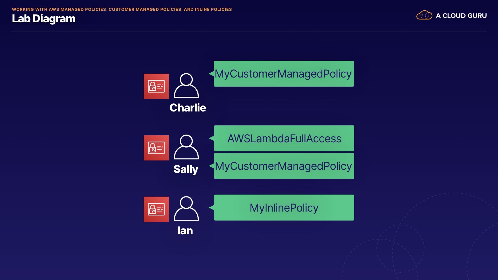

# Web Identity Federation
1. **Web Identity Federation Basics:**
    - Web identity federation simplifies authentication and authorization for web applications.
    - Users authenticate with a web-based identity provider like Facebook, Amazon, or Google.
    - After authentication, users receive an authentication code to trade for temporary AWS security credentials, granting access to AWS resources.
2. **Amazon Cognito Overview:**
    - Amazon Cognito provides web identity federation, including sign-up, sign-in, and guest user access functionalities for applications.
    - Cognito acts as an identity broker, managing authentication between the application and web identity providers without additional code.
3. **Benefits of Cognito:**
    - Supports multiple devices and synchronizes user data across devices seamlessly.
    - Recommended for mobile applications accessing AWS services.
    - Ensures security by providing temporary credentials without storing AWS credentials locally.
4. **Cognito Terminology:**
    - User pools: Manage sign-up and sign-in for applications.
    - Identity pools: Provide temporary AWS credentials for accessing AWS services.
5. **Cognito Workflow:**
    - Users authenticate through a web identity provider and receive a JWT token.
    - Cognito exchanges this token for AWS credentials mapped to an IAM role for resource access.
    - Utilizes push synchronization with SNS notifications for seamless data updates across devices.
6. **Exam Tips:**
    - Understand web identity federation, JWT token exchange for temporary AWS credentials, and Cognito's role as an identity broker.
    - Differentiate between user pools (sign-up/sign-in) and identity pools (temporary credentials for AWS access).
    - Cognito push synchronization ensures updated user data across multiple devices.

Overall, Cognito streamlines authentication and access management for web applications, making it a key component for mobile app development accessing AWS resources.

[About Web Identity Federation](https://docs.aws.amazon.com/IAM/latest/UserGuide/id_roles_providers_oidc.html)

# Demo - Cognito User Pools
1. **Creating Cognito User Pool:**
    - In the AWS Console, search for Cognito and select "Create user pool."
    - Configure sign-up and sign-in with username and password authentication.
    - Choose default password policy and skip multi-factor authentication for demo purposes.
    - Enable self-registration and configure email verification for new users.
    - Configure message delivery options for verification and confirmation emails.
    - Name the user pool (e.g., MyUserPool) and integrate it with Cognito's Hosted UI.
2. **Configuring App Client:**
    - Create a public client app for unauthenticated API operations.
    - Specify callback URLs and configure advanced settings like identity providers, grant types, and scopes.
    - Review the settings and create the user pool.
3. **Customizing User Experience:**
    - After creating the user pool, customize the app client defaults, such as uploading a logo image file.
    - Save the changes and proceed to test the hosted UI.
4. **Testing Hosted UI:**
    - Select the app client, go to Hosted UI, and view the hosted UI page.
    - Verify that the sign-up and sign-in pages are displayed with the company logo.
    - Sign up with a new account by providing a username, email address, and password.
    - Confirm the account by entering the code sent to your email.
    - Upon successful confirmation, you should be redirected to the callback URL specified earlier (e.g., acloudguru.com).
5. **Exam Tips:**
    - Cognito acts as an identity broker for federated identity and manages interaction with web identity providers.
    - It provides sign-up, sign-in, and guest user access functionalities.
    - Cognito is recommended for web identity federation, especially for mobile applications.

[Lesson Resources](https://github.com/ACloudGuru-Resources/course-aws-certified-developer-associate/tree/main/Cognito_User_Pools_Demo)


[Getting Started With User Pools](https://docs.aws.amazon.com/cognito/latest/developerguide/what-is-amazon-cognito.html)

# Demo - Identity Pools
1. **Setting up DynamoDB Table and Web Server:**
    - Create a DynamoDB table using the cloud shell with a provided command.
    - Populate the DynamoDB table with items from a JSON file using another command.
    - Launch an EC2 instance named "facts web server" with Amazon Linux, T3 Micro instance type, and allow HTTP traffic.
2. **Configuring the EC2 Instance:**
    - Use a bootstrap script in the user data section of the instance to update packages, install Git, and HTTPD (Apache web server).
    - Launch the instance and access it via public IP in a web browser to verify it's working.
3. **Setting up Cognito:**
    - In part two, configure Cognito Identity Pools and an IAM role to allow unauthenticated identities to access the DynamoDB table.
    - Add Cognito details to the website code to enable users to read items from the DynamoDB table using the Cognito identity pool and associated IAM role.
4. **Creating Cognito Identity Pool and IAM Role:**
    - Use a command to create a new Cognito Identity Pool named "Dynamo Pool" that allows unauthenticated entities.
    - Download a policy document and update it with the Identity Pool ID using vi or nano.
    - Create an IAM role called "Cognito_DynamoDBpoolunauth" and attach the updated policy document to it.
    - Associate the IAM role with the Cognito Identity Pool using a command that includes the Identity Pool ID and Role ARN.
5. **Configuring Web Application:**
    - Edit the index.html file on the EC2 instance to specify the Cognito identity credentials in the JavaScript section of the webpage.
    - Ensure that the identity pool ID and role ARN are correctly inserted into the HTML file.
    - Save and verify that the website is correctly configured by accessing it in a web browser.
6. **Exam Tips:**
    - Remember that Cognito Identity Pools create temporary AWS credentials with limited privileges, allowing access to AWS services.
    - Identity Pools can enable anonymous unauthenticated users to access websites and read data from DynamoDB tables.

That summarizes the steps involved in setting up the Cognito Identity Pool and IAM role, as well as configuring the web application to utilize these resources for accessing DynamoDB data.

[Github Repository 1](https://github.com/ACloudGuru-Resources/course-aws-certified-developer-associate/tree/main/Cognito_Demo)

[Github Repository 2](https://github.com/ACloudGuru-Resources/course-aws-certified-developer-associate/tree/main/Cognito_Demo)

# Inline Policies vs Managed Policies vs Customer Managed Policies
1. **Managed Policies:**
    - Created and managed by AWS for common use cases (e.g., DynamoDBFullAccess, EC2ReadOnlyAccess).
    - Cannot be edited by users, groups, or roles and provide predefined permissions based on job functions.
    - Can be attached to multiple users, groups, or roles across different AWS accounts.
2. **Custom Managed Policies:**
    - Standalone policies created and administered by users within their AWS account.
    - Can be attached to multiple users, groups, or roles within the same AWS account.
    - Users can copy existing AWS managed policies and customize them to suit specific requirements.
3. **Inline Policies:**
    - Embedded within a single user, group, or role and have a one-to-one relationship.
    - Deleted when the user, group, or role they are embedded in is deleted.
    - Useful when specific permissions must only be assigned to a single entity.
4. **Usage Recommendations:**
    - AWS recommends using managed policies over Inline policies in most cases for ease of management and scalability.
    - Inline policies are useful when strict control is needed over permissions for a specific entity.

In the AWS console, you can view and manage these policies under Identity Access Management (IAM). Managed policies are read-only and provided by AWS, while custom managed policies can be edited by users. Inline policies are created and managed within specific entities like users, groups, or roles.

Remember the key differences:

- Managed policies are predefined and managed by AWS.
- Custom managed policies are created by users but managed within AWS.
- Inline policies are embedded within specific entities and have a one-to-one relationship.

Understanding these policy types is essential for managing access permissions effectively within AWS IAM.

# Lab - Working With AWS Managed Policies, Customer Managed Policies, and Inline Policies


# STS AssumeRoleWithWebIdentity
1. **AssumeRoleWithWebIdentity API:**
    - Provided by STS (Security Token Service) in AWS.
    - Returns temporary security credentials for users authenticated by a web identity provider like Amazon, Facebook, or Google.
    - Commonly used in mobile or web applications for accessing AWS resources.
2. **Workflow:**
    - User authenticates with a web identity provider (e.g., Facebook, Google) and receives a JWT token.
    - Application makes the AssumeRoleWithWebIdentity API call to STS with the JWT token.
    - STS exchanges the JWT token for temporary credentials (access key, secret access key, session token).
    - Application uses temporary credentials to access AWS resources like DynamoDB or S3.
3. **Sample Response:**
    - Includes the assumed-role user ARN and ID, which are used to programmatically reference the temporary credentials.
    - Temporary credentials include a session token, secret access key, and access key, valid for one hour by default.
4. **Exam Tips:**
    - AssumeRoleWithWebIdentity is part of STS and enables temporary access to AWS resources for users authenticated via a web identity provider.
    - Application makes the API call after user authentication to obtain temporary credentials.
    - Assumed-role user ARN and ID are used to reference temporary credentials programmatically, not related to IAM roles or users.

Understanding AssumeRoleWithWebIdentity is crucial for applications using web identity providers like Amazon, Facebook, or Google to access AWS resources securely and temporarily.

[AssumeRoleWithWebIdentity](https://docs.aws.amazon.com/STS/latest/APIReference/API_AssumeRoleWithWebIdentity.html)

# Demo - Configuring Cross Account Access
1. **Overview of Cross-Account Access:**
    - Cross-account access allows delegating access to resources in different AWS accounts.
    - Achieved through IAM roles and permissions, enabling sharing of resources across accounts.
2. **Example Use Case:**
    - Scenario involves granting developers access to a specific S3 bucket in the production account from the development account.
    - Common use case for accessing resources across accounts while maintaining security and control.
3. **Steps for Configuration:**
    - Set up two AWS accounts: development and production.
    - In the development account, create an IAM group for developers and a user with necessary permissions.
    - In the production account, create an S3 bucket and an IAM policy granting access to the bucket.
    - Attach the policy to an IAM role in the production account.
    - In the development account, create an IAM policy allowing the developers group to assume the role in the production account.
    - Configure role switching within the AWS Management Console to access resources in the production account.
4. **Demo and Exam Tips:**
    - The demo walks through creating IAM groups, users, S3 bucket, IAM policies, and roles across accounts.
    - Highlights the importance of noting account IDs, creating policies, and managing permissions for cross-account access.
    - Emphasizes understanding the high-level concept of cross-account access for the exam, without needing to memorize technical details.

The lesson provides a practical demonstration of setting up cross-account access, which is a valuable skill for managing permissions and sharing resources securely across AWS accounts.

Lesson Resources
```
{
  "Version": "2012-10-17",
  "Statement": [
    {
      "Effect": "Allow",
      "Action": "s3:ListAllMyBuckets",
      "Resource": "arn:aws:s3:::*"
    },
    {
      "Effect": "Allow",
      "Action": [
        "s3:ListBucket",
        "s3:GetBucketLocation"
       ],
      "Resource": "arn:aws:s3:::productionapp"
    },
    {
      "Effect": "Allow",
      "Action": [
        "s3:GetObject",
        "s3:PutObject",
        "s3:DeleteObject"
      ],
      "Resource": "arn:aws:s3:::productionapp/*"
    }
  ]
}
```

[Tutorial: Delegate Access Across AWS Accounts Using IAM Roles](https://docs.aws.amazon.com/IAM/latest/UserGuide/tutorial_cross-account-with-roles.html)

[How to Enable Cross-Account Access to the AWS Management Console](https://aws.amazon.com/blogs/security/how-to-enable-cross-account-access-to-the-aws-management-console/)

Role
```json
{
    "Version": "2012-10-17",
    "Statement": {
        "Effect": "Allow",
        "Action": "sts:AssumeRole",
        "Resource": "arn:aws:iam::PRODUCTION-ACCOUNT-ID:role/MyDeveloperAccess"
    }
}
```

# Advanced IAM Summary
Web Identity Federation (WIF):

Allows users to authenticate with web identity providers like Google, Facebook, or Amazon.
Users receive an authentication token, which is exchanged for temporary AWS credentials via the STS assume-role-with-web-identity API call.
Cognito is recommended for handling web identity federation, providing sign-up, sign-in, guest user access, and data synchronization across devices.
Cognito and Identity Pools:

Cognito acts as an ID broker, managing interactions with web identity providers and exchanging JWT tokens for AWS credentials.
Identity pools provide temporary AWS credentials, enabling access to AWS services like S3, DynamoDB, and EC2.
IAM Policies:

Managed policies are AWS default policies (e.g., S3FullAccess) that can be assigned to users, groups, or roles.
Custom policies are user-defined policies managed by the user.
Inline policies are embedded within a single user, group, or role, with a one-to-one mapping.
Cross-Account Access Configuration:

Involves creating IAM groups, users, S3 buckets, IAM policies, and roles across accounts.
Enables sharing resources securely between different AWS accounts.
The lecture emphasizes the importance of understanding web identity federation, Cognito, IAM policies, and cross-account access configuration for managing access to AWS resources effectively.

# Quiz

.png>) 
.png>) 
.png>) 
.png>) 
.png>) 
.png>) 
.png>) 
.png>) 
.png>) 
.png>) 
.png>) 
.png>) 
.png>) 
.png>) 
.png>) 
.png>) 
.png>) 
.png>)