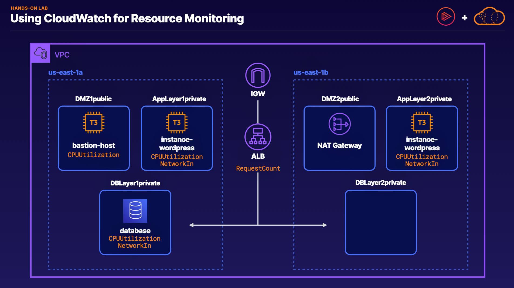

# Introduction to CloudWatch
1. **Overview of CloudWatch:**
    - CloudWatch is a monitoring service for AWS resources and applications.
    - It monitors various aspects such as compute, storage, databases, analytics, SNS topics, SQS queues, API Gateway, and AWS charges.
    - Default metrics are provided, but you can also define custom metrics using the CloudWatch agent and CloudWatch Logs.
2. **EC2 Monitoring with CloudWatch:**
    - Default EC2 metrics include CPU, network, disk, and status checks, sent at 5-minute intervals.
    - Operating system-level metrics like memory usage, processes, disk space, and CPU idle time require the CloudWatch agent.
    - Detailed monitoring at 1-minute intervals is available for an additional charge.
3. **CloudWatch Logs:**
    - Monitors system and application logs in near real-time.
    - Customizable for specific phrases, values, or patterns.
    - Requires the CloudWatch agent and is useful for tracking errors and generating notifications.
4. **CloudWatch Alarms:**
    - Alarms can be created to monitor any CloudWatch metric and trigger actions based on defined thresholds.
    - Common use cases include monitoring CPU utilization and triggering notifications or Auto Scaling policies.
5. **Exam Tips:**
    - Understand the default EC2 metrics and the need for the CloudWatch agent for operating system-level metrics.
    - Use CloudWatch logs for monitoring and troubleshooting applications.
    - Create CloudWatch alarms to monitor metrics and take actions based on thresholds.

Overall, CloudWatch is a powerful tool for monitoring and managing the performance and health of AWS resources and applications.

# Demo - CloudWatch
1. **Launching an EC2 Instance:**
    - Created an IAM role with permissions for CloudWatch agent metrics.
    - Used the CloudWatch Agent Server Policy managed policy.
    - Launched an EC2 instance with the IAM role attached.
2. **Configuring the CloudWatch Agent:**
    - Installed the CloudWatch agent on the EC2 instance.
    - Configured the agent to send operating system metrics and logs to CloudWatch.
    - Used a bootstrap script to update the operating system and install necessary packages.
3. **Generating Metrics and Logs:**
    - Started the CloudWatch agent and configured its settings.
    - Installed a utility called "stress" to generate CPU load for metric testing.
4. **Viewing Metrics and Logs in CloudWatch:**
    - Accessed CloudWatch console and selected metrics for the EC2 instance.
    - Monitored default EC2 metrics and CloudWatch agent metrics (e.g., CPU usage, memory usage, disk I/O).
    - Checked logs in CloudWatch for system logs (VAR log messages).
5. **Summary:**
    - Demonstrated how to configure the CloudWatch agent on an EC2 instance.
    - Showed how to view and analyze metrics and logs in CloudWatch.
    - Highlighted the importance of IAM roles and policies for CloudWatch agent permissions.

This hands-on lesson provided a practical understanding of setting up monitoring using CloudWatch, including metric collection and log monitoring for EC2 instances.

[Amazon Linux 2023 and Later Commands](https://github.com/ACloudGuru-Resources/course-aws-certified-developer-associate/blob/main/CloudWatch_Demo/AL2023_Commands.txt)

# Demo - Creating CloudWatch Dashboards
1. **Launching an EC2 Instance:**
    - Launched an EC2 instance in the Northern Virginia region.
    - Connected to the instance using EC2 Instance Connect.
    - Generated CPU activity on the instance.
2. **Creating a Custom CloudWatch Dashboard:**
    - Accessed the CloudWatch console and created a new dashboard.
    - Named the dashboard "my-production-systems."
    - Added line graph widgets to the dashboard to display metrics over time.
    - Selected metrics such as CPUUtilization, NetworkPacketsIn, and NetworkPacketsOut for the widgets.
    - Saved the dashboard to access it later.
3. **Exam Tips:**
    - CloudWatch dashboards allow customization of metric views.
    - Dashboards can monitor metrics meaningful to the user, such as production systems.
    - Dashboards can be multi-region, displaying metrics from different regions if permitted.
    - Always save the dashboard after configuration as CloudWatch does not automatically save changes.

This lesson demonstrated how to create a custom CloudWatch dashboard to monitor specific metrics from an EC2 instance and highlighted key exam tips related to CloudWatch dashboard usage.

# Understanding CloudWatch Concepts
1. **CloudWatch Metrics:**
    - Metrics are variables monitored using CloudWatch.
    - They consist of a time-ordered sequence of values or data points with timestamps and optional units of measurement.
    - Each metric is uniquely defined by a name, namespace, and zero or more dimensions.
2. **Namespaces:**
    - Namespaces are containers for CloudWatch metrics.
    - Example: AWS/EC2 namespace for EC2 metrics.
    - Custom namespaces can be created for publishing custom metric data.
    - Metrics from different namespaces are isolated and not aggregated together.
3. **Dimensions:**
    - Dimensions act as filters for CloudWatch data.
    - They are name/value pairs used to filter metrics.
    - Example: InstanceId dimension filters metrics related to a specific EC2 instance.
    - CloudWatch can aggregate data across dimensions for some services.
4. **Dashboards:**
    - CloudWatch dashboards are custom views used for monitoring resources.
    - They serve as a single page for monitoring critical systems and applications.
    - Users can select important metrics and add them to the dashboard for easy monitoring.
5. **Exam Tips:**
    - Understand the differences between CloudWatch concepts such as metrics, namespaces, dimensions, and dashboards.
    - Metrics are variables monitored, namespaces are containers, dimensions act as filters, and dashboards are custom views for monitoring resources.

This lecture provides a comprehensive overview of key CloudWatch concepts and terminology, essential for understanding and effectively using CloudWatch for monitoring and managing AWS resources.

# CloudWatch vs CloudTrail
1. **CloudTrail:**
    - Records all user activity in your AWS account, including CLI and console actions.
    - Records events related to resource creation, modification, and deletion, as well as failed logins.
    - Provides an audit trail of API calls and user activity.
    - Delivers log files to an S3 bucket for storage and analysis.
    - Useful for compliance, security audits, and troubleshooting user actions.
2. **CloudWatch:**
    - Monitors performance, metrics, and health of AWS resources.
    - Includes CloudWatch Logs for monitoring application and system logs, and CloudWatch Alarms for sending notifications based on defined thresholds.
    - Focuses on performance monitoring, metrics collection, and alerting for AWS resources.
3. **Differences:**
    - CloudWatch is for performance monitoring, metrics, logs, and alerts.
    - CloudTrail is for auditing user activity, API calls, and maintaining an audit trail of AWS account actions.
4. **Exam Tips:**
    - CloudWatch is for monitoring performance and health of AWS resources, including logs and alerts.
    - CloudTrail is for recording API calls and user activity in an audit trail format, useful for compliance and security audits.
    - Ask yourself if you need performance monitoring (CloudWatch) or an audit log of user activity (CloudTrail) in your AWS account.

In summary, CloudWatch focuses on performance monitoring, metrics, logs, and alerts, while CloudTrail is used for auditing API calls, user activity, and maintaining an audit trail for compliance and security purposes in your AWS account.

# Lab - Using CloudWatch for Resource Monitoring

# Using CloudWatch Actions
1. **CloudWatch Actions Overview:**
    - CloudWatch API supports various actions for publishing, monitoring, and alerting on metrics.
    - Actions are powerful for creating custom metrics and monitoring/alerting for applications.
2. **Commonly Used Actions:**
    - **PutMetricData:** Used to publish metric data points to CloudWatch. You can define metric names, namespaces, values, and timestamps.
    - **PutMetricAlarm:** Creates an alarm associated with a metric to alert when a threshold is reached. You can specify alarm names, metric names, namespaces, statistics, periods, thresholds, and comparison operators.
3. **Real-World Example:**
    - Imagine an application on EC2 that sends metrics to CloudWatch when errors occur.
    - Use **`PutMetricData`** to send error metrics.
    - Use **`PutMetricAlarm`** to create an alarm triggered by a threshold of error occurrences within a specific time period.
4. **Execution Example:**
    - A simple script using **`PutMetricData`** to send metrics to CloudWatch using AWS CLI.
    - The script simulates metric data points and shows how to monitor them in CloudWatch.
5. **Exam Tips:**
    - CloudWatch Actions are used for publishing, monitoring, and alerting on metrics.
    - Use **`PutMetricData`** to publish metric data points.
    - Use **`PutMetricAlarm`** to create alarms associated with metrics and trigger alerts based on thresholds.

In summary, CloudWatch actions like **`PutMetricData`** and **`PutMetricAlarm`** are essential for publishing, monitoring, and alerting on metrics in AWS. They are used to send metric data points and create alarms to monitor AWS resources and trigger alerts based on predefined conditions.

[Lesson Resources (script and commands)](https://github.com/ACloudGuru-Resources/course-aws-certified-developer-associate/tree/main/CloudWatch_Actions_Demo)

[CloudWatch API Reference](https://docs.aws.amazon.com/AmazonCloudWatch/latest/APIReference/API_Operations.html)

# Demo - Exploring CloudWatch Logs Insights
1. **CloudWatch Logs Insights Overview:**
    - CloudWatch Logs Insights enables interactive queries and analysis on data stored in CloudWatch Logs.
    - It uses its own query language, but you don't need to learn it extensively for the exam as example queries are provided.
2. **Capabilities:**
    - Allows querying and filtering logs directly from the CloudWatch Logs Insights Console.
    - Supports generating visualizations such as bar graphs, line graphs, pie charts, and stacked area graphs.
3. **Practical Demonstration:**
    - Created a basic Lambda function to generate log events in CloudWatch Logs.
    - Explored the CloudWatch Logs Insights Console to analyze log data using sample queries.
4. **Key Actions:**
    - Tested the Lambda function to generate log events.
    - Used CloudWatch Logs Insights to run sample queries like identifying expensive Lambda requests, querying VPC flow logs for specific IP addresses and protocols, and displaying recent log events.
5. **Visualization:**
    - Demonstrated how to visualize log data using CloudWatch Logs Insights, such as creating line graphs, stacked area graphs, bar charts, and pie charts based on query results.
6. **Exam Tips:**
    - CloudWatch Logs Insights allows interactive querying and analysis of CloudWatch Logs data.
    - Supports various visualizations for data analysis, including bar graphs, line graphs, pie charts, and stacked area graphs.
    - Example queries provided for common log analysis tasks like identifying expensive Lambda requests or querying VPC flow logs.

Overall, CloudWatch Logs Insights is a powerful tool for analyzing log data stored in CloudWatch Logs, providing interactive querying capabilities and visualizations for effective log analysis and monitoring.

# Demo - Receiving Notifications with CloudWatch
1. **Launching EC2 Instance:**
    - Created an EC2 instance with detailed CloudWatch monitoring enabled at one-minute intervals for faster data collection.
2. **Creating CloudWatch Alarm:**
    - Configured a CloudWatch alarm to trigger if CPU utilization exceeds 90% for one minute, using the EC2 CPU utilization metric.
3. **Configuring Email Notifications:**
    - Set up an SNS topic to receive notifications when the alarm is triggered, providing an email address for notification delivery.
4. **Confirming Subscription:**
    - Confirmed the subscription to the SNS topic via email confirmation to start receiving notifications.
5. **Generating High CPU Utilization:**
    - Executed a command on the EC2 instance to max out the CPU, intentionally triggering the CloudWatch alarm.
6. **Receiving Notifications:**
    - Checked CloudWatch for the alarm status, confirming it was triggered due to high CPU utilization.
    - Received an email notification from SNS indicating the alarm status and the instance causing the alarm.

**Exam Tips:**

- CloudWatch alarms can be set up to notify when specific thresholds are met or exceeded, such as CPU utilization exceeding a certain percentage.
- Alarms can be created for various metrics in CloudWatch to monitor different aspects of your AWS resources.
- CloudWatch integrates with SNS to send notifications via email or other methods when alarms are triggered, allowing you to stay informed about the health and performance of your AWS resources.

This lesson demonstrates the practical aspects of setting up notifications with CloudWatch, showcasing how to receive alerts and take action based on predefined thresholds and metrics.

# What is EventBridge?
1. **What is EventBridge?**
    - EventBridge is focused on event-driven architectures where events represent changes in state across AWS services like AWS Config, CloudTrail, and CloudWatch. These events can be routed to EventBridge for processing based on configured rules.
2. **EventBridge Features:**
    - EventBridge allows you to configure rules that match events and route them to appropriate targets, such as Lambda functions, SNS notifications, or EC2 actions.
    - It also supports scheduled events, allowing you to run tasks on predefined schedules using cron expressions.
3. **EventBridge vs. CloudWatch Events:**
    - EventBridge and CloudWatch Events are based on the same underlying service and API, but EventBridge offers more features and is considered the preferred way to manage events by AWS.
    - Changes made in either the CloudWatch or EventBridge Console are reflected in both, as they use the same backend.
4. **Example Use Cases:**
    - Use EventBridge to detect non-compliant EC2 instances (e.g., without encrypted volumes) reported by AWS Config and trigger actions like sending SNS notifications.
    - Monitor high CPU utilization on EC2 instances using CloudWatch, generate events sent to EventBridge, and trigger actions like email notifications via SNS.
5. **Exam Tips:**
    - EventBridge simplifies event-driven systems and scheduled tasks, utilizing the same technology as CloudWatch Events.
    - Events are state changes from AWS services, rules match events to targets, and targets execute predefined actions in response to events.

In conclusion, EventBridge is a powerful tool for managing event-driven architectures, allowing you to automate responses to events and schedule tasks efficiently. Understanding its features and integration with other AWS services is essential for AWS exams and real-world scenarios.

# Demo - Using EventBridge
1. **Launch EC2 Instance:**
    - Started by launching a new EC2 instance named "EventBridge Demo" with Amazon Linux and a t3.micro instance type.
2. **Create SNS Topic and Subscription:**
    - Created an SNS topic named "MyTopic" and subscribed to it using an email address.
    - Confirmed the subscription through the email confirmation link.
3. **Create EventBridge Rule:**
    - Created an EventBridge rule named "ec2-state-change-rule" to notify of any EC2 state changes using SNS as the target.
    - Configured the rule to trigger on any state change of EC2 instances.
4. **Change EC2 Instance State:**
    - Stopped the EC2 instance to trigger the EventBridge rule.
5. **Verify SNS Notification:**
    - Received email notifications confirming the successful subscription and the EC2 instance state change, triggered by the EventBridge rule.
6. **Background Information:**
    - Highlighted that EventBridge and CloudWatch Events use the same underlying technology, with EventBridge being the preferred service.
7. **Exam Tips:**
    - EventBridge handles events related to AWS state changes and allows creating rules to trigger actions based on these events, such as sending SNS notifications.
    - EventBridge and CloudWatch Events share the same technology, but EventBridge offers more features and is the recommended service.

In conclusion, EventBridge is a powerful tool for managing events and triggering actions based on state changes in AWS services. Understanding its features and integration with other AWS services is essential for AWS exams and real-world scenarios.

# Recognizing Common HTTP Error Codes
1. **Client-Side Errors:**
    - **400 (Access Denied Exception):** Indicates a lack of required access for the requested action.
    - **403 (Missing Authentication Token):** Occurs when the request is missing a valid authentication token, such as an X.509 certificate or AWS access key ID details.
    - **404 (File Not Found):** Typically encountered when the requested resource (file, object) is not found. This is a client-side error indicating an issue with the request.
2. **Server-Side Errors:**
    - **500 (Internal Failure):** Signifies a server-side failure due to an unknown error or exception.
    - **503 (Service Unavailable):** Indicates a temporary failure of the server, often caused by high traffic or internal failures.
3. **Remembering the Errors:**
    - **Client-Side Errors:** Think of a 404 error as always being the client's fault, indicating an issue with the request itself.
    - **Server-Side Errors:** Use the similarity between the number 5 and the letter S to remember that 500 errors are server-side errors.

For the exam, keep in mind that 404 errors are related to client-side issues like malformed requests or missing resources, while 500 errors point to server-side problems such as internal failures or temporary unavailability. Understanding these distinctions can help troubleshoot and address issues effectively.

[List of HTTP status codes](https://en.wikipedia.org/wiki/List_of_HTTP_status_codes)

# Recognizing Common SDK Exceptions
1. **BatchGetItem Exceptions:**
    - **ValidationException:** Occurs when too many items are requested for the BatchGetItem call. Solution: Request fewer items.
    - **UnprocessedKeys:** Indicates that some items were not successfully processed. Solution: Reduce the request size.
    - **ProvisionedThroughputExceededException:** No items were processed due to exceeding the provisioned throughput of the table. Solution: Add capacity, such as by using DynamoDB Accelerator (DAX) to cache frequently accessed data.
2. **BatchWriteItem Exceptions:**
    - **UnprocessedItems:** Some operations (put or delete) failed, and you need to retry the unprocessed items.
    - **ProvisionedThroughputExceededException:** None of the operations were processed due to exceeding the provisioned throughput of the table. Solution: Increase write capacity units on the table.

For the exam, it's crucial to understand these common error messages and their meanings:

- UnprocessedKeys and UnprocessedItems indicate items not successfully processed.
- ProvisionedThroughputExceededException signals exceeding provisioned throughput, requiring capacity adjustments.
- Solutions include reducing request size, retrying unprocessed items, and increasing provisioned capacity as needed.

[Error Handling in DynamoDB](https://docs.aws.amazon.com/amazondynamodb/latest/developerguide/Programming.Errors.html)

# Monitoring Summary
1. **CloudWatch Overview:**
    - Monitors performance and health metrics of AWS resources.
    - CloudWatch agent for OS-level metrics, CloudWatch Logs for log monitoring, and CloudWatch Alarms for alerting.
    - Use CloudWatch Dashboards for customized metric views.
    - CloudWatch actions like PutMetricData and PutMetricAlarm for publishing, monitoring, and alerting on metrics.
2. **CloudWatch vs. CloudTrail:**
    - CloudWatch: Performance monitoring, system logs, alarms.
    - CloudTrail: Records API activity for audit logs.
3. **Common HTTP Error Codes:**
    - 400 errors: Client-side errors (e.g., 404 for file not found).
    - 500 errors: Server-side errors (e.g., 500 for internal server error).
4. **SDK Exceptions in DynamoDB:**
    - BatchGetItem: UnprocessedKeys, ProvisionedThroughputExceededException.
    - BatchWriteItem: UnprocessedItems, ProvisionedThroughputExceededException.
5. **CloudWatch Logs Insights:**
    - Interactive querying and analysis of CloudWatch Logs data.
    - Generate visualizations like bar graphs, line graphs, pie charts.
6. **EventBridge (CloudWatch Events):**
    - Configurable event-driven systems based on state changes in AWS.
    - Rules match events and route them to targets (Lambda, SNS, EC2).
    - Uses the same underlying technology as CloudWatch Events.

Understanding these concepts is crucial for monitoring, troubleshooting, and optimizing AWS resources effectively.

# Quiz

.png>) 
.png>) 
.png>) 
.png>) 
.png>) 
.png>) 
.png>) 
.png>) 
.png>) 
.png>) 
.png>) 
.png>) 
.png>)