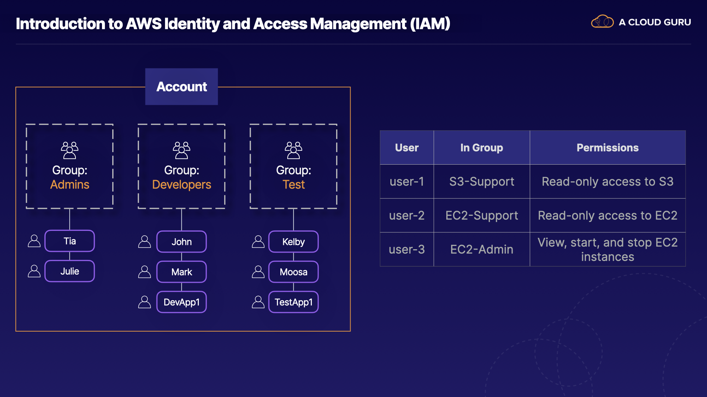

# IAM 101
1. **Introduction to IAM:**
    - IAM is crucial for managing users and their access levels in the AWS console.
    - Understanding IAM is important for both the AWS exam and real-life AWS account administration.
2. **Capabilities of IAM:**
    - Provides centralized control over AWS accounts.
    - Enables shared access with granular permissions for different users.
    - Supports identity federation for login credentials from various sources like Active Directory, Facebook, or LinkedIn.
    - Implements multifactor authentication for enhanced security.
    - Offers temporary access for users, devices, and services as needed.
    - Allows setting up password rotation policies.
    - Integrates with various AWS services and supports PCI DSS compliance.
3. **Core Concepts of IAM:**
    - Users: Individuals logging into the AWS console or using API commands.
    - Groups: Collections of users with common permissions, useful for managing teams with specific access needs.
    - Roles: Defined permissions that can be assumed by users or AWS services like EC2 instances.
    - Policies: Documents defining permissions that can be attached to users, groups, or roles.
4. **Learning IAM:**
    - The best way to learn IAM is by starting to use it practically, which will be covered in the next lecture with an IAM lab.

[AWS Identity and Access Management (IAM) Features](https://aws.amazon.com/iam/features/)

# IAM Demo
1. **Setting Up Multi-Factor Authentication (MFA):**
    - Navigate to the IAM dashboard in your AWS account and select "Add MFA" to set up multi-factor authentication.
    - Choose a virtual MFA device and follow the steps to configure it using an authenticator app like Google Authenticator.
    - After setting up MFA, refresh the dashboard to see the security recommendation related to MFA disappear.
2. **Creating IAM Users, Groups, and Roles:**
    - In the IAM dashboard, select "Users" and then "Add Users" to create a new IAM user.
    - Specify whether the user needs access to the AWS Management Console and/or programmatic access.
    - Create a new group, assign permissions (e.g., administrator access), and add the user to the group.
    - Repeat the process to create another user and assign them to an existing group or create a new group.
    - Customize the password policy under "Account Settings" to meet your organization's security requirements.
    - Create an IAM role for trusted entities such as AWS services (e.g., EC2) to grant permissions.
3. **Key IAM Concepts for the Exam:**
    - Users: Individuals accessing AWS resources, both programmatically and through the AWS Management Console.
    - Groups: Collections of users with common permissions, often organized by roles (e.g., developers, sysadmins).
    - Roles: Permissions that can be assigned to users, applications, or services to access AWS resources.

[AWS - New Account Setup](https://repost.aws/knowledge-center/create-and-activate-aws-account)
[Create a billing alert](https://docs.aws.amazon.com/AmazonCloudWatch/latest/monitoring/monitor_estimated_charges_with_cloudwatch.html)
[Create a free tier billing alert](https://aws.amazon.com/about-aws/whats-new/2017/12/aws-free-tier-usage-alerts-automatically-notify-you-when-you-are-forecasted-to-exceed-your-aws-service-usage-limits/)

# Lab

# Testing IAM Policy Permissions
1. **What is the IAM Policy Simulator?**
    - The IAM policy simulator is a tool provided by AWS that allows you to test the effects of IAM policies before applying them to production.
    - It helps validate that policies work as expected and can be used for troubleshooting IAM-related issues.
2. **Using the IAM Policy Simulator:**
    - Access the IAM policy simulator using the link [https://policysim.aws.amazon.com](https://policysim.aws.amazon.com/).
    - In the simulator, you can select users, groups, or roles from your AWS account to test IAM permissions.
    - Choose a service (e.g., Athena, CodeCommit), select an action (e.g., RunQuery), and run a simulation to see if the action would be allowed or denied based on the attached policies.
    - The simulator provides clear results indicating whether the action would be allowed or denied, helping you understand the effectiveness of your IAM policies.
3. **Exam Tips for the IAM Policy Simulator:**
    - Understand that the IAM policy simulator is used to test IAM permissions before applying them to production environments.
    - It helps validate existing policies and troubleshoot IAM-related issues by testing permissions attached to users, groups, or roles.
    - Familiarize yourself with using the simulator to ensure that policies work as expected and to avoid unintended access or restrictions.

Overall, the IAM policy simulator is a valuable tool for testing and validating IAM permissions, ensuring secure and efficient access control within AWS environments.

[IAM policy simulator documentation](https://docs.aws.amazon.com/IAM/latest/UserGuide/access_policies_testing-policies.html)
[IAM policy simulator ](https://signin.aws.amazon.com/signin?redirect_uri=https%3A%2F%2Fpolicysim.aws.amazon.com%2Fhome%2Findex.jsp%3Fstate%3DhashArgs%2523%26isauthcode%3Dtrue&client_id=arn%3Aaws%3Aiam%3A%3A015428540659%3Auser%2Fpolicysim&forceMobileApp=0&code_challenge=dMhznynz4zw8FedDgunNewpgXZGnyTaWnjeCBLLd0Nc&code_challenge_method=SHA-256)

# IAM 101 Summary
1. **IAM Components:**
    - IAM consists of users, groups, and roles.
    - Users are individual AWS accounts, groups are collections of users with common permissions, and roles define permissions for entities like EC2 instances.
    - Example: Creating users, groups, and roles in the lab and assigning permissions.
2. **IAM Policies:**
    - IAM policies are written in JSON format as key-value pairs.
    - Policies define permissions such as allowing or denying actions on AWS resources.
    - Example: Showing a policy document allowing full access across all resources in AWS.
3. **IAM Global Scope:**
    - IAM is universal and not tied to specific AWS regions.
    - Policies and configurations set in IAM are accessible and applicable globally.
4. **Root Account and New Users:**
    - The root account is the initial AWS account created during registration.
    - It has complete administrative access, but best practice is to avoid using it for day-to-day activities.
    - New users have no permissions initially and must be granted specific permissions based on their roles.
5. **Access Keys and MFA:**
    - New users are assigned access key ID and secret access keys for API and CLI access.
    - Access keys are not used for console login.
    - Multi-factor authentication (MFA) should be enabled for the root account for added security.
6. **Password Rotation and Security:**
    - Customize password rotation policies to enhance security.
    - Safeguard access keys and secret access keys in a secure location to avoid loss or unauthorized access.

[Security best practices](https://docs.aws.amazon.com/IAM/latest/UserGuide/best-practices.html?secd_iam7)
