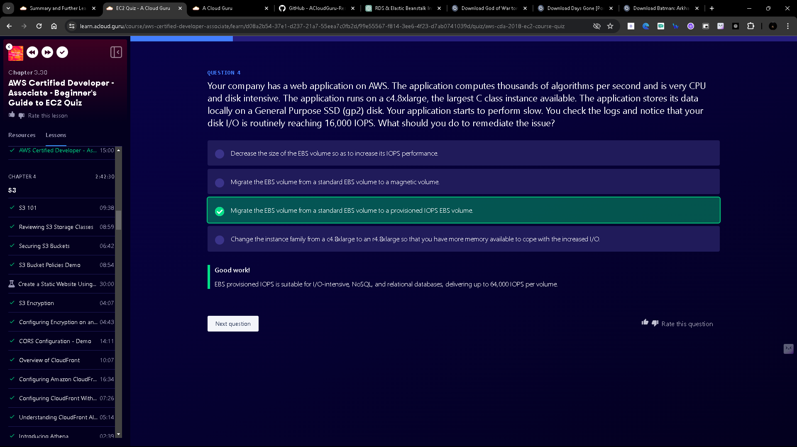

# Introducing EC2
1. **EC2 Overview:**
    - EC2 stands for Elastic Compute Cloud and provides secure, resizable compute capacity in the cloud.
    - It's like a virtual machine hosted in AWS, offering complete control and flexibility over instances.
2. **Benefits of EC2:**
    - Pay only for what you use with a pay-as-you-go model, changing the economics of computing.
    - Avoid wasted capacity seen in physical servers by scaling capacity as needed.
    - Provision servers in minutes compared to the lengthy process in traditional data centers.
3. **Game-Changing Impact:**
    - AWS and EC2 were game-changers in the IT industry, introducing the first virtual machine in a public cloud.
    - Revolutionized computing economics by allowing precise capacity selection and immediate provisioning.
4. **Exam Tips for EC2:**
    - EC2 is akin to a virtual machine hosted by AWS, offering scalability and cost-effectiveness.
    - Select capacity as needed, pay for actual usage, and enjoy rapid infrastructure deployment compared to traditional methods.

Understanding EC2's role as a cloud-based virtual machine with on-demand scalability and rapid provisioning is crucial for leveraging AWS effectively.

# EC2 Pricing Options
1. **On-Demand Instances:**
    - Pay by the hour or second, ideal for flexible workloads without upfront commitments.
    - Good for short term or unpredictable workloads.
    - Example: Testing application developed on EC2 instance for the first time.
2. **Reserved Instances:**
    - Reserve capacity for 1 or 3 years, offering up to a 72% discount on the hourly charge. (Pay upfront to get more discount)
    - Great for predictable workloads and specific capacity requirements.
    - Three types of reserved capacities are
        - Standard: 72% discount on capacity.
        - Convertible: 54% discount on capacity and can increase reserved capacity to large or equal value.
        - Scheduled: Launch instance in a specific time window.(Example - Phone company calculating customer bill at end of every month)
3. **Spot Instances:**
    - Purchase unused capacity at a discount of up to 90%.
    - Prices fluctuate based on supply and demand, suitable for flexible start/end time applications.
    - if price exceeds maximum then instance will be terminated or hibernated.
    - Can be used by used with urgent need for large amount of additional computing capacity.
    - Example: Image Processing.
4. **Dedicated Hosts:**
    - Physical EC2 server dedicated for your use and does not support multi-tenant.
    - Ideal for compliance requirements or software licenses tied to physical hardware.
5. **Savings Plans:**
    - Save up to 72% on all AWS compute usage with commitments for 1 or 3 years.
    - Includes various AWS services like EC2, Lambda, and Fargate.

Note: Best way to save money is to terminate service/instance that is not used to avoid unnecessary charges

[AWS Pricing Calculator](https://calculator.aws/#/)

[Instance purchasing options](https://docs.aws.amazon.com/AWSEC2/latest/UserGuide/instance-purchasing-options.html)

# EC2 Instance Types
1. **General Purpose**:
    - Provides a balance of compute, memory, and network.
    - Suitable for small or medium databases, web servers, and code repositories.
2. **Compute Optimized**:
    - Offers higher CPU power for compute-intensive applications.
    - Ideal for batch processing, distributed analytics, media transcoding, and high-performance science/engineering apps.
3. **Memory Optimized**:
    - Designed for workloads processing large data sets in memory.
    - Suitable for memory-intensive workloads and in-memory databases.
4. **Accelerated Computing**:
    - Includes special hardware accelerators for graphics processing, data pattern matching, floating-point calculations, and machine learning workloads.
    - Includes instances with CPUs optimized for deep learning.
5. **Storage Optimized**:
    - Allows adding large amounts of storage to EC2 instances.
    - Suitable for applications requiring specific disk I/O and storage capacity like NoSQL databases, data warehousing, Elasticsearch, big data analytics.

Instance types are grouped into families based on their capabilities, and you should choose an instance type based on your application's requirements. Each instance type offers different compute, memory, and storage capabilities, so selecting the appropriate instance type ensures optimal performance for your workload.

Exam tips:

- Instance types determine the hardware configuration and capabilities of the host computer.
- Choose the instance type based on your application's requirements.
- Understand the characteristics of each instance family to make informed decisions.

[EC2 Instance Types](https://aws.amazon.com/ec2/instance-types/)

# Demo - Launching an EC2 Instance

1. **Accessing AWS Console**:
    - Log in to your AWS Free Tier account or use Cloud Playground if available.
2. **Launching EC2 Instance**:
    - Navigate to the EC2 service in the AWS Management Console.
    - Click on "Launch Instance" and follow the configuration steps.
3. **Instance Configuration**:
    - Choose an appropriate AMI (Amazon Machine Image) like Amazon Linux 2.
    - Select the instance type based on your application's requirements (e.g., t3.micro for a simple web server).
    - Create a new key pair for SSH access.
    - Configure network settings, security groups (firewall rules), storage, and other advanced details as needed.
4. **Connecting to the Instance**:
    - Download the private key (.pem) file and set permissions using chmod400.
    - Use SSH to connect to the instance with the public IP address and private key.
5. **Setting Up the Web Server**:
    - Update the operating system and install the Apache web server using yum commands.
    - Start and enable Apache to run automatically at boot time.
    - Create a simple HTML file (e.g., index.html) in /var/www/html directory to serve as the web page.
    ```html
    <html><body><h1>Hello Cloud Gurus !</h1></body></html>
    ```
6. **Accessing the Web Page**:
    - Use the public IP address of the EC2 instance in a browser to access the web page.
7. **Terminating the Instance**:
    - After finishing the exercise, terminate the instance to avoid unnecessary charges.

# Demo - How to Use Putty
1. **Download and Install Putty**:
    - Go to the Putty download page and download the latest version suitable for your Windows machine (32-bit or 64-bit).
    - Install Putty and Puttygen on your local machine. You may want to place shortcuts to these utilities on your desktop for easy access.
2. **Launch EC2 Instance**:
    - Access the AWS Management Console and navigate to the EC2 service.
    - Launch a new EC2 instance, choosing the Amazon Linux 2 AMI and the desired instance type.
    - Configure security groups to allow SSH access from your IP address or open to the world for demo purposes (not recommended for production).
3. **Download Key Pair (.pem file)**:
    - Download the key pair (.pem file) generated during the instance launch process.
4. **Convert .pem to .ppk Format**:
    - Open Puttygen and load the .pem file.
    - Save the private key in .ppk format, providing a passphrase if desired.
    - Save the .ppk file on your local machine.
5. **Configure Putty**:
    - Open Putty and enter the EC2 instance's public IP address, username (usually ec2-user), and the path to the .ppk private key under SSH > Auth.
    - Save the session configuration for future use.
6. **Connect to EC2 Instance**:
    - Open the saved Putty session to connect to the EC2 instance.
    - Accept the server's host key when prompted.
7. **Adjust Appearance (Optional)**:
    - Customize Putty appearance settings such as font size and colors as per your preference.
8. **Run Commands on EC2 Instance**:
    - Once connected, you can run commands on the EC2 instance using the terminal in Putty. For example, you can update the operating system using **`sudo yum update -y`**.

[Download PuTTY](https://www.chiark.greenend.org.uk/~sgtatham/putty/latest.html)

[AWS Putty User Guide](https://docs.aws.amazon.com/AWSEC2/latest/UserGuide/putty.html)

# Demo - Using EC2 Instance Connect
1. **Launch an EC2 Instance**:
    - Access the AWS Management Console and navigate to the EC2 service.
    - Launch a new EC2 instance, selecting the desired Amazon Linux AMI and instance type (e.g., t3.micro).
    - Create a new key pair or use an existing one. Ensure that the security group associated with the instance allows SSH access from anywhere.
2. **Connect to the Instance using EC2 Instance Connect**:
    - Once the instance is running, select the instance ID in the EC2 console.
    - Click on the "Connect" button and choose "EC2 Instance Connect."
    - Follow the prompts to start a remote session on the EC2 instance.
3. **Perform Administrative Tasks**:
    - Within the EC2 Instance Connect session, run commands to administer the instance. For example, you can update the operating system using **`sudo yum update -y`** or install software like the Apache Web server.

EC2 Instance Connect provides a convenient and straightforward way to connect to EC2 instances directly from the AWS console without the need to manage SSH keys on your local machine.

[Connect to your Linux instance using EC2 Instance Connect](https://docs.aws.amazon.com/AWSEC2/latest/UserGuide/connect-linux-inst-eic.html)

[General prerequisites for connecting to your instance](https://docs.aws.amazon.com/AWSEC2/latest/UserGuide/connect-to-linux-instance.html)

# Understanding EBS Volumes
1. **What are EBS Volumes?**
    - EBS (Elastic Block Store) volumes are storage volumes that can be attached to EC2 instances, similar to disks in local computers.
    - They are used for storing operating systems, data, databases, applications, and more.
    - When an EC2 instance is launched, it will have 1 EBS volume in which OS is installed.
2. **Features of EBS Volumes:**
    - Highly available: EBS volumes are automatically replicated within a single availability zone, protecting against hardware failures.
    - Highly scalable: Capacity can be increased dynamically without downtime or performance impact.
    - Designed for critical workloads.
3. **Types of EBS Volumes:**
    a. **General Purpose SSD (gp2):**

    - Balanced price and performance.
    - Suitable for boot volumes, development, and non-latency-sensitive applications.
    - 3 IOPS per GiB and maximum of 16,000 IOPS.
    - 3,000 IOPS for volumes smaller than 1TB
    
    b. **General Purpose SSD (gp3):**
    
    - Balanced price and performance.
    - Suitable for boot volumes, development, and non-latency-sensitive applications.
    - gp3 is the latest generation with a baseline of 3,000 IOPS for volume size of 1TB - 16TB and maximum of 16,000 IOPS.
    - 20% cheaper than gp2
    
    c. **Provisioned IOPS SSD (io1):**
    
    - High-performance option with up to 64,000 IOPS per volume and most expensive.
    - Suitable for I/O intensive applications, latency-sensitive applications and large databases.
    - io2 offers higher durability and 50 IOPS per GiB.
    - Used when more than 16,000 IOPS is required.
    
    d. **Provisioned IOPS SSD (io2):**
    
    - High-performance option with up to 64,000 IOPS per volume with 99.999% durability..
    - Suitable for latency-sensitive applications and large databases.
    - io2 offers higher durability and 500 IOPS per GiB.
    
    e. **io2 Block Express (Provisioned IOPS SSD):**
    
    - Offers SAN-level performance in the cloud.
    - Highest-performance among all EBS volumes and wth millisecond latency.
    - Uses EBS Block Express Architecture.
    - Has 4 times throughput, IPOS and capacity of io2.
    - Supports up to 64 TB and 256,000 IOPS per volume with 99.999% durability.
    - Ideal for mission-critical databases like SAP HANA, Oracle, etc.

    f. **Throughput Optimized HDD (st1):**
    
    - Suitable for throughput intensive workloads and large datasets accessed frequently.
    - Measured in MB/s per terabyte, has throughput of 40MB/s per TB upto 250MB/s per TB with a maximum throughput of 500 MB/s per volume.
    - Ideal for big data, data warehouses, and ETL operations.
    - Cannot be a boot volume.
    - Low-cost HDD volume.
    
    g. **Cold HDD (sc1):**
    
    - Lowest cost option with a baseline throughput of 12 MB/s per terabyte.
    - Burst throughput up to 80 MB/s per terabyte, maxing at 250 MB/s per volume.
    - Suitable for less frequently accessed data and cost-sensitive applications.
    - Cannot be a boot volume.
    
4. **Difference between IOPS and Throughput**
    a. **IOPS:**
    - IOPS stands for I/O Operations per Second.
    - Measures number of read and write operations per second.
    - Important metric for quick transaction, low latency applications.

    b. **Throughput**
    - Measures number of bits read or written per second (MB/s).
    - Important metric for large datasets, large I/O sizes and complex queries.

5. **Exam Tips for EBS Volumes:**
    - Understand the differences between gp2, gp3, io1, io2, st1, and sc1.
    - Consider use cases for each type based on performance, cost, and durability requirements.
    - Review the AWS documentation for a comprehensive comparison of EBS volume types.

[Amazon EBS volume types documentation](https://docs.aws.amazon.com/ebs/latest/userguide/ebs-volume-types.html)

[Amazon EBS volume types](https://aws.amazon.com/ebs/volume-types/)

#  Demo - Creating an EBS Volume
1. **Launch an EC2 Instance:**
    - Navigate to the EC2 console and launch an instance, such as the Amazon Linux AMI, with default configurations.
    - Note the availability zone (e.g., US East 1C) where your instance is created.
2. **Create an EBS Volume:**
    - In the EC2 console, go to EBS volumes and select "Create Volume."
    - Choose the desired volume type (e.g., GP2, GP3, IO1, IO2, SC1, ST1).
    - Set the size of the volume, considering the IOPS (I/O operations per second) requirements.
    - Ensure the volume is created in the same availability zone as your EC2 instance.
    - Optionally, you can create a volume based on a snapshot or enable encryption using KMS (Key Management Service).
3. **Attach the Volume to EC2 Instance:**
    - Once the volume is created and available, select it and choose "Attach Volume" from the actions menu.
    - Select the EC2 instance to which you want to attach the volume and specify the device name.
    - Complete the attachment process, and the volume state will change to "in use."
4. **Considerations for Encryption:**
    - Encryption settings depend on account-level configurations:
        - If encryption by default is enabled, all volumes will be encrypted, and you cannot create unencrypted volumes.
        - Creating a volume from an encrypted snapshot results in an encrypted volume.
        - If default encryption is not enabled, encryption is optional when creating volumes unless an encrypted snapshot is used.
5. **Final Steps:**
    - Verify that the volume is successfully attached to the EC2 instance and in use.
    - Refresh the console if needed to update the volume state.

Remember these key points regarding encryption settings based on account configurations and the options available when creating EBS volumes.

# Elastic Load Balancer
1. **Load Balancer Overview:**
    - A load balancer distributes network traffic across a group of servers, ensuring efficient utilization and fault tolerance.
    - It can route requests to servers based on algorithms like least busy or round-robin.
    - Load balancers are scalable, allowing easy capacity adjustments to handle traffic spikes.
2. **AWS Elastic Load Balancer Options:**
    - **Application Load Balancer (ALB):** Ideal for HTTP and HTTPS traffic at Layer 7 of the OSI model. It supports advanced request routing based on HTTP headers.
    - **Network Load Balancer (NLB):** Offers high-performance TCP load balancing at Layer 4, capable of handling millions of requests with low latencies at high-cost.
    - **Classic Load Balancer:** Legacy option supporting HTTP, HTTPS, and TCP protocols. It includes features like X-Forwarded-For headers and sticky sessions.
    - **Gateway Load Balancer:** Designed for load balancing workloads of third-party virtual appliances in AWS, such as firewalls and intrusion detection systems.
3. **Understanding OSI Model Layers:**
    - The OSI model defines seven layers from the application layer (Layer 7) down to the physical layer (Layer 1), each handling specific functions in network communication. (Application-Presentation-Session-Transport-Network-DataLink-Physical)
    - ALB operates at Layer 7, making it application-aware and suitable for HTTP-based routing.
4. **X-Forwarded-For Header:**
    - An HTTP header used by load balancers to reveal the originating client's IP address to the backend servers, overcoming the challenge of obscured IP addresses due to load balancing.
5. **Common Load Balancer Errors:**
    - Error 504 (Gateway Timeout) indicates that the target server failed to respond, often due to application issues or slow response times, as seen in online payment scenarios.
6. **Exam Tips for Elastic Load Balancer:**
    - ALB for HTTP/HTTPS with intelligent routing based on HTTP headers.
    - NLB for high-performance TCP load balancing.
    - Classic Load Balancer for legacy support and Layer 4/7 functionalities.
    - Gateway Load Balancer for third-party virtual appliances.
    - Utilize X-Forwarded-For header to retrieve client IP addresses.

Remember these key concepts for Elastic Load Balancer types, OSI model layers, X-Forwarded-For header usage, common load balancer errors, and exam preparation tips.

[Elastic Load Balancing features](https://aws.amazon.com/elasticloadbalancing/features/)

[Gateway Load Balancer](https://aws.amazon.com/elasticloadbalancing/gateway-load-balancer/)

[AWS Elastic Load Balancing: Support for SSL Termination](https://aws.amazon.com/blogs/aws/elastic-load-balancer-support-for-ssl-termination/)

[Create an HTTPS listener for your Application Load Balancer](https://docs.aws.amazon.com/elasticloadbalancing/latest/application/create-https-listener.html)

[Troubleshoot your Application Load Balancers](https://docs.aws.amazon.com/elasticloadbalancing/latest/application/load-balancer-troubleshooting.html)

# Demo- Route 53
1. **Route 53 Overview:**
    - Route 53 is Amazon's DNS service that maps domain names to AWS resources like EC2 instances, load balancers, and S3 buckets.
    - It provides domain registration, DNS routing, and health checking services.
    - Route 53 Hosted zones: It is a container for DNS records (Already configured with a DNS registered domain name that is owned).
2. **Demo Steps:**
    - Launched an EC2 instance named "My web server" running Amazon Linux with httpd installed.
    - Configured the instance's security group to allow HTTP traffic on port 80.
    - Created an Application Load Balancer (ALB) named "myalb" for HTTP traffic in two availability zones.
    - Configured a target group ("mytg") for the ALB with the EC2 instance as the target.
    - Used user data in the EC2 instance to run a bootstrap script for setting up httpd.
    - Set up health checks for the ALB to monitor the EC2 instance's health.
3. **Route 53 Configuration:**
    - Created a hosted zone in Route 53 for the domain name.
    - Added an A record alias to map the domain name to the ALB's DNS address using Route 53's alias feature.
    - Configured the routing policy as simple routing to route traffic to the ALB.
4. **Accessing the Website:**
    - Accessed the website using the domain name mapped through Route 53, providing a user-friendly URL for accessing the application.
5. **Recap and Exam Tips:**
    - Route 53 enables mapping domain names to AWS resources for easy access.
    - Understanding how to create hosted zones, DNS records, and alias routing is crucial for AWS exams involving Route 53.

Overall, Route 53 simplifies DNS management and enables users to create custom domain names for AWS resources, enhancing accessibility and branding.

```php
#bootstrap.sh
#!/bin/bash  
yum update -y
yum install httpd -y
echo "<html><body><h1>Hello Cloud Gurus</h1></body></html>" >/var/www/html/index.html
systemctl start httpd
systemctl enable httpd
```
# Demo - CLI Lab
1. **Launching an EC2 Instance:**
    - Used the AWS CLI to launch an EC2 instance, specifying the Amazon Linux AMI, instance type (t2.micro), and creating a new key pair for SSH access.
2. **IAM User Creation and Permissions:**
    - Created an IAM user (e.g., "faye") with programmatic access and assigned the user to an IAM group (e.g., "developers") with permissions limited to S3 operations using the S3FullAccess policy.
3. **Configuring AWS CLI:**
    - Configured the AWS CLI on the EC2 instance by providing the access key, secret access key, default region (us-east-1), and output format (JSON).
4. **Working with S3:**
    - Used AWS CLI commands to interact with S3:
        - Checked existing S3 buckets using **`aws s3 ls`** (which initially failed due to lack of configured credentials).
        - Created a new S3 bucket using **`aws s3 mb`**.
        - Uploaded a text file to the S3 bucket using **`aws s3 cp`**.
        - Listed the contents of the S3 bucket using **`aws s3 ls s3://bucket-name`**.
5. **Access Key Management:**
    - Demonstrated accessing and managing access keys for an IAM user, including deactivating and deleting access keys.
6. **AWS CLI Documentation:**
    - Emphasized the importance of understanding AWS CLI documentation for finding commands and syntax, and accessing different AWS services.
7. **Exam Tips:**
    - Highlighted exam-relevant tips such as least privilege principle, IAM groups for managing permissions, access key security, and the availability of AWS CLI across different platforms.

Overall, the lesson provided hands-on experience with the AWS CLI, IAM user management, S3 operations, and emphasized best practices and exam preparation strategies.

[Get started with the AWS CLI](https://docs.aws.amazon.com/cli/latest/userguide/cli-chap-getting-started.html)

[Configuration and credential file settings](https://docs.aws.amazon.com/cli/latest/userguide/cli-configure-files.html)

[AWS - CLI S3 reference document](https://awscli.amazonaws.com/v2/documentation/api/latest/reference/s3/index.html)

[Instance metadata and user data](https://docs.aws.amazon.com/AWSEC2/latest/UserGuide/ec2-instance-metadata.html)

# CLI Pagination
1. **Understanding Pagination:** AWS CLI Pagination allows you to control the number of items returned in the output of an AWS CLI command. By default, the CLI returns 1,000 items per API call (page size).
2. **Challenges with Default Page Size:** When dealing with a large number of resources (e.g., over 1,000 objects in an S3 bucket), errors like timeouts can occur due to the default page size being too high.
3. **Adjusting Page Size:** You can adjust the page size using the **`--page-size`** option in your CLI command. For example, **`--page-size 100`** would request a smaller number of items per API call.
4. **Max Items Option:** Another option is **`--max-items`**, which allows you to specify the maximum number of items to return in the CLI output. For instance, **`--max-items 100`** would limit the output to the first 100 items.
5. **Demonstration in Terminal:** The lecture demonstrated these commands in the terminal, showing how to list objects in an S3 bucket with different page sizes and max items settings.
6. **Exam Tips:** Remember that adjusting pagination can help avoid errors like timeouts caused by fetching too many results in a single CLI command. Use **`--page-size`** or **`-max-items`** to adjust pagination as needed.

Overall, understanding AWS CLI Pagination is important for managing large sets of resources effectively without encountering errors.

```command
#AWS CLI Pagination commands
#Remember to replace <YOUR_BUCKET_NAME> with the name of your S3 bucket

aws s3api list-objects --bucket <YOUR_BUCKET_NAME>
aws s3api list-objects --bucket <YOUR_BUCKET_NAME> --page-size 5
aws s3api list-objects --bucket <YOUR_BUCKET_NAME> --max-items 1
```

# Demo - Working With The AWS CloudShell
1. **Launching CloudShell:** You can access the AWS CloudShell directly from the AWS console. It provides a Linux terminal with pre-installed tools for managing your AWS environment.
2. **Pre-installed Tools:** The CloudShell comes with a variety of pre-installed utilities, programming languages, runtimes, SDKs (such as Python and Node.js), and AWS CLI.
3. **Using AWS CLI in CloudShell:** You can run AWS CLI commands directly in the CloudShell to perform tasks like creating S3 buckets, managing DynamoDB tables, and more.
4. **Persistent Storage:** CloudShell provides persistent storage in a home directory where you can upload and download files and scripts.
5. **Actions Menu:** The Actions menu allows you to manage files, including downloading and uploading.
6. **Free and Easy to Use:** CloudShell is free to use and requires no configuration, making it a convenient tool for running AWS CLI commands without setting up anything on your local machine.
7. **Exam Note:** While it's beneficial to know about CloudShell for practical use, it's not required knowledge for the exam.

Overall, CloudShell is a handy feature for managing AWS resources using a Linux terminal directly from the AWS console.

[What is AWS CloudShell?](https://docs.aws.amazon.com/cloudshell/latest/userguide/welcome.html)

# Demo - EC2 with S3 Role
1. **Create IAM Role with S3 Access:**
    - Navigate to IAM in the AWS console and go to Roles.
    - Create a new role for an EC2 instance, select AWS Service, EC2, and attach an S3 full access policy.
2. **Launch EC2 Instance:**
    - Go to EC2 in the AWS console and launch a new instance.
    - Choose the Amazon Linux AMI, set instance type, configure key pair, network settings, and under IAM instance profile, select the role created earlier.
3. **Connect to EC2 Instance:**
    - Use EC2 Instance Connect to connect to the newly launched instance via SSH from the AWS console.
4. **Test S3 Access:**
    - Run AWS CLI commands on the EC2 instance to test S3 access, such as listing buckets, creating a new bucket, uploading a file to S3, and verifying the file's presence in S3.
5. **Detach and Reattach IAM Role:**
    - Demonstrate detaching and reattaching the IAM role from the EC2 instance to observe changes in AWS CLI credentials and permissions.
6. **Exam Tips:**
    - Use roles rather than hard-coding credentials for accessing AWS resources from applications or EC2 instances.
    - Policies control role permissions, and you can update them to take immediate effect.
    - You can attach/detach roles from running EC2 instances without stopping or terminating them.

Remember to focus on using roles for accessing AWS resources securely, avoiding hard-coded credentials, and understanding how policies control role permissions.

# RDS 101
1. **Overview of Relational Databases:**
    - Relational databases organize data into tables with rows (data items/records) and columns (fields).
    - Example: A customer table with columns like customer ID, name, address, and country.
2. **Usage of RDS:**
    - RDS is used for Online Transaction Processing (OLTP) workloads.
    - It offers different database engines like Microsoft SQL Server, Oracle, MySQL, PostgreSQL, MariaDB, and Amazon Aurora.
3. **Amazon Aurora:**
    - Amazon Aurora is Amazon's own relational database offering, compatible with MySQL and PostgreSQL but more performant and scalable.
4. **Quick Start with RDS:**
    - RDS allows quick setup of multi-AZ databases with failover and automated backups, saving time compared to manual installation in traditional data centers.
5. **Difference Between OLTP and OLAP:**
    a. **OLTP (Online Transaction Processing):**
    - OLTP processes real-time transaction data (e.g., customer orders, banking transactions, booking systems).
    - It's all about data processing and completing large number of small transactions in real-time.
    - RDS is used to store these kind of data.
    
    b. **OLAP (Online Analytics Processing):**
    - OLAP analyzes historical data for complex queries (e.g., net profit analysis, sales forecasting).
    - It's all about data analysis using large amount of data and complex queries that take a long time to complete.
    - Data warehouses like Redshift is used for these kind of data.

6. **Suitability of RDS and OLAP:**
    - RDS is suitable for OLTP workloads but not for OLAP tasks that involve analyzing large amounts of data.
    - For OLAP tasks, consider using data warehouses like Redshift optimized for such workloads.
7. **Exam Tips for RDS:**
    - Understand the different database engine options available with RDS.
    - Know that RDS is designed for OLTP workloads, processing small transactions in real time.
    - RDS is not suitable for OLAP tasks; use Redshift for data warehousing, reporting, and analysis of large datasets.

Remember these key points for the exam, especially the distinction between OLTP and OLAP workloads and the suitable use cases for RDS and Redshift.

# Demo - RDS
1. **Creating RDS Instance:**
    - Access AWS console, search for RDS, and select "Create Database."
    - Choose MySQL as the database engine and Free Tier for the template.
    - Configure settings like database identifier, master username, password, instance type, storage, VPC settings, security group, backup, encryption, and maintenance.
    - Review and launch the RDS instance, ensuring it's within the Free Tier to avoid unnecessary costs.
2. **Launching EC2 Instance:**
    - Search for EC2 in the AWS console and launch a new instance.
    - Configure settings like instance name, Amazon Linux AMI, instance type, key pair, network settings (public IP), security group, and user data (for installing MySQL client).
3. **Connecting EC2 to RDS:**
    - Connect to the EC2 instance using EC2 Instance Connect.
    - Verify the installation of the MySQL client on the EC2 instance.
    - Update the RDS security group to allow incoming connections from the EC2 instance on port 3306 (MySQL).
4. **Connecting to RDS from EC2:**
    - Use the MySQL client on the EC2 instance to connect to the RDS database.
    - Provide the necessary details such as username, password, RDS endpoint, and database name to establish the connection.
    - Verify the connection by running commands like status and show databases.
5. **Summary and Conclusion:**
    - Successfully established a connection between the EC2 instance and the RDS database.
    - Demonstrated the process of creating an RDS instance, launching an EC2 instance, and connecting them using the MySQL client.
    - Emphasized the importance of configuring security groups and ensuring connectivity between resources.

Overall, the lesson showcased the practical steps involved in setting up and connecting AWS resources like RDS and EC2, highlighting key configuration settings and connectivity considerations.

```php
#bootstrap.sh
#!/bin/bash  
yum update -y
yum install mysql -y
```

```command
1) Check mysql has installed:
mysql --version

2) Connect to your database using your endpoint (specify your own endpoint):
mysql -u acloudguru -p -h <YOUR_RDS_ENDPOINT> acloudguru

3) Check the status of your database:
status
show databases;

4) Quit the database connection:
exit
```

# RDS Multi-AZ and Read Replicas
1. **Multi-AZ (Availability Zone):**
    - It's an exact copy of the production database in another availability zone for disaster recovery.
    - Automatic failover to the standby instance occurs in case of primary instance failure or maintenance.
    - Replication between primary and secondary instances is handled by AWS without manual configuration.
    - Suitable for ensuring high availability and resilience but not for scaling performance.
2. **Read Replicas:**
    - Read-only copies of the primary database used for scaling read performance.
    - Ideal for read-heavy workloads like business intelligence reporting.
    - Can be located in the same AZ, a different AZ, or even a different region.
    - Each Read Replica has its own DNS endpoint and can be promoted to an independent database.
    - Configured with automatic backups enabled, and multiple Read Replicas (up to five) are supported.
3. **Comparison and Use Cases:**
    - Multi-AZ is for disaster recovery and automatic failover in case of primary instance failure.
    - Read Replicas are for scaling read performance and reducing read load on the primary database.
    - Multi-AZ ensures high availability, while Read Replicas improve read performance for specific workloads.
    - Multi-AZ is not suitable for scaling performance, while Read Replicas are specifically designed for that purpose.

In exam tips, understanding the difference between Multi-AZ (disaster recovery) and Read Replicas (scaling read performance) is crucial. Multi-AZ provides high availability through automatic failover, while Read Replicas help offload read-heavy workloads from the primary database. Both features are important for different purposes in enterprise scenarios.

# RDS Backups and Snapshots
1. **Backup Options:**
    - **Automated Backups:** Enabled by default, perform daily backups during a defined backup window and store transaction logs for point-in-time recovery within a retention period of 1 to 35 days. Suitable for point-in-time recovery and managed by AWS.
    - **Manual Snapshots:** User-initiated, ad-hoc snapshots that capture the database state at a specific point in time. No retention period, and snapshots are stored indefinitely even if the original RDS instance and automated backups are deleted.
2. **Automated Backups Details:**
    - Allow point-in-time recovery down to the second within the retention period.
    - Combination of daily snapshots and transaction logs enables precise recovery to a desired state.
    - Stored in S3, with free storage space equivalent to the size of the database.
    - Backup window defines the period during which storage I/O may experience latency during initialization.
3. **Manual Snapshots Details:**
    - User-initiated snapshots for backing up the database to a known state.
    - Used before significant updates or changes to data to enable easy rollback if needed.
    - Restoring from a manual snapshot creates a new RDS instance with a different DNS endpoint from the original instance.
4. **Encryption and Snapshots:**
    - Encryption at rest is integrated with RDS using AWS KMS and AES-256 bit encryption.
    - Encryption applies to all storage associated with the database, including backups, snapshots, logs, and read replicas.
    - Encryption can only be enabled at database creation, but snapshots can help encrypt existing unencrypted databases.
5. **Exam Tips:**
    - Understand the difference between automated backups (managed by AWS, point-in-time recovery) and manual snapshots (user-initiated, ad-hoc).
    - Automated backups allow recovery to any point in time within the retention period, while manual snapshots capture a specific state of the database.
    - Encryption is enabled at creation time and applies to all underlying storage; snapshots can be used to encrypt existing unencrypted databases.

Overall, automated backups are for point-in-time recovery managed by AWS, while manual snapshots are for user-initiated backups to known states of the database. Encryption is crucial for securing data at rest, and snapshots can assist in encrypting existing databases if needed.

# Increasing Scalability Using RDS Proxy
1. **How RDS Proxy Works:**
    - RDS Proxy sits between client applications and the RDS database.
    - It pulls and shares database connections to improve application stability and database efficiency.
    - Connection pooling maintains a pool of active connections to the backend database for efficient application performance.
2. **Fault Tolerance and Scaling:**
    - RDS Proxy is serverless and scales automatically based on workload.
    - It prevents database overload by pooling established connections instead of creating new ones each time.
    - Preserves application connections during failover and quickly routes requests to standby databases.
    - Deployable across multiple availability zones for protection against infrastructure failures.
    - Offers up to 66% faster failover times compared to not using RDS Proxy.
3. **Other Use Cases:**
    - Suitable for applications with unpredictable workloads, infrequent database connections, availability through transient failures, and open but idle connections.
    - Provides benefits such as improved scalability, application efficiency, and faster failover times.
4. **Exam Tips:**
    - Understand that RDS Proxy enhances scalability and efficiency by managing database connections for client applications.
    - It is serverless, automatically scales, and preserves connections during failover.
    - Offers faster failover times and can be deployed across multiple availability zones for fault tolerance.
    - Useful for applications with varying workloads and connection patterns.

In summary, RDS Proxy is a valuable tool for improving scalability and efficiency in applications by managing database connections effectively and providing fault tolerance and automatic scaling capabilities.

# Elasticache 101
1. **What is ElastiCache?**
    - ElastiCache is an in-memory cache service provided by AWS.
    - It speeds up database queries by storing frequently accessed data in an in-memory cache.
    - Designed to improve database performance by retrieving information from fast in-memory caches instead of slower disk-based storage.
    - Particularly beneficial for read-heavy database workloads and storing session data for distributed applications.
2. **Types of ElastiCache:**
    - Memcached: Ideal for basic object caching, scales horizontally, but lacks persistence, Multi-AZ, and failover options.
    - Redis: Offers enterprise features like persistence, replication, Multi-AZ, failover, supports sorting, ranking data (e.g., gaming leaderboards), and complex data types like lists and hashes.
3. **Use Cases and Scenarios:**
    - Use ElastiCache for read-heavy databases where data is not frequently changing.
    - Memcached for basic object caching needs, while Redis for more sophisticated caching requirements.
    - Consider database load and characteristics when deciding to use ElastiCache, as it's not suitable for heavy write loads or OLAP queries.
4. **Exam Tips:**
    - ElastiCache improves read performance for read-heavy databases.
    - Choose Memcached for basic object caching without advanced features, and Redis for enterprise features, complex data types, and advanced caching needs.
    - Understand when to use ElastiCache based on database workload characteristics and limitations.

In conclusion, ElastiCache is a valuable service for improving database performance by caching frequently accessed data in memory, with options like Memcached for basic caching and Redis for advanced caching needs. Understanding its use cases and limitations is essential for effective utilization.

# Introducing MemoryDB For Redis
1. **What is MemoryDB for Redis?**
    - MemoryDB for Redis is a massively scalable in-memory database that can scale from gigabytes to over 100 terabytes.
    - It's highly available with multi-AZ support and includes a transaction log for recovery and durability of transactions.
    - Provides ultra-fast performance with over 160 million requests per second, microsecond read latency, and single-digit millisecond write latency.
2. **Suitable Use Cases:**
    - Workloads requiring an ultra-fast Redis-compatible primary database.
    - High-performance applications needing an in-memory database to handle millions of requests per second.
    - Data-intensive or low-latency applications requiring high scalability and highly scalable microservices-based architectures.
    - Example use case: an online gaming company with millions of concurrent users sharing digital assets.
3. **Differences Between MemoryDB and ElastiCache:**
    - MemoryDB for Redis can be used as a primary database, offering ultra-fast performance and scalability to store the entire dataset in memory.
    - ElastiCache for Redis is an in-memory database cache service that sits in front of a traditional database like RDS, providing fast but not ultra-fast performance.
4. **Exam Tips:**
    - MemoryDB for Redis offers ultra-fast performance, microsecond read latency, and single-digit millisecond write latency, suitable for high-performance and large-scale applications.
    - It can be used as a primary database, eliminating the need for a traditional database plus a cache.
    - Understand the differences between MemoryDB for Redis and ElastiCache for Redis, where MemoryDB is scalable and can function as a primary database, while ElastiCache is a cache service for databases.

In conclusion, MemoryDB for Redis is a powerful in-memory database solution suitable for high-performance and large-scale applications that require ultra-fast performance and scalability. Understanding its features and differences from ElastiCache is important for making informed architectural decisions.

# Systems Manager Parameter Store
1. **What is Parameter Store?**
    - Parameter Store is a service within AWS Systems Manager that allows you to securely store and manage configuration data and secrets.
    - It's useful for storing parameters like license keys, database connection information, usernames, passwords, and other sensitive data needed by your applications.
    - Parameter Store ensures confidentiality by avoiding hardcoding parameters into your code and provides a centralized and secure way to store this information.
2. **Demo - Creating Parameters in Parameter Store:**
    - Access Parameter Store in the AWS Management Console under Systems Manager > Parameter Store.
    - You can create parameters such as strings, string lists, and secure strings (encrypted using AWS KMS).
    - Parameters can be tagged for better organization and management.
3. **Usage and Integration:**
    - Parameters stored in Parameter Store can be accessed and utilized by various AWS services like EC2, CloudFormation, Lambda, CodeBuild, CodePipeline, and CodeDeploy.
    - They can be referenced by name in scripts, configurations, and deployments, making it easy to manage and use sensitive data securely.
4. **Exam Tips:**
    - Parameter Store is ideal for storing confidential information such as passwords, database connection strings, license keys, etc., in a secure and centralized manner.
    - Parameters can be stored as plain text or encrypted using AWS KMS for added security.
    - Integration with a wide range of AWS services allows for seamless access and usage of parameters across different parts of your AWS infrastructure.

In conclusion, Parameter Store is a valuable tool for managing and securely storing sensitive data and configuration parameters used by your AWS applications and services. Understanding its features and integration capabilities is essential for effective cloud management and security practices.

[Systems Manage User Guide](https://docs.aws.amazon.com/systems-manager/latest/userguide/what-is-systems-manager.html)

[AWS Systems Manager Parameter Store](https://docs.aws.amazon.com/systems-manager/latest/userguide/systems-manager-parameter-store.html)

[AWS Systems Manager FAQs > Parameter Store](https://aws.amazon.com/systems-manager/faq/#Parameter_Store)

[AWS Secrets Manager FAQ](https://aws.amazon.com/secrets-manager/faqs/)

# Securely Storing Secrets With AWS Secrets Manager
1. **Introduction to Secrets Manager:**
    - AWS Secrets Manager is a service that allows you to protect and store secrets such as database credentials, API keys, and other sensitive information used by your applications and AWS services.
    - It provides centralized management, automation of secret rotation, fine-grained permissions, and encryption using AWS KMS.
    - Customer Master Key (CMK) is a logical representation of a master key which holds key material to encrypt data. CMK's can only encrypt upto 4KB of data.
2. **Types of Secrets Stored in Secrets Manager:**
    - You can store secrets for various AWS services like RDS databases (MySQL, PostgreSQL, Oracle, MariaDB, SQL Server), Redshift clusters, DocumentDB databases, and other databases.
    - Secrets Manager also supports storing API keys securely.
3. **Automated Rotation and Encryption:**
    - Secrets Manager allows you to automate the rotation of secrets, such as database passwords, using AWS Lambda functions. Rotation can be scheduled at regular intervals (30/60/90/custom days).
    - Secrets are encrypted using AWS KMS keys, providing an additional layer of security.
4. **Demo - Creating and Storing Secrets:**
    - The demo involves creating an RDS database (PostgreSQL), storing the database password as a secret in Secrets Manager, and enabling automatic rotation for the secret.
5. **Comparison with Systems Manager Parameter Store:**
    - Secrets Manager is focused on securely storing confidential information like database credentials and API keys, with automated rotation capabilities.
    - Systems Manager Parameter Store, on the other hand, is more suitable for storing configuration variables and non-sensitive data.
6. **Exam Tips:**
    - Understand the use cases and benefits of Secrets Manager, including centralized management, automated rotation, fine-grained permissions, and encryption.
    - Know the types of secrets that can be stored in Secrets Manager and when to use it compared to Systems Manager Parameter Store based on the nature of the data (confidential vs. configuration).
    - Remember that Secrets Manager helps meet security and compliance requirements related to sensitive information.

In conclusion, Secrets Manager is a powerful AWS service for securely managing and automating the rotation of secrets used by your applications and AWS resources, ensuring enhanced security and compliance

# Discovering EC2 Image Builder
1. **Introduction to EC2 Image Builder:**
    - EC2 Image Builder is a service that allows you to create and manage virtual machine images (Amazon Machine Images - AMI) and container images in AWS.
    - It provides a graphical interface for creating, testing, validating, and distributing images.
2. **Key Features and Benefits:**
    - Automates the process of creating and maintaining images, including software updates and security patches.
    - Allows testing and validation of images for security compliance and functionality.
    - Provides AWS-provided tests and supports custom tests.
    - Can automatically distribute images to chosen AWS regions.
    - Enables sharing of AMIs with other AWS accounts owned by you.
3. **How It Works:**
    - Start by providing a base operating system image (e.g., Amazon Linux 2 AMI).
    - Define the software components to install or update on the image.
    - Image Builder runs tests on the new image, such as boot testing on a new EC2 instance.
    - The image is distributed to selected AWS regions, with the default being the region you are operating in.
4. **Terminology:**
    - Image Pipeline: Defines the configuration and process for building images, including image recipe, distribution settings, and test settings.
    - Image Recipe: Contains the source image (e.g., Amazon Linux 2 AMI) and build components (software to install/update).
    - Build Components: Refers to the software components included in the image.
5. **Exam Tips:**
    - Understand the four-step process of EC2 Image Builder: selecting a base image, customizing it with software, running tests, and distributing the image.
    - Know the terminology, including image pipeline, image recipe, and build components.
    - Recognize the benefits of Image Builder, such as automation, testing, and distribution capabilities.

Overall, EC2 Image Builder simplifies and automates the process of creating and managing images in AWS, making it efficient for building and maintaining virtual machine and container images.

# Demo - Creating an AMI Using EC2 Image Builder
1. **Creating an IAM Role:**
    - Navigate to the IAM console and create a new role with the trusted entity type set to AWS service and the use case set to EC2.
    - Add the managed policies "EC2 Instance Profile for Image Builder" and "Amazon SSM Managed Instance Core Policy" to the role.
    - Name the role and create it.
2. **Creating an Image Pipeline:**
    - Navigate to the EC2 Image Builder console and create a new image pipeline.
    - Provide a name for the pipeline and choose manual build scheduling.
    - Configure the pipeline settings, including creating a new recipe for the image.
    - Specify the base image (e.g., Amazon Linux 2), select build components (e.g., security updates), and optional test components (e.g., simple boot test).
    - Define infrastructure configuration, such as instance type (e.g., T3 Micro) and IAM role.
    - Review the settings and create the pipeline.
3. **Executing the Pipeline:**
    - Once the pipeline is created, initiate it by selecting the pipeline, then Actions, and Run Pipeline.
    - Monitor the pipeline's progress in the Image Builder console.
    - The pipeline will launch temporary EC2 instances to build and test the image.
4. **Viewing the Output AMI:**
    - After the pipeline completes, the output AMI will be available.
    - Check the Image Builder console for the status of the pipeline and the availability of the AMI.
    - Additionally, you can view the AMI in the EC2 console under AMIs.
5. **Exam Tips:**
    - Understand the four-step process of EC2 Image Builder: selecting a base image, customizing it with software, running tests, and distributing the image.
    - Know the terminology and concepts related to Image Builder, such as image pipelines, recipes, build components, and infrastructure configurations.
    - Remember that Image Builder automates the creation, testing, and distribution of AMIs, making it a powerful tool for managing EC2 instances.

Overall, EC2 Image Builder streamlines the process of creating and managing AMIs in AWS, providing automation and validation capabilities for efficient image management.

# Using AMIs in a Different Region
1. **Regional Nature of AMIs:**
    - AMIs are regional, meaning they exist only in a single region and can only be used in that region.
2. **Copying an AMI:**
    - To use an AMI in a different region, you need to copy it to the desired region.
    - When copying an AMI, you can select the destination region.
    - You may also have the option to specify the encryption status of the copy.
3. **Encryption Rules for AMI Copies:**
    - If the source AMI is unencrypted, the copy can be unencrypted as well.
    - If the source AMI is encrypted, the copy can also be encrypted.
    - You can add encryption to a copy of an unencrypted AMI during the copying process.
    - However, you cannot create an unencrypted copy of an encrypted AMI.
4. **Default Encryption Status:**
    - If you don't specify encryption parameters during copying, the copy retains its original encryption status.
    - For example, copying an unencrypted AMI without specifying encryption results in an unencrypted copy.
5. **Encrypting Existing AMIs:**
    - If you want to encrypt an existing unencrypted AMI, you need to create a copy and specify encryption during the copying process.
    - After creating the encrypted copy, you can delete the unencrypted one.
6. **Exam Tips:**
    - To use an AMI in a different region, create a copy and specify the destination region.
    - Understand the rules for encryption during AMI copying: encryption can be added but not removed during copying.

In summary, when working with AMIs in different regions, remember to consider the regional nature of AMIs, copying them to the desired region, and managing encryption status during the copying process.

# EC2 Summary
1. **EC2 Overview:**
    - EC2 is like a virtual machine hosted in AWS, offering scalability, pay-as-you-go pricing, and fast deployment compared to traditional data centers.
2. **Pricing Options:**
    - On-Demand: Pay by the hour/second, flexible usage.
    - Reserved Instances: Reserved capacity for 1-3 years with discounts.
    - Spot Instances: Purchase unused capacity at a discount.
    - Dedicated: Dedicated physical server for compliance or licensing needs.
3. **Instance Types:**
    - Different instance types offer varying compute, memory, and storage capabilities.
    - Choose an instance type based on application requirements.
4. **EBS Volumes:**
    - Highly available, scalable storage volumes attachable to EC2 instances.
    - Types include gp2 (general applications), gp3 (latest SSD generation), provisioned IOPS (high-performance), io2 Block Express (for critical applications), st1 (optimized HDD for big data), and sc1 (cold HDD for infrequent access).
5. **EBS Snapshots:**
    - Point-in-time copies of EBS volumes for backups.
    - Creating a volume from an encrypted snapshot results in an encrypted volume.
6. **Elastic Load Balancing:**
    - Application Load Balancers (ALB): Intelligent HTTP/HTTPS load balancing.
    - Network Load Balancers (NLB): High-performance TCP load balancing.
    - Classic Load Balancers: Legacy support for basic HTTP, HTTPS, and TCP.
    - Gateway Load Balancers: Load balancing for third-party virtual appliances.
    - Use X-Forwarded-For HTTP header to find end user's IPv4 address.
    - Troubleshoot 504 Gateway timeout errors by fixing application or database server issues.
7. **Route 53:**
    - Amazon's DNS service for mapping domain names to AWS resources.
    - Terminology includes hosted zones, alias, and A records.
8. **AWS CLI:**
    - Principle of least privilege for user access.
    - Use IAM groups, avoid sharing key pairs, and regenerate access keys if lost.
    - AWS CLI supports Linux, Windows, and MacOS.
9. **Roles with EC2:**
    - Use IAM roles to grant EC2 instances access to AWS resources without hard-coding credentials.
    - IAM policies control role permissions, immediate effect on updates, and attach/detach roles without stopping instances.
10. **RDS (Relational Database Service):**
    - Different RDS database types (SQLServer, Oracle, MySQL, PostgreSQL, MariaDB, Amazon Aurora) for online transaction processing.
    - Use RedShift for online analytics processing.
    - Understand automated backups vs. database snapshots, encryption at creation time, and integration with KMS for encryption.
    - Multi-AZ for disaster recovery, read replicas for scaling read performance, and ElastiCache for improving read performance.
    - Two ElastiCache options: memcached for basic caching, redis for advanced features and enterprise needs.
    - Parameter Store for storing confidential information securely and integrating with various AWS services.
11. **Secrets Manager and Parameter Store:**
    - Secrets Manager is for storing and accessing secrets securely, supporting automatic rotation of credentials.
    - Parameter Store is for wider use cases like configuration variables and parameters but does not support database password rotation.
12. **MemoryDB for Redis:**
    - In-memory database with ultra-fast performance, suitable for high-performance, large-scale applications, and online gaming.
13. **RDS Proxy:**
    - Used for scaling applications by pooling and sharing database connections, managing connections for application scalability and efficiency.
14. **EC2 Image Builder:**
    - Automates the creation and maintenance of AMI and container images through a four-step process: selecting a base OS image, customizing, testing, and distributing.
15. **AMI Copy and Encryption:**
    - AMIs are regional, requiring a copy for use in different regions, with options to apply encryption during copying but unable to remove encryption.

# Quiz
 
 
 
 
 
 
 
 
 
 
 
 
 
 
 
 
 
 
 
 
 
 
 
 
 
