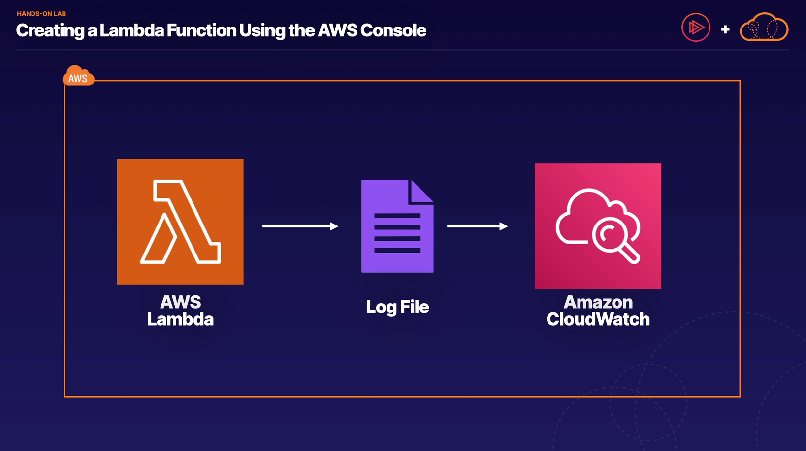
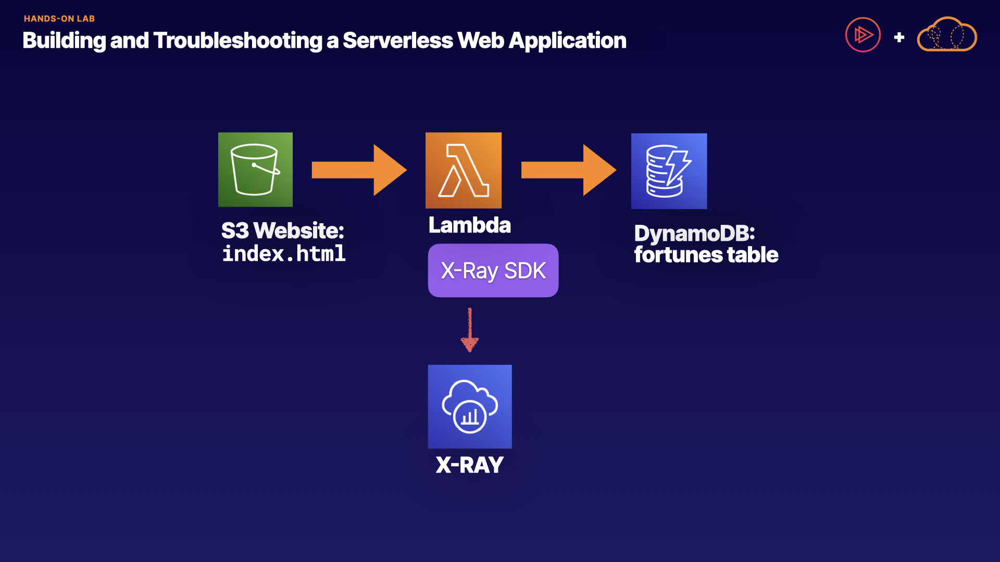

# Serverless 101
1. **What is Serverless?**
    - Serverless allows running application code in the cloud without managing servers.
    - AWS handles infrastructure tasks like capacity provisioning, scaling, and high availability.
    - Developers focus on writing code rather than managing servers.
2. **Advantages of Serverless:**
    - Speed to market: Eliminates server management overhead, allowing quick code releases.
    - Scalability: Automatically scales to handle a large number of users.
    - Cost-effectiveness: Pay only for executed code, no charges for idle resources.
    - Focus on application: Developers concentrate on building applications rather than infrastructure.
3. **AWS Serverless Technologies:**
    - Lambda: Run code as functions without server provisioning.
    - SQS (Simple Queue Service): Decouple and scale applications with message queuing.
    - SNS (Simple Notification Service): Send messages, notifications, and emails.
    - API Gateway: Create, publish, and secure APIs at any scale.
    - DynamoDB: Fully managed NoSQL database for serverless data storage.
    - S3: Object storage and web hosting.
4. **Serverless Architecture Example:**
    - A Cloud Guru website as a serverless example.
    - Browser request goes through API Gateway to Lambda functions.
    - Videos stored in S3, authentication via Auth0, data storage in Firebase.
    - Third-party services used for credit card payments.
    - Scalable, cost-effective, and no server management.
5. **Exam Tips:**
    - Serverless enables scalable applications without server management.
    - Cost-effective as you pay only for executed code.
    - AWS handles infrastructure tasks, allowing focus on coding and application development.

Overall, serverless computing offers benefits such as scalability, cost-effectiveness, and simplified application development by abstracting server management tasks.

# Introducing Lambda
1. **Serverless and Enterprise-Ready:** Lambda handles infrastructure tasks like scaling and high availability. It supports multiple languages like Java, Go, PowerShell, Node.js, C#, Python, and Ruby.
2. **Pricing:** Lambda pricing is based on the number of requests, duration, and memory usage. The first 1 million requests per month are free, and subsequent requests are charged at 20 cents per million. Memory usage is charged per gigabyte-second, with the first 400,000 gigabyte-seconds per month free.
3. **Event-Driven:** Lambda functions are triggered by events from AWS services like S3, DynamoDB, API Gateway, Alexa, CloudFront, etc., or from custom events like HTTP requests.
4. **Use Cases:** Lambda is used for various tasks such as data processing, real-time file processing, web and mobile backend, IoT backend, automation, etc.
5. **Integration:** Lambda integrates with a wide range of AWS services, enabling event-driven architecture and seamless scalability.
6. **Exam Tips:** Understand Lambda's cost-effective pricing model, event-driven nature, scalability, and integration with other AWS services like API Gateway, DynamoDB, S3, SNS, and SQS.

Lambda is a powerful tool for building scalable and cost-effective serverless applications, making it a core component of modern cloud architectures.

[Lambda Documentation](https://docs.aws.amazon.com/lambda/latest/dg/lambda-services.html)

[AWS::Lambda::Function](https://docs.aws.amazon.com/AWSCloudFormation/latest/UserGuide/aws-resource-lambda-function.html)

[Lambda@Edge](https://aws.amazon.com/lambda/edge/)

# Lab - Creating a Lambda Function Using the AWS Console


# API Gateway
1. **API Concept:** APIs are used to interact with web applications, allowing them to communicate with each other. They act as intermediaries, similar to a waiter in a restaurant who takes orders from customers and communicates them to the kitchen.
2. **Real-Life Example:** In a travel booking website, APIs are used to aggregate flight, hotel, and car rental information from external services. The website makes API calls to these services, receives JSON responses, processes the data, and presents it to users.
3. **API Gateway Functionality:** API Gateway allows you to create and manage APIs for applications running on AWS, such as Lambda, EC2, or services like DynamoDB and Kinesis. It supports RESTful APIs for serverless and web applications.
4. **RESTful APIs:** REST stands for Representational State Transfer. RESTful APIs are stateless and optimized for serverless and web applications. They use JSON (JavaScript Object Notation) for data exchange, which consists of key-value pairs.
5. **API Gateway Features:** API Gateway provides a single endpoint for all traffic, supports multiple endpoints and targets, allows versioning of APIs, is serverless for cost-effectiveness and scalability, integrates with CloudWatch for logging, and supports throttling to manage traffic.
6. **Exam Tips:** Understand that API Gateway acts as the front door to your application, provides endpoints for applications running on AWS, is serverless and scalable, supports throttling for traffic management, and logs API calls and errors to CloudWatch.

API Gateway plays a crucial role in building and managing APIs for serverless and web applications, making it an essential component in modern cloud architectures.

[AWS - API Gateway structure](https://docs.aws.amazon.com/apigateway/latest/api/API_Operations.html)

[Setting up a stage using the API Gateway console](https://docs.aws.amazon.com/apigateway/latest/developerguide/stages.html)

# Demo - Building a Serverless Website
1. **Lambda Function Creation:** Created a Lambda function named "mylambdafunction" using Python runtime in the AWS Management Console. Added custom Python code to the Lambda function.
2. **API Gateway Configuration:** Configured API Gateway as a trigger for the Lambda function. Created a new API with HTTP type and enabled cross-origin resource sharing (CORS) to allow calls from the webpage.
3. **S3 Bucket Setup:** Created an S3 bucket to host the static website. Enabled static website hosting in the bucket properties, specifying index.html and error.html as the index and error documents.
4. **Website File Preparation:** Modified index.html to include the API Gateway endpoint URL. Uploaded index.html, error.html, and granted public read access to these files in the S3 bucket permissions.
5. **Testing the Website:** Accessed the static website hosting endpoint provided by S3 to view the website. Clicked the button on the webpage to trigger the Lambda function via API Gateway and display the response on the website.

This process demonstrates the seamless integration of Lambda, API Gateway, and S3 to create a serverless website without managing any servers directly.

[Serverless Website Demo Code](https://github.com/ACloudGuru-Resources/course-aws-certified-developer-associate/tree/main/Serverless_Webite_Demo)

# Demo - Version Control With Lambda
1. **$LATEST in Lambda:** When you first create a Lambda function, it is labeled as $LATEST, representing the latest code version you uploaded to the function.
2. **Managing Multiple Versions:** You can upload multiple versions of your function code to Lambda and use aliases to reference specific versions. For example, you can have versions like development, test, production, etc.
3. **Lambda Aliases:** Aliases are pointers to specific versions of your function code. They allow you to direct application traffic to different versions based on your needs.
4. **Demo Overview:** The demo covers creating a Lambda function, publishing versions, creating aliases, and understanding ARNs (Amazon Resource Names).
5. **Demo Steps:**
    - Create a Lambda function using version 1 of the code.
    - Publish version 1 and create an alias called "prod."
    - Upload version 2 of the code, publish it, and create an alias called "test."
    - Review the ARNs and aliases created in the process.
6. **Exam Tips:**
    - $LATEST always represents the latest uploaded code.
    - Use Lambda versioning and aliases to direct application traffic to specific versions.
    - Example ARNs include aliases like "prod" and referring to the latest version using $LATEST.
    - Remember to update your application to point to the latest version if you use aliases instead of $LATEST.

The lesson provides a hands-on demonstration of how to manage Lambda versions and aliases effectively.

[GitHub Repository - Version 1 and 2 code](https://github.com/ACloudGuru-Resources/course-aws-certified-developer-associate/tree/main/Version_Control_With_Lambda)

# Lambda Concurrent Executions Limit
1. **Understanding Concurrent Executions Limit:**
    - The concurrent executions limit in AWS Lambda is the maximum number of functions that can run simultaneously within the same region.
    - It's a safety feature to prevent overwhelming the system with too many simultaneous executions.
    - The default limit is 1000 concurrent executions per region per account.
2. **Error Messages and Limit Increase:**
    - If you exceed the concurrent executions limit, you'll receive an error message like "TooManyRequestsException" with an HTTP Status Code of 429.
    - AWS allows you to request an increase in the limit through the AWS Support Center if needed.
3. **Reserved Concurrency:**
    - Reserved concurrency allows you to guarantee a set number of executions for critical functions.
    - It acts as a limit as well, ensuring that a specific function never goes over the reserved concurrency limit set for it.
4. **Exam Tips:**
    - Understand that there is a limit on concurrent executions (default is 1000 per region per account).
    - Exceeding the limit can result in rejection of invocation requests and HTTP status code 429.
    - Remedies include requesting a limit increase or using reserved concurrency for critical functions.

Overall, knowing about the Lambda concurrent executions limit is important for managing serverless applications effectively and ensuring optimal performance.

# Demo - Lambda and VPC Access
1. **Use Case for VPC Access with Lambda:**
    - Lambda functions may need to access resources in a private VPC, such as an RDS database or EC2 instances in a private subnet.
2. **Configuration Information Required:**
    - To enable Lambda to access resources in a VPC, you need to provide three pieces of configuration information:
        - VPC ID: Identifies the VPC that the Lambda function needs to access.
        - Subnets: Specifies the subnets within the VPC that Lambda will use.
        - Security Groups: Determines the network access permissions for the Lambda function.
3. **Console Setup for VPC Access:**
    - In the AWS Lambda console, create a new function and configure its permissions.
    - Attach the "AWSLambdaVPCAccessExecutionRole" policy to the Lambda execution role to allow it to create network interfaces and assign IP addresses within the VPC.
4. **Configuring VPC, Subnets, and Security Groups:**
    - Edit the function's configuration to specify the VPC, subnets, and security group.
    - Choose the appropriate VPC, select the required subnets, and assign the necessary security group to allow access to resources within the VPC.
5. **Exam Tips:**
    - Understand that Lambda can access resources in a private VPC with the right configuration.
    - Provide VPC ID, subnets, and security group ID to Lambda for accessing resources.
    - Lambda creates elastic network interfaces using IPs from the private subnet.
    - Ensure the Lambda execution role has the necessary permissions, such as "AWSLambdaVPCAccessExecutionRole" policy.

By following these steps and providing the correct configuration information, Lambda can successfully access and interact with resources within a private VPC.

# Example Serverless Architectures
1. **Event-Driven Architectures:**
    - Asynchronous communication using events to loosely couple application components.
    - Components are not dependent on immediate responses, allowing for independent operation and scalability.
    - Typically includes stateless functions performing specific tasks.
2. **Building Serverless Applications with AWS:**
    - AWS services act as building blocks for serverless applications, offering scalability, performance, and reliability.
    - Utilize AWS services like Lambda, S3, DynamoDB, API Gateway, EventBridge, SQS, SNS, CloudFront, Kinesis Firehose, etc., for various functionalities.
3. **Components of Event-Driven Architectures:**
    - Event Source: Generates events, e.g., S3 uploads, DynamoDB modifications.
    - Event Destination: Receives events, e.g., Lambda functions.
    - Event Router: Routes events between components, e.g., EventBridge.
4. **Example Applications:**
    - Banking Application: ATM withdrawal triggers Lambda function, updates DynamoDB, sends notifications via EventBridge, SQS, and SNS.
    - Image Processing Application: S3 upload triggers Lambda function to process images, store metadata in DynamoDB, and serve images via CloudFront.
    - Streaming Data Processing Application: Kinesis Firehose receives social media data, Lambda function performs processing (e.g., sentiment analysis), and stores results in DynamoDB.
5. **Exam Tips:**
    - Understand event-driven and asynchronous nature of serverless architectures.
    - AWS services act as building blocks that can be integrated to create complex applications.
    - Services like SQS, EventBridge, and others facilitate event handling and routing.
    - Focus on scalability, flexibility, and independence of components in event-driven architectures.

By grasping these concepts, you'll be better prepared to design and understand event-driven serverless applications using AWS services effectively.

# Demo - Step Functions
1. **Overview of Step Functions:**
    - Step Functions provide a visual interface for building and running serverless applications as a series of steps.
    - Each step executes based on defined business logic, with output from one step becoming input for the next.
    - Step Functions handle orchestration, sequencing, error handling, and retry logic in serverless applications.
2. **Types of Workflows in Step Functions:**
    - Sequential Workflow: Steps happen one after another, with output from each step feeding into the next.
    - Parallel Workflow: Steps split into parallel tasks, execute concurrently, and converge back to a single step.
    - Branching Workflow: Includes decision-making steps to follow different paths based on conditions.
3. **Demo and Usage of Step Functions:**
    - Step Functions are used to coordinate different Lambda functions within a serverless application.
    - They manage workflow logic, state tracking, error handling, and provide a visual representation of the workflow.
4. **Demo Steps in AWS Console:**
    - Create a state machine using Amazon States Language or visual designer in the AWS Step Functions console.
    - Define workflows with sequential, parallel, or branching steps.
    - Monitor execution progress, track state, and debug issues using the console interface.
5. **Exam Tips:**
    - Understand the purpose and benefits of Step Functions in orchestrating serverless applications.
    - Recognize the types of workflows (sequential, parallel, branching) and their characteristics.
    - Step Functions provide visual representation, state tracking, and error handling for serverless workflows.

By grasping these concepts and practicing with the AWS Step Functions console, you'll be better prepared to design and manage serverless workflows effectively.

[AWS Step Functions FAQs](https://aws.amazon.com/step-functions/faqs/)

# Lab - Building a Serverless Application Using Step Functions, API Gateway, Lambda, and S3 in AWS


# Lab - Building and Troubleshooting a Serverless Web Application


# Comparing Step Functions Workflows
1. **Standard Workflows:**
    - Long-running, durable, and auditable workflows.
    - Execution history available for up to 90 days.
    - Uses an at-most-once model, suitable for non-idempotent actions.
    - Non-idempotent actions cause a change in state with repeated identical requests.
2. **Express Workflows:**
    - Short-lived workflows lasting up to 5 minutes.
    - Ideal for high-volume event-processing workloads.
    - Uses an at-least-once model, suitable for idempotent actions.
    - Idempotent actions have no additional side effects with repeated identical requests.
3. **Synchronous and Asynchronous Express Workflows:**
    - **Synchronous:** Workflow completes before moving to the next step, suitable for sequential operations like confirming payments before processing orders.
    - **Asynchronous:** Workflow begins but does not wait for completion, suitable for tasks not dependent on workflow completion, like messaging systems.
4. **Understanding Synchronous vs. Asynchronous:**
    - Synchronous workflows hold up progression until completion, like a face-to-face interview where responses are awaited.
    - Asynchronous workflows allow for background execution without waiting for responses, similar to sending an email and moving on to the next task.
5. **Exam Tips:**
    - Understand the differences between Standard and Express Workflows based on duration, execution model, and idempotence.
    - Differentiate between Synchronous and Asynchronous Express Workflows based on dependency on workflow completion for subsequent tasks.

By grasping these concepts, you'll be well-equipped to design and choose the appropriate Step Functions workflows for various application requirements.

[Standard vs. Express Workflows](https://docs.aws.amazon.com/step-functions/latest/dg/concepts-standard-vs-express.html)

# Understanding Ephemeral and Persistent Data Storage Patterns
1. **/tmp (Temporary Storage):**
    - Temporary storage within the execution environment.
    - Up to 10 gigabytes configurable.
    - Behaves like a cached file system.
    - Data is not persistent and is only available during the execution.
2. **Lambda Layers:**
    - Ideal for including libraries and SDKs.
    - Up to 50 megabytes zipped or 250 megabytes unzipped.
    - Layers can be shared across multiple functions.
    - Best practice for keeping deployment packages small and improving performance.
3. **External Storage Options:**
a. **S3 (Object Storage):**
    - Object storage for storing and retrieving objects.
    - No size limit as it's elastic.
    - Data is persistent, but objects cannot be directly modified; new versions need to be uploaded.
    - Can be shared across execution environments.
    
    b. **EFS (Elastic File System):**
    
    - Shared file system based on NFS protocol.
    - Data is persistent and can be dynamically updated.
    - No size limit as it's elastic.
    - Ideal for dynamic read and writes, shared across execution environments.
    - Requires Lambda function and EFS file system to be in the same VPC.

For the exam, understand the differences between each storage option, including their limitations and use cases. Native Lambda storage options like /tmp and Lambda layers are suitable for temporary and library storage, respectively. External options like S3 and EFS provide persistent storage with different capabilities such as object storage and file system behavior. Choose the appropriate storage pattern based on your application's requirements for data persistence, access, and modification.

[Choosing Between Lambda Storage Options](https://aws.amazon.com/blogs/compute/choosing-between-aws-lambda-data-storage-options-in-web-apps/)

# Lambda Environment Variables and Parameters
1. **Lambda Environment Variables:**
    - Allow adjusting function behavior without changing code.
    - Consist of key-value pairs (e.g., environment=development).
    - Used for configuring functions differently based on environments (e.g., development, production).
    - Locked when the function version is published.
    - Example use cases include referencing S3 objects, SNS topics, or DynamoDB tables.
2. **Other Configurable Parameters in Lambda:**
    - **General Configuration:** Memory allocation, ephemeral storage, function timeout.
    - **Triggers:** Services or resources that invoke the function.
    - **Permissions:** Execution role and associated permissions.
    - **Function URL:** HTTP endpoint for accessing the function without API Gateway.
    - **Tags:** User-defined key-value pairs for organizing functions.
    - **VPC Configuration:** Access resources in a custom VPC.
    - **Monitoring:** CloudWatch and X-Ray for performance analysis.
    - **Concurrency:** Reserved and provisioned concurrency options.
    - **File System Options:** Connect to EFS file systems (requires VPC association).

For the exam, understand that Lambda is highly configurable, with environment variables used for behavior adjustments and other parameters for setting function configurations like memory, triggers, permissions, monitoring, and connectivity to resources and file systems. These options are available in the Lambda console under the configuration tab.

# Demo - Configuring a Lambda Function Using Environment Variables and Parameters
1. **Creating Lambda Function:**
    - Author a new function in the AWS Lambda console with Python runtime.
    - Replace sample code with provided code from GitHub repository.
    - Deploy the function and test it to ensure it's working correctly.
2. **Configuring Environment Variables:**
    - Edit the function's configuration and navigate to environment variables.
    - Add two environment variables: **`enable_exclamation_points`** set to true and **`number_of_exclamation_points`** set to 10 (or any desired value).
    - The function code uses these variables to determine behavior; if **`enable_exclamation_points`** is true, it displays the specified number of exclamation points.
3. **Other Configurable Parameters in Lambda:**
    - The Lambda configuration tab offers various settings:
        - General configuration (capacity, memory, ephemeral storage).
        - Triggers for invoking the function.
        - Permissions, function URL, tags, VPC access.
        - Monitoring, concurrency, and EFS file system connectivity.
4. **Testing the Function:**
    - After configuring environment variables, test the function again to verify the changed behavior based on the variables.

For the exam, understand that environment variables are key-value pairs used to adjust function behavior without altering code. The Lambda configuration tab provides additional options for configuring the function's settings, including memory, triggers, permissions, VPC access, monitoring, concurrency, and EFS file system connectivity.

[course-aws-certified-developer-associate.git](https://github.com/ACloudGuru-Resources/course-aws-certified-developer-associate)

```python
import os

def lambda_handler(event, context):
    num_exclamations = get_configured_number_of("ExclamationPoints", 1)
   
    return f'Hello Cloud Gurus{"!" * num_exclamations} The numberOfExclamationPoints is: {get_configured_number_of("ExclamationPoints", 1)}'

def get_configured_number_of(configuration_type, default):
    if os.getenv("enable" + configuration_type, "False") == "True":
        return int(os.getenv("numberOf" + configuration_type, str(default)))
    else:
        return default
```
Instructions.txt
```text
Create the following environment variables in your Lambda function, the code is case sensitive, so enter them exactly as below : 

1. enableExclamationPoints True 
2. numberOfExclamationPoints 10
```

# Handling Lambda Event Lifecycle and Errors
1. **Invocation Lifecycle:**
    - Lambda functions can be invoked synchronously or asynchronously.
    - Synchronous invocation waits for a response, while asynchronous invocation does not provide acknowledgment of successful processing.
    - Examples include API Gateway for synchronous invocation and S3 for asynchronous invocation.
2. **Lambda Retries:**
    - Lambda automatically retries a function twice by default if it returns an error.
    - Retries occur with increasing time intervals (1 minute for the first retry, 2 minutes for the second).
3. **Dead-Letter Queues (DLQ):**
    - DLQs are used to store failed invocations for further analysis and processing.
    - Associated with a specific version of a Lambda function.
    - Can be configured with SQS to hold failed events or with SNS to send notifications about failed events to multiple destinations.
4. **Lambda Destinations:**
    - Lambda destinations allow configuring Lambda to send invocation records to another service.
    - Records are sent to one destination for successful invocations and another for unsuccessful invocations.
    - Supported destinations include SQS, SNS, Lambda, and EventBridge.
    - Useful for detailed analysis and handling of successful and failed invocations.

For the exam, remember the automatic retry behavior of Lambda, the use of dead-letter queues for storing failed invocations, and the versatility of Lambda destinations in handling invocation records for both successful and unsuccessful invocations. Understanding these concepts is crucial for effective error handling and monitoring in Lambda functions.

# Lambda Deployment Packaging Options
1. **Lambda Deployment Package:**
    - It is a .zip file containing your function code and any dependencies needed to run the code.
    - Automatically created by Lambda when you type code directly into the console.
    - Supports packages up to 50 megabytes in size for direct upload from your local machine.
2. **Large Deployment Packages (>50MB):**
    - If your deployment package exceeds 50 megabytes, you must upload the .zip file to S3 in the same region as your Lambda function.
    - Specify the S3 object location when creating your function.
3. **Lambda Layers:**
    - Alternative to including all dependencies in the deployment package.
    - A Lambda layer is a .zip file archive containing function dependencies like libraries, custom runtimes, or SDKs.
    - Reduces the size of the deployment package, leading to faster initialization of functions.
    - Multiple functions can reference the same layer, promoting reusability and efficiency.

For the exam, remember that using Lambda layers is a best practice for managing dependencies, especially for large libraries or when multiple functions need to share dependencies. Layers reduce deployment package size and improve function initialization speed. If faced with questions related to providing code dependencies or optimizing deployment, consider using Lambda layers as the preferred approach.

# Lambda Performance Tuning Best Practices
1. **Capacity Allocation in Lambda:**
    - Memory allocation directly impacts CPU capacity in Lambda.
    - Increasing memory improves performance for memory or CPU-bound functions.
    - Testing and adjusting memory allocation is crucial for optimal performance.
2. **Lambda Execution Environment:**
    - Lambda creates the execution environment during the first invocation.
    - It downloads code, configures memory and runtime, and performs static initialization.
    - The execution environment is temporary but can be reused if the function is invoked again shortly after.
3. **Optimizing Static Initialization Phase:**
    - The static initialization phase contributes significantly to latency.
    - Factors to consider for optimization include code amount, function package size, and performance of libraries and services.
    - Importing only necessary libraries and SDKs can significantly reduce initialization time.
4. **Best Practices for Performance:**
    - Increasing memory can enhance CPU capacity and reduce function runtime.
    - Importing only required libraries and SDKs minimizes initialization time and improves performance.
    - Avoid importing entire SDKs if only specific components are needed, such as DynamoDB.

For the exam, remember to adjust memory allocation for better performance, optimize static initialization by importing only necessary components, and focus on reducing latency in Lambda functions to enhance overall performance.

# Demo - Using Lambda Destinations and Dead-Letter Queues
1. **Creating a Lambda Function and SNS Topic:**
    - A new Lambda function was created using the latest Python runtime.
    - A standard SNS topic ("my topic") was created, and a subscription was added using an email address.
2. **Configuring Lambda Destinations:**
    - A destination for successful events was created using an SNS topic.
    - The function was invoked asynchronously using the Cloud Shell.
    - The invocation record was checked in the email received from AWS notifications.
3. **Adding a Dead-Letter Queue:**
    - The destination was removed to add a dead-letter queue instead.
    - Asynchronous invocation settings were edited to configure Amazon SNS as the dead-letter queue service.
    - The function code was updated to raise an exception for testing.
4. **Testing Dead-Letter Queue and Lambda Destinations:**
    - The function was invoked again to simulate a failed invocation.
    - An email was received from the dead-letter queue, indicating a failed event.
    - The purpose of the dead-letter queue was highlighted as informing Lambda about failed invocations without providing detailed information.
5. **Comparison between Dead-Letter Queue and Lambda Destinations:**
    - Dead-letter queues are used for handling failed events but do not include human-readable information about the failure.
    - Lambda destinations provide detailed information about invocations, including response payloads, making them more suitable for error handling and analysis.

For the exam, remember that dead-letter queues and Lambda destinations serve different purposes in error handling. Dead-letter queues are used to notify Lambda about failed invocations without providing detailed information, while Lambda destinations provide comprehensive information about both successful and failed invocations, making them more suitable for analysis and troubleshooting.

[GitHub - Lambda_Destinations_Demo
](https://github.com/acloudguru-resources/course-aws-certified-developer-associate/tree/main/Lambda_Destinations_Demo)

# Advanced API Gateway
1. **Importing APIs using OpenAPI (formerly Swagger):**
    - API Gateway supports importing API definition files using the OpenAPI protocol.
    - OpenAPI is an industry standard format for describing RESTful APIs.
    - You can import an OpenAPI definition file to create or update an API in API Gateway.
2. **Legacy Protocols like SOAP:**
    - SOAP (Simple Object Access Protocol) is a legacy protocol that returns responses in XML format.
    - API Gateway provides options for dealing with legacy applications that use SOAP:
        - Configure API Gateway as a web service pass-through, which passes XML responses back to the client.
        - Use API Gateway to transform XML responses into JSON format.
3. **Exam Tips:**
    - Know that you can import APIs into API Gateway using OpenAPI files.
    - Understand the options for handling SOAP-based applications in API Gateway, including pass-through and XML-to-JSON conversion.

For detailed information on how to perform these actions in API Gateway, refer to the AWS documentation and additional resources linked in the lecture.

[How to configure Amazon API Gateway as a SOAP webservice passthrough in minutes](https://joshuamoesa.github.io/joshuamoesa/)

# Using API Gateway Mock Endpoints for Integration Testing and Resolving Integration Dependencies
1. **Overview of Mock Endpoints:**
    - Mock endpoints in API Gateway allow developers to create, test, and debug software by mimicking the responses and behaviors of a real API.
    - They are described as mock integrations and simulate the responses expected from a real API.
2. **Use Case Example:**
    - A common use case for mock endpoints is when frontend development is ahead of backend development.
    - Developers can use mock endpoints to simulate backend responses, allowing them to continue testing and development without waiting for the real backend to be available.
3. **Configuring Mock Endpoints:**
    - When configuring a mock endpoint, developers define the response, including status codes and messages, to form the mock integration response.
4. **Exam Tips:**
    - Understand that API Gateway provides mock endpoints to simulate API responses, aiding development and testing processes.
    - Mock endpoints are particularly useful when frontend components are ready for testing but backend components are not yet available.

By leveraging mock endpoints, development teams can streamline their workflow and continue making progress on their applications even when certain backend functionalities are not fully developed or available.

# Using API Gateway Stages for Testing Deployed Code
1. **API Gateway Stage Overview:**
    - An API Gateway stage is a logical reference that represents the lifecycle state of the API, such as development, production, or specific versions.
    - Each stage can be associated with different endpoints, such as development, production, or testing environments, and has a unique invoke URL.
2. **Stage Variables:**
    - Stage variables are key-value pairs acting like environment variables.
    - They allow you to modify the behavior of your API based on the variable's value, such as configuring the endpoint that a stage routes HTTP requests to.
    - For example, you can use stage variables to define whether requests go to a production or development endpoint, such as different Lambda functions.
3. **Exam Tips:**
    - Understand that API Gateway stages reference the lifecycle state of an API, with each stage having a unique invoke URL and associating with different endpoints.
    - Stage variables are used to configure backend endpoints based on specific conditions, allowing for routing requests to different functions or environments.

By utilizing API Gateway stages and stage variables effectively, developers can manage and test their APIs across different environments and versions, ensuring smooth transitions between development, testing, and production phases.

# Creating Dynamic Lambda Deployments Using API Gateway Staging Variables


# API Response and Request Transformations
1. **API Request Transformations:**
    - API Gateway can modify request parameters before forwarding them to the backend application.
    - Changes can be made to request headers, query strings, and request paths using parameter mapping.
    - For example, you can add headers, modify query strings, or adjust the request path to route requests appropriately.
2. **API Response Transformations:**
    - After receiving a response from the backend, API Gateway can modify response parameters before sending them back to the client.
    - Response transformations can include changes to response headers, status codes, or adding custom data to responses.
    - For instance, you can append information to headers or change status codes based on backend responses.
3. **Parameter Mapping Examples:**
    - Request transformations can involve adding headers, modifying query strings, or adjusting request paths.
    - Response transformations can include appending data to headers, changing status codes, or adding custom information to responses.
4. **Exam Tips:**
    - Understand that API Gateway supports transformations for both request and response parameters using parameter mapping.
    - Request transformations can modify headers, query strings, and request paths, while response transformations can modify headers and status codes.
    - Be familiar with the concept of parameter mapping and its applications in API Gateway for modifying API requests and responses.

By leveraging API Gateway's parameter mapping for request and response transformations, developers can customize and optimize the interaction between client requests and backend services, ensuring seamless communication and efficient data exchange.

# API Gateway Caching and Throttling
1. **API Gateway Caching:**
    - API Gateway caches endpoint responses to reduce calls to the backend and improve latency.
    - Responses are cached for a specified time-to-live period, with a default of 300 seconds (5 minutes).
    - Caching helps improve API performance by serving cached responses instead of making new requests to the backend.
2. **API Gateway Throttling:**
    - Throttling limits the steady-state request rate to 10,000 requests per second per region by default.
    - There's also a limit on concurrent requests, set at 5,000 requests across all APIs per region.
    - Exceeding these limits triggers a "429-Too Many Requests" error, indicating throttling to prevent overwhelming the API.
3. **Caching Example:**
    - Users make requests to the API Gateway endpoint, which forwards requests to the backend.
    - Responses are cached for a specified time, and subsequent identical requests are served from the cache, reducing backend calls.
4. **Throttling Example:**
    - API Gateway limits request rates and concurrent requests to prevent overload.
    - Requests beyond the limits are throttled, with a "Too Many Requests" error returned.
5. **Exam Tips:**
    - Understand that caching improves API performance by caching responses and reducing backend calls.
    - Throttling limits request rates and concurrent requests to prevent API overload, with default limits that can be increased.
    - Know the default limits for throttling (10,000 requests per second and 5,000 concurrent requests) and the error message for exceeding limits (429-Too Many Requests).

These features are crucial for optimizing API performance, reducing latency, and ensuring smooth operation under varying loads.

[Enabling API caching to enhance responsiveness](https://docs.aws.amazon.com/apigateway/latest/developerguide/api-gateway-caching.html)

[Amazon API Gateway REST API Reference: Signing Requests](https://docs.aws.amazon.com/apigateway/latest/api/API_Operations.html)

# Understanding X-Ray
1. **What is X-Ray?**
    - X-Ray is a tool designed to help developers analyze and debug distributed applications.
    - It allows for troubleshooting performance issues, errors, and connection problems.
    - X-Ray provides a visual representation of your application's underlying components through the X-Ray service map, showing an end-to-end view of requests as they traverse your application.
2. **Integration with AWS Services:**
    - X-Ray can be integrated with various AWS services, including EC2, ECS, Lambda, Elastic Beanstalk, SNS, SQS, DynamoDB, Elastic Load Balancer, and API Gateway.
    - It can also be integrated with applications written in Java, Node.js, .NET, Go, Ruby, and Python.
    - The X-Ray SDK captures metadata for API calls made to AWS services using the AWS SDK, automatically monitoring API calls and capturing relevant data.
3. **Setting up X-Ray with Your Application:**
    - To use X-Ray with your application, you first install the X-Ray agent on your EC2 instance where your application is running.
    - Next, you instrument your application using the X-Ray SDK, which provides libraries and methods for generating trace data.
    - The X-Ray SDK gathers information from request and response headers, application code, and metadata about AWS resources, sending this trace data to X-Ray for analysis.
4. **Exam Tips:**
    - Understand that X-Ray is used for analyzing and debugging distributed applications, providing a visual service map of application components.
    - Know that integrating X-Ray with your application requires installing the X-Ray agent on your EC2 instance and using the X-Ray SDK to instrument your application and send trace data to X-Ray.

In the next lecture, we'll delve deeper into working with X-Ray to gain a practical understanding of its capabilities. If you have any questions, feel free to ask. Otherwise, I'll see you in the next lecture. Thank you.

[X-Ray Link](https://signin.aws.amazon.com/signin?redirect_uri=https%3A%2F%2Fconsole.aws.amazon.com%2Felasticbeanstalk%3FhashArgs%3D%2523%252FnewApplication%253FapplicationName%253Dscorekeep%2526solutionStackName%253DJava%26isauthcode%3Dtrue%26state%3DhashArgsFromTB_eu-north-1_32bf4a528b281e39&client_id=arn%3Aaws%3Asignin%3A%3A%3Aconsole%2Felasticbeanstalk&forceMobileApp=0&code_challenge=fuHt9XSYEfPF4qrx2T_4fgvxnuNHrQ0MpNL0bl61Cko&code_challenge_method=SHA-256)

[AWS X-Ray FAQs](https://aws.amazon.com/xray/faqs/)

[Integrating AWS X-Ray with other AWS services](https://docs.aws.amazon.com/xray/latest/devguide/xray-services.html)

# X-Ray Configuration
1. **AWS X-Ray Overview:**
    - X-Ray provides an end-to-end view of distributed applications, helping to identify performance bottlenecks and failures.
    - It can monitor applications running on various platforms, including EC2, ECS, Lambda, DynamoDB, and API Gateway, as well as on-premises systems.
2. **X-Ray Components and Configuration Steps:**
    - X-Ray requires both the X-Ray SDK and the X-Ray Daemon installed on your systems to send data into X-Ray.
    - The X-Ray SDK instruments your application to send trace data to X-Ray, capturing information about incoming and outgoing requests.
    - High-level configuration steps include installing the X-Ray Daemon on EC2 instances or on-premises servers, and for ECS, running the X-Ray Daemon in its own Docker container alongside your application (not within the same container).
3. **Annotations and Indexing:**
    - Annotations are key-value pairs used to record additional information about requests or traces.
    - X-Ray indexes annotations, allowing for filter expressions and grouping related traces together in the console.
    - Annotations can be used to add user-defined metadata to X-Ray data, such as game_name or game_id, for filtering and search purposes.
4. **Getting Started:**
    - To start using X-Ray, you need the X-Ray SDK, X-Ray Daemon, and instrument your application using the SDK to send required data to X-Ray.
    - Annotations can be used to add application-specific information to X-Ray data for better organization and searchability.

In summary, X-Ray is a powerful tool for monitoring and troubleshooting distributed applications across various platforms. By following the configuration steps and leveraging annotations, you can effectively use X-Ray to gain insights into your application's performance and behavior.

If you have any questions or need further clarification, feel free to ask. Otherwise, you can proceed to the next lecture. Thank you.

# Demo - X-Ray
1. **Setting Up the Demo Application:**
    - We used CloudFormation to create a sample Java application for tic-tac-toe.
    - The CloudFormation configuration was pre-populated, so we could quickly set up the application without manual configurations.
    - After CloudFormation deployment, we accessed the application through the load balancer URL provided in the CloudFormation outputs.
2. **Playing the Game and Generating Traffic:**
    - We played a game of tic-tac-toe to generate sample traffic to our application.
    - The game interactions helped simulate real user activity and API calls within the application.
3. **Using X-Ray to View Traces and Service Map:**
    - We accessed the X-Ray console from the AWS Management Console.
    - Using X-Ray, we viewed the service map which provided an end-to-end view of requests traveling through our application.
    - The service map showed different components of our application, including ECS containers, SNS topics, and DynamoDB tables.
    - We used the legend to identify components with faults or errors, such as SNS topics with 100% errors.
    - By viewing traces, we could pinpoint errors and exceptions within our application, such as issues with subscribing to SNS topics or unauthorized access to DynamoDB tables.
    - We demonstrated how changes in IAM roles (removing DynamoDB access) can break the application and generate error traces in X-Ray.
4. **Understanding X-Ray for Exam Preparation:**
    - For exam preparation, it's important to understand that X-Ray's service map provides a visual representation of application components, reporting on latency, HTTP status codes, and errors.
    - X-Ray helps in troubleshooting and identifying the root cause of performance issues and errors in distributed applications.

In conclusion, the demo provided hands-on experience with AWS X-Ray, showcasing its capabilities in monitoring and analyzing distributed applications. Understanding X-Ray's features and how to interpret traces and service maps is crucial for troubleshooting and optimizing application performance.

If you have any questions or need further clarification, feel free to ask. Otherwise, you can proceed to the next lesson. Thank you.

# Serverless Summary
1. **Serverless 101:**
    - Serverless enables building scalable applications without managing servers.
    - It's cost-effective as you only pay for executed code.
    - AWS handles infrastructure, allowing developers to focus on coding.
2. **AWS Lambda:**
    - Cost-effective and scales automatically based on events.
    - Triggered by various events like API calls, file uploads, etc.
    - Serverless nature makes it ideal for event-driven architectures.
3. **API Gateway:**
    - Acts as a front door to applications in AWS.
    - Provides endpoints, scales automatically, and offers throttling.
    - Logs API calls, latencies, and errors to CloudWatch.
4. **Version Control with Lambda:**
    - **`$latest`** points to the latest code version in Lambda.
    - Lambda versioning and aliases allow pointing to specific code versions.
    - Aliases are useful for production environments to avoid using **`$latest`**.
5. **Lambda Concurrent Executions Limit:**
    - Default limit is 1000 concurrent executions per second.
    - Exceeding the limit leads to rejected invocations (HTTP status code 429).
    - Can raise the limit through AWS support or use reserved concurrency for critical functions.
6. **Lambda and VPCs:**
    - Lambda can access resources in a private VPC by providing VPC config info.
    - It configures an elastic network interface using an IP from the private subnet CIDR range.
    - Security groups control access to resources in the VPC.
7. **Step Functions:**
    - Used to visualize and orchestrate serverless applications.
    - Tracks each step of the state machine or workflow.
    - Differentiates between standard and express workflows based on duration and idempotency.
8. **X-Ray:**
    - Helps analyze and debug distributed applications.
    - Provides a service map for visualizing application components.
    - Integrated with various AWS services and allows custom application instrumentation.
9. **API Gateway Caching and Throttling:**
    - Caching improves API performance by caching responses for a specified TTL.
    - Default TTL is 300 seconds.
    - Throttling limits requests per second and concurrent requests, preventing overload.
10. **Advanced API Gateway:**
    - Supports importing APIs using OpenAPI (formerly Swagger) definitions.
    - Can handle legacy SOAP applications as a passthrough or convert XML to JSON responses.
11. **Example Serverless Architectures:**
    - Event-driven and asynchronous architectures using services like SQS and EventBridge for loose coupling and scalability.
    - Examples include banking applications, image processing, and social media data processing.
12. **Storage Options for Lambda:**
    - Internal storage (/tmp) for temporary data.
    - Lambda Layers for storing libraries and SDKs.
    - External storage options like S3 and EFS for persistent data.
13. **Lambda Environment Variables and Configurable Parameters:**
    - Adjust function behavior without changing code using environment variables.
    - Configure various settings like memory, concurrency, and connections to other AWS services in the Configuration tab.
14. **Lambda Deployment Packages and Performance Tuning:**
    - Package contains function code and optional dependencies.
    - Use Lambda Layers to reduce deployment package size and improve initialization speed.
    - Import only necessary libraries to avoid performance overhead.
    - Increasing memory allocation can increase CPU capacity and reduce function duration.
15. **Error Handling and Retries:**
    - Lambda retries failed invocations automatically.
    - Configure dead letter queues for further processing of failed invocations.
    - Use Lambda Destinations to send invocation records to specific destinations based on success or failure.
16. **API Gateway Stages, Mock Endpoints, and Transformations:**
    - Stages reference API lifecycle states like development or production.
    - Use stage variables to reference specific backend endpoints.
    - Mock endpoints simulate API responses for testing and debugging.
    - Transform HTTP requests and responses using API Gateway transformations.