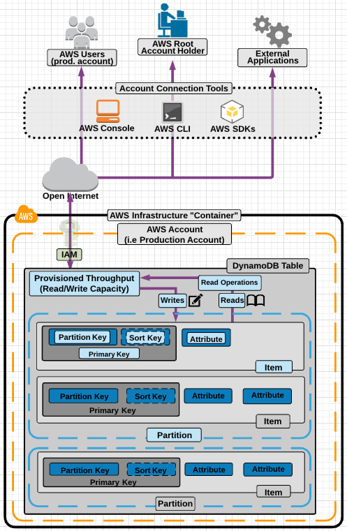

# Introduction to DynamoDB
1. **What is DynamoDB?**
    - DynamoDB is a fast and flexible NoSQL database.
    - It's great for applications needing consistent single-digit millisecond latency at any scale.
    - Supports both key-value and document data models (JSON, HTML, XML).
    - Ideal for mobile, web, gaming, ad tech, IoT, and more.
    - Fully managed, serverless, and integrates well with Lambda.
    - Data is stored on SSDs for fast performance.
2. **Consistency Models:**
    - Eventually Consistent Reads (default): Consistency across all copies of data usually reached within one second.
    - Strongly Consistent Reads: All successful writes are reflected across all locations immediately.
3. **ACID Transactions:**
    - DynamoDB transactions provide atomic, consistent, isolated, and durable operations.
    - Ensures all-or-nothing transactions, crucial for critical operations like credit card payments.
4. **Data Structure:**
    - DynamoDB data consists of items (rows) stored in tables, each with attributes (columns).
    - Items are uniquely identified by primary keys, which can be either partition keys (unique) or composite keys (partition key + sort key).
5. **Primary Keys:**
    - Partition Key: Unique identifier (e.g., user ID, product ID) determining data storage location.
    - Composite Key: Combination of partition key and sort key, used when partition key alone is not unique (e.g., forum posts with user ID + timestamp).
6. **Exam Tips:**
    - DynamoDB is low latency, supports JSON, HTML, XML, and offers eventual consistency by default.
    - Strong consistency ensures immediate reflection of writes across all locations.
    - ACID transactions guarantee all-or-nothing operations.
    - Understand the structure of tables, items, attributes, and primary keys for efficient data modeling.

These concepts are fundamental for working with DynamoDB and designing efficient data storage solutions.

[Amazon DynamoDB FAQs](https://aws.amazon.com/dynamodb/faqs/)

[Amazon DynamoDB Transactions: How it works](https://docs.aws.amazon.com/amazondynamodb/latest/developerguide/transaction-apis.html)

[Service, account, and table quotas in Amazon DynamoDB](https://docs.aws.amazon.com/amazondynamodb/latest/developerguide/ServiceQuotas.html)

# Demo - Creating a DynamoDB Table
1. **Creating IAM User:**
    - Created an IAM user named dynamodb_admin with programmatic access.
    - Attached the DynamoDBFullAccess policy to the user to grant full access to DynamoDB.
2. **Launching EC2 Instance:**
    - Launched an EC2 instance with Amazon Linux 2 AMI and t2.micro instance type.
    - Configured the instance to auto assign a public IP and added a bootstrap script to update packages and install Git upon boot.
3. **Configuring AWS CLI:**
    - Used **`aws configure`** on the EC2 instance to set up AWS CLI with the credentials of the IAM user created earlier.
4. **Creating DynamoDB Table:**
    - Ran the command **`aws dynamodb create-table`** to create a table named ProductCatalog with an ID attribute as the primary key (partition key) and provisioned throughput of 5 read capacity units and 5 write capacity units.
5. **Populating the Table:**
    - Used Git to clone a repository containing an items.json file with data items to be added to the DynamoDB table.
    - Ran **`aws dynamodb batch-write-item`** to add items from items.json to the table.
6. **Querying and Scanning Data:**
    - Demonstrated querying the DynamoDB table for an item with a specific product ID (403) using **`aws dynamodb get-item`**.
    - Showed how to perform a scan operation to retrieve all items in the table using **`aws dynamodb scan`**.
7. **Interacting with DynamoDB Console:**
    - Navigated to the DynamoDB console to view details of the created table, including primary key, provisioned capacity, and items.
    - Created a new item in the table through the console and demonstrated querying and scanning data directly from the console.
8. **Cleanup:**
    - Emphasized the importance of cleaning up resources by deleting the DynamoDB table and EC2 instance to avoid unnecessary charges.

Overall, DynamoDB offers flexibility in data modeling and querying, making it suitable for a wide range of applications.

Dynamodb get-item command
```command
#Command to query Dynamodb from EC2 command line - just remember replace the region with the correct one for your database
aws dynamodb get-item --table-name ProductCatalog --region eu-west-2  --key '{"Id":{"N":"205"}}'
```

[GitHub Link](https://github.com/ACloudGuru-Resources/course-aws-certified-developer-associate)

# DynamoDB Access Control
1. **Authentication and Access Control:** IAM is used to manage authentication and access control for DynamoDB tables within your AWS account. You can create IAM users with specific permissions to access, read, write, and create DynamoDB tables.
2. **IAM Roles for Temporary Access:** IAM roles can be created to provide temporary access to DynamoDB, which is useful for scenarios where access needs to be granted for a limited time.
3. **Restricting User Access:** To restrict user access to only their own records in DynamoDB, you can use a special IAM condition called DynamoDB leading keys condition. This condition allows users to access only items where the partition key value matches their user ID.
4. **Example IAM Policy:** An example IAM policy was provided in the lecture, demonstrating how to use the DynamoDB leading keys condition to restrict user access to their own data based on the partition key (user ID).
5. **Exam Tips:**
    - Fine-grained access control can be configured using IAM, specifically with the DynamoDB leading keys condition parameter.
    - By using this condition in an IAM policy, you can ensure that users can access only the items in DynamoDB that are related to their user ID, preventing access to other users' data within the same table.

# Indexes Deepdive
1. **What is an Index?**
    - An index in DynamoDB allows you to perform queries based on attributes that are not the primary key.
    - It enables faster and more efficient queries by selecting specific columns to include in the index and running searches on the index rather than the entire dataset.
2. **Types of Indexes:**
    - **Local Secondary Index (LSI):**
        - Created during table creation.
        - Shares the same partition key as the main table but has a different sort key.
        - Provides a different view of the data, organized according to the alternative sort key.
        - Queries based on the sort key in the LSI are faster than querying the main table directly.
        - Limitation: Must be added at table creation and cannot be modified later.
    - **Global Secondary Index (GSI):**
        - Can be created at any time, either during table creation or later.
        - Offers more flexibility by allowing a different partition key and sort key compared to the main table.
        - Provides a completely different view of the data, speeding up queries related to the alternative partition key and sort key.
3. **Exam Tips:**
    - Indexes improve query performance but only for specific data columns.
    - Understand the differences between LSI and GSI:
        - LSI uses the same partition key and a different sort key, created during table creation.
        - GSI uses different partition and sort keys, offering flexibility in creation timing.

By mastering DynamoDB indexes, you can optimize your database queries for faster and more targeted data retrieval.

1. **Authentication and Access Control:** IAM is used to manage authentication and access control for DynamoDB tables within your AWS account. You can create IAM users with specific permissions to access, read, write, and create DynamoDB tables.
2. **IAM Roles for Temporary Access:** IAM roles can be created to provide temporary access to DynamoDB, which is useful for scenarios where access needs to be granted for a limited time.
3. **Restricting User Access:** To restrict user access to only their own records in DynamoDB, you can use a special IAM condition called DynamoDB leading keys condition. This condition allows users to access only items where the partition key value matches their user ID.
4. **Example IAM Policy:** An example IAM policy was provided in the lecture, demonstrating how to use the DynamoDB leading keys condition to restrict user access to their own data based on the partition key (user ID).
5. **Exam Tips:**
    - Fine-grained access control can be configured using IAM, specifically with the DynamoDB leading keys condition parameter.
    - By using this condition in an IAM policy, you can ensure that users can access only the items in DynamoDB that are related to their user ID, preventing access to other users' data within the same table.

# Lab - AWS DynamoDB in the Console - Creating Tables, Items, and Indexes


# Demo - Scan vs Query API Call
1. **Query Operation:**
    - Finds items based on the primary key attribute and a distinct value.
    - Can be refined using an optional sort key.
    - By default, returns all attributes for the item, but can be customized using ProjectionExpression.
    - Results are sorted by the sort key (if present) in ascending order.
2. **Scan Operation:**
    - Examines every item in the table.
    - By default, returns all items and attributes.
    - Can be refined using ProjectionExpression and filtered after the scan.
    - Generally less efficient than a query, especially as the table size grows.
3. **Performance Considerations:**
    - Avoid scans whenever possible due to their inefficiency.
    - Use queries, GetItem, or BatchGetItem APIs instead.
    - Set a smaller page size to avoid throttling and improve performance.
    - Consider isolating scan operations to specific tables and try parallel scans cautiously to avoid impacting other applications.
4. **Exam Tips:**
    - Understand the differences between queries and scans.
    - Use ProjectionExpression to refine results and filters to narrow down scan results.
    - Queries are more efficient than scans, especially for targeted searches.
    - Set smaller page sizes, isolate scan operations, and avoid scans whenever possible for better performance.

By following these guidelines, you can optimize your DynamoDB operations for better performance and efficiency.

```command
1) Launch the AWS CloudShell and run the following command to create a DynamoDB table:

aws dynamodb create-table --table-name ProductCatalog --attribute-definitions \
AttributeName=Id,AttributeType=N --key-schema \
AttributeName=Id,KeyType=HASH \
--provisioned-throughput ReadCapacityUnits=5,WriteCapacityUnits=5

2) Download the items.json file to your CloudShell environment:
curl -O https://raw.githubusercontent.com/ACloudGuru-Resources/course-aws-certified-developer-associate/main/Create_A_DynamoDB_Table_Demo/items.json

3) Populate the table you just created with the file you just downloaded: 
aws dynamodb batch-write-item --request-items file://items.json
```
[Amazon DynamoDB > API Actions](https://docs.aws.amazon.com/amazondynamodb/latest/APIReference/API_Operations.html)

[Best Practices for Querying and Scanning Data](https://docs.aws.amazon.com/amazondynamodb/latest/developerguide/bp-query-scan.html)

# Using DynamoDB API Calls
1. **DynamoDB API Calls:**
    - API calls allow programmatically interacting with DynamoDB, such as querying, adding, or deleting items.
    - Common API calls include:
        - **`CreateTable`**: Creates a new table.
        - **`PutItem`**: Adds or replaces an item in a table.
        - **`GetItem`**: Retrieves attributes for an item based on the primary key.
        - **`UpdateItem`**: Edits attributes of an existing item.
        - **`UpdateTable`**: Modifies table settings like throughput.
        - **`ListTables`**: Lists all tables in the account.
        - **`DescribeTable`**: Returns information about a table.
        - **`Scan`**: Reads all items in a table.
        - **`Query`**: Queries based on a partition key value.
        - **`DeleteItem`**: Deletes an item.
        - **`DeleteTable`**: Deletes the entire table.
2. **AWS CLI Commands:**
    - AWS CLI commands correspond to DynamoDB API calls and have similar names.
    - CLI commands are invoked under the hood even when using the AWS console.
3. **Exam Tips:**
    - Understand the purpose of common DynamoDB API calls and their differences.
    - Know when to use each command and what they are used for.
    - Understand that CLI commands make API calls, and the correct IAM permissions are necessary for successful execution.
    - You don't need to memorize command syntax but understand the concepts and functionalities.

The official AWS CLI command reference provides detailed information on each command, including examples. Focus on understanding the concepts and practical use cases rather than memorizing syntax.

[DynamoDB Command Line Reference](https://awscli.amazonaws.com/v2/documentation/api/latest/reference/dynamodb/index.html)
# DynamoDB Provisioned Throughput
1. **Capacity Units:**
    - Provisioned throughput in DynamoDB is defined in terms of read capacity units and write capacity units.
    - Each write capacity unit provides one 1-kilobyte write per second.
    - For strongly consistent reads, each read capacity unit provides one 4-kilobyte read per second.
    - For eventually consistent reads (default), each read capacity unit provides two 4-kilobyte reads per second, which is double the throughput of strongly consistent reads.
2. **Calculating Capacity Units:**
    - To calculate read capacity units needed for strongly consistent reads, divide the item size by 4 kilobytes and round up to the nearest whole number.
    - For eventually consistent reads, divide the result by 2.
    - For write capacity units, divide the item size by 1 kilobyte and round up to the nearest whole number.
3. **Example Challenges:**
    - Calculate read capacity units needed for a specific number of reads per second, considering item size and read consistency (strongly consistent or eventually consistent).
    - Calculate write capacity units needed for a specific number of writes per second, considering item size.
4. **Exam Tips:**
    - Understand the concept of DynamoDB provisioned throughput and capacity units.
    - Know the difference between strongly consistent and eventually consistent reads in terms of throughput.
    - Practice calculating read and write capacity units based on given requirements.

# DynamoDB On-Demand Capacity
1. **On-Demand Capacity:**
    - On-demand capacity is a pricing model for DynamoDB where charges are based on actual reads, writes, and storage usage.
    - DynamoDB automatically scales up and down based on application activity, eliminating the need to specify a fixed number of read and write capacity units.
2. **When to Use On-Demand Capacity:**
    - Use on-demand capacity for unpredictable workloads with unknown traffic patterns.
    - It's suitable for applications with spiky or short-lived peaks in traffic.
    - On-demand is beneficial if you prefer a pay-per-request model and want to pay only for what you use.
3. **Provisioned Capacity:**
    - Provisioned capacity involves specifying a fixed number of read and write capacity units when creating the table.
    - It's ideal when workload requirements can be accurately forecasted and when traffic is consistent or gradually increasing.
    - Provides more control over cost management compared to on-demand capacity.
4. **Exam Tips:**
    - Understand the differences between on-demand and provisioned capacity models.
    - Use on-demand for unpredictable workloads and a pay-per-use model.
    - Use provisioned capacity for predictable workloads and when cost control is important.

# DynamoDB Accelerator (DAX)
1. **DynamoDB Accelerator (DAX):**
    - DAX is a fully managed, clustered, in-memory cache for DynamoDB, designed to improve read performance significantly.
    - It can deliver up to a 10x read performance improvement and offers microsecond response times for millions of requests per second.
    - Ideal for read-heavy workloads, bursty read patterns, and applications with high read demand during peak times like promotions or events.
2. **How DAX Works:**
    - DAX operates as a write-through caching service, where data is written to both the cache and the backend DynamoDB store simultaneously.
    - API calls can be directed to the DAX cluster, and if the requested item is in the cache (cache hit), DAX returns the result directly to the application.
    - If the item is not in the cache (cache miss), DAX performs an eventually consistent GetItem operation against DynamoDB, retrieves the data, and updates the cache.
3. **Suitability and Limitations:**
    - DAX is suitable for eventually consistent reads only and is not recommended for applications requiring strongly consistent reads.
    - It is not beneficial for write-intensive applications since DAX primarily improves read operations.
    - Applications with minimal read operations or those not needing microsecond response times may not see significant benefits from using DAX.
4. **Exam Tips:**
    - DAX provides in-memory caching to boost DynamoDB read performance for eventually consistent reads.
    - It operates as a write-through caching service, updating both the cache and DynamoDB simultaneously.
    - Use DAX for read-heavy workloads and applications that can benefit from reduced read load on DynamoDB tables.
    - Understand that DAX is not suitable for strongly consistent reads or write-intensive applications.

# Demo - DynamoDB TTL
1. **DynamoDB TTL (Time to Live):**
    - TTL is an attribute in DynamoDB that defines an expiry time for your data.
    - You set an expiry time, and items that reach this time are automatically marked for deletion.
    - Once marked for deletion, items are deleted within the next 48 hours.
2. **Use Cases for TTL:**
    - TTL is beneficial for removing irrelevant or old data, such as session data, event logs, and temporary data that your application no longer needs.
    - It helps reduce storage costs by automatically removing data that is no longer useful.
3. **Working with TTL in DynamoDB:**
    - TTL is expressed in the epoch time format, representing the number of seconds since January 1st, 1970.
    - Items in DynamoDB can be configured with TTL based on their expiration time.
    - You can use tools like EpochConverter to convert dates to epoch timestamps for TTL configuration.
4. **Configuring TTL in DynamoDB:**
    - In DynamoDB console, you can define the TTL attribute (e.g., expiration time) for items in your table.
    - DynamoDB allows you to preview TTL before applying it, ensuring you set it up correctly.
    - TTL automatically marks items for deletion when their expiry time is reached.
5. **Benefits of TTL:**
    - TTL automates the process of data cleanup, ensuring old or irrelevant data is removed from your DynamoDB tables.
    - It helps optimize storage costs by managing data expiration automatically.

Remember to configure TTL based on your application's needs to efficiently manage data lifecycle in DynamoDB.

```command
1) Check your IAM user permissions:

aws iam get-user

2) Creating the SessionData table:

***LINUX or MAC USERS***:
aws dynamodb create-table --table-name SessionData --attribute-definitions \
AttributeName=UserID,AttributeType=N --key-schema \
AttributeName=UserID,KeyType=HASH \
--provisioned-throughput ReadCapacityUnits=5,WriteCapacityUnits=5

***WINDOWS USERS*** - Please replace \ with ^ (Shift+6) as follows:
aws dynamodb create-table --table-name SessionData --attribute-definitions ^
AttributeName=UserID,AttributeType=N --key-schema ^
AttributeName=UserID,KeyType=HASH ^
--provisioned-throughput ReadCapacityUnits=5,WriteCapacityUnits=5

3) Populate SessionData Table:

aws dynamodb batch-write-item --request-items file://items.json
```

[Git Repository](https://github.com/ACloudGuru-Resources/course-aws-certified-developer-associate/tree/main/DynamoDB_TTL_Demo)

# DynamoDB Streams
1. **DynamoDB Streams Overview:**
    - DynamoDB Streams are time-ordered sequences that record modifications (inserts, updates, deletes) made to items in a DynamoDB table.
    - The stream logs these actions in a time-ordered log, which is encrypted at rest and stored for 24 hours only.
2. **Use Cases for DynamoDB Streams:**
    - Auditing and archiving transactions.
    - Triggering events based on specific changes in the DynamoDB table.
    - Replicating data across multiple DynamoDB tables.
3. **Integration with Serverless Architectures:**
    - DynamoDB Streams are excellent for serverless architectures.
    - They can trigger Lambda functions or applications based on changes in the DynamoDB table, making them a powerful event source.
4. **Architecture Example with DynamoDB Streams:**
    - We discussed an example scenario where DynamoDB Streams are used to trigger a workflow in an invoicing and payment system.
    - Each new invoice entry triggers a Lambda function through the DynamoDB Stream, which then sends notifications and processes tasks in the application.
5. **Exam Tips for DynamoDB Streams:**
    - DynamoDB Streams record item-level modifications in tables in a time-ordered sequence.
    - Data in the stream is stored for 24 hours before deletion.
    - It's an ideal event source for Lambda functions to take actions based on DynamoDB table events.

Overall, DynamoDB Streams provide real-time insights and triggers for applications based on changes in DynamoDB tables, making them valuable for event-driven architectures.

# Provisioned Throughput Exceeded and Exponential Backoff
1. **ProvisionedThroughputExceededException:**
    - This exception occurs when the request rate to a DynamoDB table exceeds the read and write capacity provisioned for that table.
    - It can happen when there are too many concurrent read or write requests to the table.
2. **Exponential Backoff:**
    - Exponential backoff is a technique used to handle overloaded systems by implementing retries with progressively longer waits between retries.
    - AWS SDKs automatically use exponential backoff to retry requests until they are successful.
    - The wait time between retries increases exponentially with each retry, allowing for improved flow control and reducing the load on the system.
3. **Handling ProvisionedThroughputExceededException:**
    - If you encounter this exception, you can implement exponential backoff in your application to retry requests with increasing wait times between retries.
    - Exponential backoff helps manage traffic spikes and reduces the chances of overwhelming the DynamoDB table.
4. **Exam Tips:**
    - ProvisionedThroughputExceededException indicates high request rates to DynamoDB.
    - Exponential backoff is used to improve flow control by retrying requests with progressively longer waits.
    - If wait times are consistently reaching around 1 minute, check and adjust your DynamoDB table's read and write capacity settings.
5. **Exponential Backoff in AWS SDKs:**
    - Exponential backoff is a feature of all AWS SDKs and applies to various AWS services, not just DynamoDB.
    - If you're not using the AWS SDK, you'll need to handle exponential backoff in your application code to manage retries and reduce request frequency.

Overall, understanding ProvisionedThroughputExceededException and implementing exponential backoff can help ensure smooth operation and improved performance when interacting with DynamoDB.

# DynamoDB Summary
1. **DynamoDB Overview:**
    - DynamoDB is a low-latency NoSQL database supporting both document and key-value data models.
    - It supports document formats like JSON, HTML, and XML.
    - Read operations are eventually consistent by default but can be strongly consistent as well.
    - DynamoDB transactions ensure ACID properties (Atomic, Consistent, Isolated, Durable).
2. **Data Structure:**
    - Data is stored in tables as items (rows) and attributes (columns).
    - Primary keys are essential, with options for partition keys, composite keys, and sort keys.
3. **Access Control:**
    - Fine-Grained Access Control using IAM allows restricting access to specific items based on partition keys.
4. **Secondary Indexes:**
    - Local Secondary Index uses the same partition key but a different sort key.
    - Global Secondary Index allows different partition and sort keys from the original table.
5. **Queries and Scans:**
    - Queries find items based on primary key attributes.
    - Scans examine every item in the table, and you can refine results using ProjectionExpression.
6. **Provisioned Throughput:**
    - Measured in capacity units for reads and writes.
    - On-Demand Capacity for unpredictable traffic, Provisioned Capacity for forecasted workloads.
7. **DynamoDB Accelerator (DAX):**
    - In-memory cache for DynamoDB, improving response time for eventually consistent reads.
8. **Time to Live (TTL):**
    - Expiry time for data, automatically deleting expired items.
9. **DynamoDB Streams:**
    - Records modifications to a DynamoDB table, suitable for creating Lambda event sources.
10. **Handling ProvisionedThroughputExceededException:**
    - Exponential backoff helps manage high request rates and improves flow control.
11. **AWS CLI Commands:**
    - Various CLI commands corresponding to DynamoDB API calls, requiring appropriate IAM permissions.