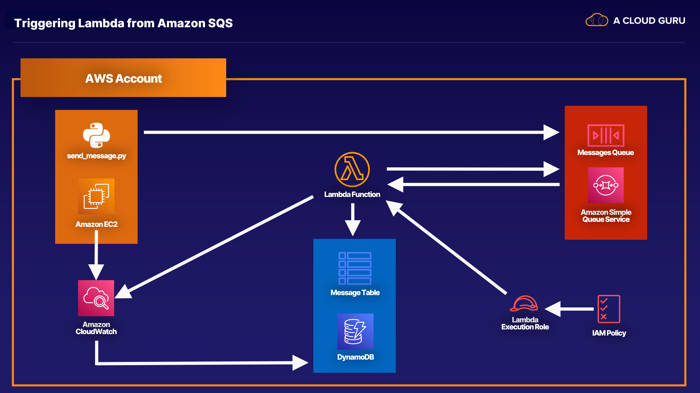

# SQS
1. **What is SQS?**
    - SQS is a message queue service that allows storing messages while waiting for processing by an application or component.
    - It enables reliable queuing of messages between different parts of an application.
2. **Message Queues and Queuing:**
    - A queue is a temporary storage for messages awaiting processing.
    - Messages can include data, instructions, or tasks for components to complete.
3. **Examples of SQS Use:**
    - A meme website example: Images uploaded trigger tasks in Lambda, which send data to SQS for processing by EC2 instances.
    - A travel website example: User searches trigger tasks in EC2 instances, which query airlines via SQS for flight information.
4. **Pull-Based System and Decoupling:**
    - SQS is a pull-based system, where components pull messages from the queue for processing.
    - It helps decouple application components, ensuring tasks are not lost if components fail or if there's a surge in workload.
5. **Key Facts and Exam Tips:**
    - SQS messages can be up to 256 KB in size and are text-based (XML, JSON, plain text).
    - It guarantees message processing at least once.
    - Retention period for messages can be up to 14 days (default is 4 days).
    - SQS is pull-based, ensuring reliable and independent message handling between components.
    - Remember that SQS helps decouple infrastructure components and ensures task continuity even if components fail.

# Understanding SQS Queue Types
1. **Standard Queues:**
    - Default type of SQS queue.
    - Provides best-effort ordering, meaning messages are generally delivered in the same order they were sent but occasional out-of-order delivery or duplicates may occur.
    - Offers a nearly unlimited number of transactions per second.
    - Guarantees that a message will be delivered at least once.
2. **FIFO Queues (First-In-First-Out):**
    - Strictly preserves the order in which messages are sent and received.
    - Provides exactly-once processing, ensuring messages are delivered once and not duplicated.
    - Ideal for scenarios where message order preservation is critical, such as financial transactions.
    - Has a limit of 300 transactions per second but offers the same capabilities as Standard queues.

**Exam Tips:**

- Standard queues provide best-effort ordering and may have occasional duplicates.
- FIFO queues guarantee strict message order preservation and deliver messages exactly once without introducing duplicates.
- FIFO queues are suitable for scenarios where message order and no duplicates are crucial, such as banking applications.

# SQS Settings
1. **Visibility Timeout:**
    - It's the duration a message stays invisible in the SQS queue after being picked up by a consumer.
    - Default is 30 seconds, but you can increase it up to a maximum of 12 hours.
    - If a task takes longer than the timeout, adjust the visibility timeout accordingly to ensure messages aren't reprocessed prematurely.
2. **Short Polling vs. Long Polling:**
    - Short Polling returns an immediate response, even if the queue is empty, leading to additional costs for empty responses.
    - Long Polling waits until a message arrives or the long poll times out, saving costs by avoiding unnecessary responses.
    - Long Polling is generally preferred for cost-effectiveness and is the recommended choice over Short Polling.

**Exam Tips:**

- Understand Visibility Timeout as the duration a message remains invisible during processing, and adjust it based on task completion time.
- Long Polling is preferable over Short Polling for cost-effectiveness and avoiding unnecessary empty responses.
- Always choose Long Polling if given the option between Short Polling and Long Polling.

[Amazon SQS FAQs](https://aws.amazon.com/sqs/faqs/)

[SQS Short and Long Polling](https://docs.aws.amazon.com/AWSSimpleQueueService/latest/SQSDeveloperGuide/sqs-short-and-long-polling.html)

[Amazon SQS visibility timeout](https://docs.aws.amazon.com/AWSSimpleQueueService/latest/SQSDeveloperGuide/sqs-visibility-timeout.html)

# SQS Delay Queues & Large Messages
1. **SQS Delay Queues:**
    - These queues allow you to postpone the delivery of new messages in SQS.
    - Messages remain invisible to consumers for the duration of the delay period, which can be set from 0 to 900 seconds (15 minutes).
    - Delay queues are useful for introducing delays in processing, such as in online retail applications for database updates before confirming transactions.
2. **Managing Large Messages in SQS:**
    - Best practice for large messages (256KB to 2GB) is to store them in S3.
    - To manage large messages in S3, you need the Amazon SQS Extended Client Library for Java and the AWS SDK for Java.
    - The Extended Client Library allows specifying messages to be stored in S3 and provides operations for sending, getting, and deleting message objects from S3.

**Exam Tips:**

- SQS Delay Queues are used to postpone message delivery and are handy for introducing delays in processing.
- For large messages in SQS, store them in S3 using the Extended Client Library and AWS SDK for Java.
- You cannot manage large messages in SQS using the regular AWS CLI, Management Console, or SQS API alone.

# Lab - Triggering AWS Lambda from Amazon SQS


# Simple Notification Service
1. **SNS Overview:**
    - SNS is a web service designed for setting up, operating, and sending notifications from the cloud.
    - It supports various notification formats, including push notifications to mobile devices (Apple, Google, Fire OS, Windows, Android), SMS, emails, and integration with Amazon SQS or HTTP endpoints.
    - SNS can also trigger Lambda functions to process messages or interact with other AWS services.
2. **Pub-Sub Model:**
    - SNS operates on a publish-subscribe model where applications publish messages to topics, and subscribers subscribe to receive messages from those topics.
    - Subscribers can be Lambda functions, SQS queues, email recipients, mobile devices, or HTTP endpoints.
    - SNS delivers messages in appropriately formatted copies to each subscriber based on their subscription type.
3. **Benefits of SNS:**
    - Instantaneous message delivery using a push-based mechanism.
    - Easy to set up and integrate with other AWS services and applications.
    - Flexible message delivery over multiple protocols.
    - Cost-effective with pay-as-you-go pricing and no upfront costs.
    - Highly available and durable with redundancy across multiple availability zones.
4. **Comparison with SQS:**
    - SNS is push-based, delivering messages to subscribers, while SQS is pull-based, requiring applications to actively poll the queue for messages.
    - SNS is ideal for notifications and real-time updates, while SQS is more suitable for decoupling applications and message processing.

**Exam Tips:**

- SNS is focused on notifications and push-based delivery, supporting various message formats and a pub-sub model.
- Remember that SNS is used for sending notifications to subscribers, while SQS is used for message queuing and processing.
- If the exam question mentions a push mechanism for sending messages to subscribers, it refers to SNS. If it mentions a pull mechanism or polling messages from a queue, it refers to SQS.

# SES vs SNS
1. **SES (Simple Email Service):**
    - SES is a scalable and highly available email service designed for sending marketing, notification, and transactional emails.
    - It supports both sending and receiving emails, with incoming emails delivered to an S3 bucket.
    - SES can be used to trigger Lambda functions and SNS notifications based on incoming emails.
    - Use cases for SES include sending automated emails for notifications, purchase confirmations, shipping notifications, order status updates, and marketing communications.
2. **SNS (Simple Notification Service):**
    - SNS is a pub-sub messaging service designed for sending push notifications to subscribers in various formats, including SMS, HTTP, SQS, and email.
    - It supports fan-out messages to multiple endpoints simultaneously.
    - SNS can be used to trigger Lambda functions based on notifications but is not used for receiving incoming notifications.
    - Consumers need to subscribe to topics in SNS to receive notifications.

**Key Differences:**

- SES is focused on email messaging, supporting both sending and receiving emails, while SNS is focused on push notifications and does not support receiving incoming notifications.
- SES requires only an email address to start sending emails, whereas SNS requires subscribers to subscribe to topics before receiving notifications.
- SNS is more versatile, supporting multiple formats and fan-out messages, making it suitable for sophisticated notification workflows.

**Exam Tips:**

- SES is for emails only, supporting sending and receiving emails, including triggering Lambda functions and SNS notifications based on incoming emails.
- SNS supports multiple formats for push notifications, requires subscription to topics for receiving notifications, and supports fan-out messages to multiple recipients simultaneously.
- Understand the use cases and capabilities of SES and SNS to choose the right service for sending emails or push notifications in different scenarios.

# Kinesis 101
1. **Kinesis Overview:**
    - Kinesis is a suite of services that handles streaming data, which is data generated continuously by multiple sources in small sizes.
    - Examples of streaming data include financial transactions, stock prices, in-game data, social media feeds, IoT sensor data, clickstream data, and log files.
    - Kinesis is ideal for high-throughput information that requires real-time analysis and decision-making based on the data.
2. **Kinesis Family of Services:**
a. **Kinesis Data Streams:** Streams data or video for building custom applications that process data in real time. It includes Data Streams for data and Video Streams for video data.
b. **Kinesis Data Firehose:** Captures, transforms, and loads data streams into AWS data stores for near real-time analytics using business intelligence tools.
c. **Kinesis Data Analytics:** Analyzes, queries, and transforms streamed data in real time using standard SQL, storing results in AWS data stores.
3. **Key Concepts:**
    - **Shards:** Unique sequence numbers in Kinesis Streams, providing a fixed unit of capacity for data processing. Increasing shards increases data processing capacity.
    - **Kinesis Video Streams:** Used for securely streaming video from connected devices to AWS for analytics and machine learning.
    - **Kinesis Data Firehose:** Automates data capture, transformation, and loading into AWS data stores without the need for shards or data consumers.
    - **Kinesis Data Analytics:** Allows real-time analytics with standard SQL queries on data from Data Streams and Data Firehose, storing results in AWS data stores.
4. **Exam Tips:**
    - Understand the differences between Kinesis Data Streams, Video Streams, Data Firehose, and Data Analytics.
    - Data Streams and Video Streams handle real-time data capture and processing.
    - Data Firehose automates data loading into AWS data stores for near real-time analytics.
    - Data Analytics enables real-time analytics using SQL queries on streaming data.

Knowing these distinctions will help you choose the right Kinesis service for various streaming data processing needs in different scenarios.

# Demo - Setting Up A Kinesis Data Stream
1. **Architecture Overview:**
    - We used CloudFormation to set up an architecture that includes an EC2 instance running a Java application.
    - The Java application serves as both a data producer and a data consumer.
    - The data producer generates clickstream data, which is sent to the Kinesis Data Stream.
    - The data consumer retrieves data from the Kinesis stream and persists it in DynamoDB.
2. **CloudFormation Setup:**
    - CloudFormation was used to automate the provisioning of services, including the EC2 instance, Kinesis Data Stream, and DynamoDB table.
    - The CloudFormation template provided in the course resources was used to define the architecture.
3. **Deployment Steps:**
    - We navigated to the CloudFormation service in the AWS Management Console.
    - Created a stack using the CloudFormation template URL.
    - Specified parameters such as stack name, instance type, and optional key pair.
    - Reviewed the settings and acknowledged the creation of IAM resources before creating the stack.
4. **Monitoring and Validation:**
    - After the stack creation completed, we monitored events and checked outputs to confirm successful deployment.
    - We accessed the EC2 instance and observed the sample Java application generating and consuming data.
    - Checked the Kinesis Data Stream and DynamoDB table to verify data streaming and persistence.
5. **Cleanup:**
    - It's important to delete the CloudFormation stack after completing the exercises to avoid ongoing charges.
    - This can be done by selecting the stack in CloudFormation and choosing the delete option.

By following these steps, we were able to set up a complete data streaming architecture using Kinesis, EC2, and DynamoDB in an automated and efficient manner.

Kinesis-data-vsi-sample-app-template
```template
{
  "AWSTemplateFormatVersion" : "2010-09-09",

  "Description" : "The Amazon Kinesis Data Visualization Sample Application",

  "Parameters" : {
    "InstanceType" : {
      "Description" : "EC2 instance type",
      "Type" : "String",
      "Default" : "t2.micro",
      "AllowedValues" : [ "t2.micro", "t2.small", "t2.medium", "m3.medium", "m3.large", "m3.xlarge", "m3.2xlarge", "c3.large", "c3.xlarge", "c3.2xlarge", "c3.4xlarge", "c3.8xlarge" ],
      "ConstraintDescription" : "must be a supported EC2 instance type for this template."
    },

    "KeyName" : {
      "Description" : "(Optional) Name of an existing EC2 KeyPair to enable SSH access to the instance. If this is not provided you will not be able to SSH on to the EC2 instance.",
      "Type" : "String",
      "Default" : "",
      "MinLength" : "0",
      "MaxLength" : "255",
      "AllowedPattern" : "[\\x20-\\x7E]*",
      "ConstraintDescription" : "can contain only ASCII characters."
    },

    "SSHLocation" : {
      "Description" : "The IP address range that can be used to SSH to the EC2 instances",
      "Type" : "String",
      "MinLength" : "9",
      "MaxLength" : "18",
      "Default" : "0.0.0.0/0",
      "AllowedPattern" : "(\\d{1,3})\\.(\\d{1,3})\\.(\\d{1,3})\\.(\\d{1,3})/(\\d{1,2})",
      "ConstraintDescription" : "must be a valid IP CIDR range of the form x.x.x.x/x."
    },

    "ApplicationArchive" : {
      "Description" : "A publicly accessible URL to the sample application archive as produced by 'mvn package'",
      "Type" : "String",
      "MinLength" : "7",
      "MaxLength" : "255",
      "Default" : "https://github.com/awslabs/amazon-kinesis-data-visualization-sample/releases/download/v1.1.1/amazon-kinesis-data-visualization-sample-1.1.1-assembly.zip"
    }
  },

  "Conditions": {
    "UseEC2KeyName": {"Fn::Not": [{"Fn::Equals" : [{"Ref" : "KeyName"}, ""]}]}
  },

  "Mappings" : {
    "AWSInstanceType2Arch" : {
      "t2.micro"    : { "Arch" : "64" },
      "t2.small"    : { "Arch" : "64" },
      "t2.medium"   : { "Arch" : "64" },
      "m3.medium"   : { "Arch" : "64" },
      "m3.large"    : { "Arch" : "64" },
      "m3.xlarge"   : { "Arch" : "64" },
      "m3.2xlarge"  : { "Arch" : "64" },
      "c3.large"    : { "Arch" : "64" },
      "c3.xlarge"   : { "Arch" : "64" },
      "c3.2xlarge"  : { "Arch" : "64" },
      "c3.4xlarge"  : { "Arch" : "64" },
      "c3.8xlarge"  : { "Arch" : "64" }
    },

    "AWSRegionArch2AMI" : {
      "us-east-1"      : { "64" : "ami-76817c1e" },
      "us-west-2"      : { "64" : "ami-d13845e1" },
      "eu-west-1"      : { "64" : "ami-892fe1fe" },
      "ap-southeast-1" : { "64" : "ami-a6b6eaf4" },
      "ap-southeast-2" : { "64" : "ami-d9fe9be3" },
      "ap-northeast-1" : { "64" : "ami-29dc9228" }
    }
  },

  "Resources" : {
    "KinesisStream" : {
      "Type" : "AWS::Kinesis::Stream",
      "Properties" : {
        "ShardCount" : "2"
      }
    },

    "KCLDynamoDBTable" : {
      "Type" : "AWS::DynamoDB::Table",
      "Properties" : {
        "AttributeDefinitions" : [
          {
            "AttributeName" : "leaseKey",
            "AttributeType" : "S"
          }
        ],
        "KeySchema" : [
          {
            "AttributeName" : "leaseKey",
            "KeyType" : "HASH"
          }
        ],
        "ProvisionedThroughput" : {
          "ReadCapacityUnits" : "10",
          "WriteCapacityUnits" : "5"
        }
      }
    },

    "CountsDynamoDBTable" : {
      "Type" : "AWS::DynamoDB::Table",
      "Properties" : {
        "AttributeDefinitions" : [
          {
            "AttributeName" : "resource",
            "AttributeType" : "S"
          },
          {
            "AttributeName" : "timestamp",
            "AttributeType" : "S"
          }
        ],
        "KeySchema" : [
          {
            "AttributeName" : "resource",
            "KeyType" : "HASH"
          },
          {
            "AttributeName" : "timestamp",
            "KeyType" : "RANGE"
          }
        ],
        "ProvisionedThroughput" : {
          "ReadCapacityUnits" : "10",
          "WriteCapacityUnits" : "5"
        }
      }
    },

    "Ec2SecurityGroup" : {
      "Type" : "AWS::EC2::SecurityGroup",
      "Properties" : {
        "GroupDescription" : "Enable SSH access and HTTP access on the inbound port",
        "SecurityGroupIngress" :
          [{ "IpProtocol" : "tcp", "FromPort" : "22", "ToPort" : "22", "CidrIp" : { "Ref" : "SSHLocation"} },
           { "IpProtocol" : "tcp", "FromPort" : "80", "ToPort" : "80", "CidrIp" : "0.0.0.0/0"}]
      }
    },

    "EIP" : {
      "Type" : "AWS::EC2::EIP",
      "Properties" : {
        "InstanceId" : { "Ref" : "Ec2Instance" }
      }
    },

    "RootRole": {
       "Type" : "AWS::IAM::Role",
       "Properties" : {
          "AssumeRolePolicyDocument": {
             "Version" : "2012-10-17",
             "Statement" : [ {
                "Effect" : "Allow",
                "Principal" : {
                   "Service" : [ "ec2.amazonaws.com" ]
                },
                "Action" : [ "sts:AssumeRole" ]
             } ]
          },
          "Path" : "/"
       }
    },

    "RolePolicies" : {
       "Type" : "AWS::IAM::Policy",
       "Properties" : {
          "PolicyName" : "root",
          "PolicyDocument" : {
             "Version" : "2012-10-17",
             "Statement" : [ {
                "Effect" : "Allow",
                "Action" : "kinesis:*",
                "Resource" : { "Fn::Join" : [ "", [ "arn:aws:kinesis:", { "Ref" : "AWS::Region" }, ":", { "Ref" : "AWS::AccountId" }, ":stream/", { "Ref" : "KinesisStream" } ]]}
             }, {
                "Effect" : "Allow",
                "Action" : "dynamodb:*",
                "Resource" : { "Fn::Join" : [ "", [ "arn:aws:dynamodb:", { "Ref" : "AWS::Region" }, ":", { "Ref" : "AWS::AccountId" }, ":table/", { "Ref" : "KCLDynamoDBTable" } ]]}
             }, {
                "Effect" : "Allow",
                "Action" : "dynamodb:*",
                "Resource" : { "Fn::Join" : [ "", [ "arn:aws:dynamodb:", { "Ref" : "AWS::Region" }, ":", { "Ref" : "AWS::AccountId" }, ":table/", { "Ref" : "CountsDynamoDBTable" } ]]}
             }, {
                "Effect" : "Allow",
                "Action" : "cloudwatch:*",
                "Resource" : "*"
             } ]
          },
          "Roles" : [ { "Ref": "RootRole" } ]
       }
    },

    "RootInstanceProfile" : {
       "Type" : "AWS::IAM::InstanceProfile",
       "Properties" : {
          "Path" : "/",
          "Roles" : [ { "Ref": "RootRole" } ]
       }
    },

    "Ec2Instance": {
      "Type" : "AWS::EC2::Instance",
      "Metadata" : {
        "AWS::CloudFormation::Init" : {
          "config" : {
            "packages" : {
              "yum" : {
                "java-1.7.0-openjdk" : []
              }
            },
            "files" : {
              "/var/kinesis-data-vis-sample-app/watchdog.sh" : {
                "content" : {"Fn::Join" : ["", [
                  "#!/bin/bash\n",
                  "if ! ps aux | grep HttpReferrerCounterApplication | grep -v grep ; then\n",
                  "    # Launch the Kinesis application for counting HTTP referrer pairs\n",
                  "    java -cp /var/kinesis-data-vis-sample-app/lib/\\* com.amazonaws.services.kinesis.samples.datavis.HttpReferrerCounterApplication ", { "Ref" : "KCLDynamoDBTable" }, " ", { "Ref" : "KinesisStream" }, " ", { "Ref" : "CountsDynamoDBTable" }, " ", { "Ref" : "AWS::Region" }, " &>> /home/ec2-user/kinesis-data-vis-sample-app-kcl.log &\n",
                  "fi\n",
                  "if ! ps aux | grep HttpReferrerStreamWriter | grep -v grep ; then\n",
                  "    # Launch our Kinesis stream writer to fill our stream with generated HTTP (resource, referrer) pairs.\n",
                  "    # This will create a writer with 5 threads to send records indefinitely.\n",
                  "    java -cp /var/kinesis-data-vis-sample-app/lib/\\* com.amazonaws.services.kinesis.samples.datavis.HttpReferrerStreamWriter 5 ",  { "Ref" : "KinesisStream" }, " ", { "Ref" : "AWS::Region" }, " &>> /home/ec2-user/kinesis-data-vis-sample-app-publisher.log &\n",
                  "fi\n",
                  "if ! ps aux | grep WebServer | grep -v grep ; then\n",
                  "    # Launch the webserver\n",
                  "    java -cp /var/kinesis-data-vis-sample-app/lib/\\* com.amazonaws.services.kinesis.samples.datavis.WebServer 80 /var/kinesis-data-vis-sample-app/wwwroot ", { "Ref" : "CountsDynamoDBTable" }, " ", { "Ref" : "AWS::Region" }, " &>> /home/ec2-user/kinesis-data-vis-sample-app-www.log &\n",
                  "fi\n"
                ]]},
                "mode" : "000755",
                "owner" : "ec2-user",
                "group" : "ec2-user"
              },
              "/var/kinesis-data-vis-sample-app/crontask" : {
                "content" : {"Fn::Join" : ["", [
                  "* * * * * bash /var/kinesis-data-vis-sample-app/watchdog.sh\n"
                ]]},
                "mode" : "000644",
                "owner" : "ec2-user",
                "group" : "ec2-user"
              }
            },
            "sources": {
              "/var/kinesis-data-vis-sample-app" : { "Ref" : "ApplicationArchive" }
            }
          }
        }
      },

      "Properties" : {
        "KeyName" : { "Fn::If" : [ "UseEC2KeyName", { "Ref" : "KeyName" }, { "Ref" : "AWS::NoValue" } ]},
        "ImageId" : { "Fn::FindInMap" : [ "AWSRegionArch2AMI", { "Ref" : "AWS::Region" },
                                          { "Fn::FindInMap" : [ "AWSInstanceType2Arch", { "Ref" : "InstanceType" },
                                          "Arch" ] } ] },
        "InstanceType" : { "Ref" : "InstanceType" },
        "SecurityGroups" : [{ "Ref" : "Ec2SecurityGroup" }],
        "IamInstanceProfile": { "Ref": "RootInstanceProfile" },
        "UserData"       : { "Fn::Base64" : { "Fn::Join" : ["", [
          "#!/bin/bash\n",
          "yum update -y aws-cfn-bootstrap\n",

          "/opt/aws/bin/cfn-init -s ", { "Ref" : "AWS::StackId" }, " -r Ec2Instance ",
          "         --region ", { "Ref" : "AWS::Region" }, "\n",

          "# Register watchdog script with cron\n",
          "crontab /var/kinesis-data-vis-sample-app/crontask\n",

          "# Launch watchdog script immediately so if it fails this stack fails to start\n",
          "/var/kinesis-data-vis-sample-app/watchdog.sh\n",

          "/opt/aws/bin/cfn-signal -e $? '", { "Ref" : "WaitHandle" }, "'\n"
        ]]}}
      }
    },

    "WaitHandle" : {
      "Type" : "AWS::CloudFormation::WaitConditionHandle"
    },

    "WaitCondition" : {
      "Type" : "AWS::CloudFormation::WaitCondition",
      "DependsOn" : "Ec2Instance",
      "Properties" : {
        "Handle" : {"Ref" : "WaitHandle"},
        "Timeout" : "600"
      }
    }
  },
  "Outputs" : {
    "URL" : {
      "Description" : "URL to the sample application's visualization",
      "Value" : { "Fn::Join" : [ "", [ "http://", { "Fn::GetAtt" : [ "Ec2Instance", "PublicDnsName" ] }]]}
    },
    "InstanceId" : {
      "Description" : "InstanceId of the newly created EC2 instance",
      "Value" : { "Ref" : "Ec2Instance" }
    },
    "AZ" : {
      "Description" : "Availability Zone of the newly created EC2 instance",
      "Value" : { "Fn::GetAtt" : [ "Ec2Instance", "AvailabilityZone" ] }
    },
    "StreamName" : {
      "Description" : "The name of the Kinesis Stream. This was autogenerated by the Kinesis Resource named 'KinesisStream'",
      "Value" : { "Ref" : "KinesisStream" }
    },
    "ApplicationName" : {
      "Description" : "The name of the Kinesis Client Application. This was autogenerated by the DynamoDB Resource named 'KCLDynamoDBTable'",
      "Value" : { "Ref" : "KCLDynamoDBTable" }
    },
    "CountsTable" : {
      "Description" : "The name of the DynamoDB table where counts are persisted. This was autogenerated by the DynamoDB Resource named 'CountsDynamoDBTable'",
      "Value" : { "Ref" : "CountsDynamoDBTable" }
    }
  }
}

```

CloudFormation Template
```template
{
  "AWSTemplateFormatVersion" : "2010-09-09",

  "Description" : "The Amazon Kinesis Data Visualization Sample Application",

  "Parameters" : {
    "InstanceType" : {
      "Description" : "EC2 instance type",
      "Type" : "String",
      "Default" : "t2.micro",
      "AllowedValues" : [ "t2.micro", "t2.small", "t2.medium", "m3.medium", "m3.large", "m3.xlarge", "m3.2xlarge", "c3.large", "c3.xlarge", "c3.2xlarge", "c3.4xlarge", "c3.8xlarge" ],
      "ConstraintDescription" : "must be a supported EC2 instance type for this template."
    },

    "KeyName" : {
      "Description" : "(Optional) Name of an existing EC2 KeyPair to enable SSH access to the instance. If this is not provided you will not be able to SSH on to the EC2 instance.",
      "Type" : "String",
      "Default" : "",
      "MinLength" : "0",
      "MaxLength" : "255",
      "AllowedPattern" : "[\\x20-\\x7E]*",
      "ConstraintDescription" : "can contain only ASCII characters."
    },

    "SSHLocation" : {
      "Description" : "The IP address range that can be used to SSH to the EC2 instances",
      "Type" : "String",
      "MinLength" : "9",
      "MaxLength" : "18",
      "Default" : "0.0.0.0/0",
      "AllowedPattern" : "(\\d{1,3})\\.(\\d{1,3})\\.(\\d{1,3})\\.(\\d{1,3})/(\\d{1,2})",
      "ConstraintDescription" : "must be a valid IP CIDR range of the form x.x.x.x/x."
    },

    "ApplicationArchive" : {
      "Description" : "A publicly accessible URL to the sample application archive as produced by 'mvn package'",
      "Type" : "String",
      "MinLength" : "7",
      "MaxLength" : "255",
      "Default" : "https://github.com/awslabs/amazon-kinesis-data-visualization-sample/releases/download/v1.1.1/amazon-kinesis-data-visualization-sample-1.1.1-assembly.zip"
    }
  },

  "Conditions": {
    "UseEC2KeyName": {"Fn::Not": [{"Fn::Equals" : [{"Ref" : "KeyName"}, ""]}]}
  },

  "Mappings" : {
    "AWSInstanceType2Arch" : {
      "t2.micro"    : { "Arch" : "64" },
      "t2.small"    : { "Arch" : "64" },
      "t2.medium"   : { "Arch" : "64" },
      "m3.medium"   : { "Arch" : "64" },
      "m3.large"    : { "Arch" : "64" },
      "m3.xlarge"   : { "Arch" : "64" },
      "m3.2xlarge"  : { "Arch" : "64" },
      "c3.large"    : { "Arch" : "64" },
      "c3.xlarge"   : { "Arch" : "64" },
      "c3.2xlarge"  : { "Arch" : "64" },
      "c3.4xlarge"  : { "Arch" : "64" },
      "c3.8xlarge"  : { "Arch" : "64" }
    },

    "AWSRegionArch2AMI" : {
      "us-east-1"      : { "64" : "ami-0dfcb1ef8550277af" },
      "us-west-2"      : { "64" : "ami-0f1a5f5ada0e7da53" },
      "eu-west-1"      : { "64" : "ami-06e0ce9d3339cb039" },
      "ap-southeast-1" : { "64" : "ami-0f2eac25772cd4e36" },
      "ap-southeast-2" : { "64" : "ami-0692dea0a2f8a1b35" },
      "ap-northeast-1" : { "64" : "ami-0ffac3e16de16665e" }
    }
  },

  "Resources" : {
    "KinesisStream" : {
      "Type" : "AWS::Kinesis::Stream",
      "Properties" : {
        "ShardCount" : "2"
      }
    },

    "KCLDynamoDBTable" : {
      "Type" : "AWS::DynamoDB::Table",
      "Properties" : {
        "AttributeDefinitions" : [
          {
            "AttributeName" : "leaseKey",
            "AttributeType" : "S"
          }
        ],
        "KeySchema" : [
          {
            "AttributeName" : "leaseKey",
            "KeyType" : "HASH"
          }
        ],
        "ProvisionedThroughput" : {
          "ReadCapacityUnits" : "10",
          "WriteCapacityUnits" : "5"
        }
      }
    },

    "CountsDynamoDBTable" : {
      "Type" : "AWS::DynamoDB::Table",
      "Properties" : {
        "AttributeDefinitions" : [
          {
            "AttributeName" : "resource",
            "AttributeType" : "S"
          },
          {
            "AttributeName" : "timestamp",
            "AttributeType" : "S"
          }
        ],
        "KeySchema" : [
          {
            "AttributeName" : "resource",
            "KeyType" : "HASH"
          },
          {
            "AttributeName" : "timestamp",
            "KeyType" : "RANGE"
          }
        ],
        "ProvisionedThroughput" : {
          "ReadCapacityUnits" : "10",
          "WriteCapacityUnits" : "5"
        }
      }
    },

    "Ec2SecurityGroup" : {
      "Type" : "AWS::EC2::SecurityGroup",
      "Properties" : {
        "GroupDescription" : "Enable SSH access and HTTP access on the inbound port",
        "SecurityGroupIngress" :
          [{ "IpProtocol" : "tcp", "FromPort" : "22", "ToPort" : "22", "CidrIp" : { "Ref" : "SSHLocation"} },
           { "IpProtocol" : "tcp", "FromPort" : "80", "ToPort" : "80", "CidrIp" : "0.0.0.0/0"}]
      }
    },

    "EIP" : {
      "Type" : "AWS::EC2::EIP",
      "Properties" : {
        "InstanceId" : { "Ref" : "Ec2Instance" }
      }
    },

    "RootRole": {
       "Type" : "AWS::IAM::Role",
       "Properties" : {
          "AssumeRolePolicyDocument": {
             "Version" : "2012-10-17",
             "Statement" : [ {
                "Effect" : "Allow",
                "Principal" : {
                   "Service" : [ "ec2.amazonaws.com" ]
                },
                "Action" : [ "sts:AssumeRole" ]
             } ]
          },
          "Path" : "/"
       }
    },

    "RolePolicies" : {
       "Type" : "AWS::IAM::Policy",
       "Properties" : {
          "PolicyName" : "root",
          "PolicyDocument" : {
             "Version" : "2012-10-17",
             "Statement" : [ {
                "Effect" : "Allow",
                "Action" : "kinesis:*",
                "Resource" : { "Fn::Join" : [ "", [ "arn:aws:kinesis:", { "Ref" : "AWS::Region" }, ":", { "Ref" : "AWS::AccountId" }, ":stream/", { "Ref" : "KinesisStream" } ]]}
             }, {
                "Effect" : "Allow",
                "Action" : "dynamodb:*",
                "Resource" : { "Fn::Join" : [ "", [ "arn:aws:dynamodb:", { "Ref" : "AWS::Region" }, ":", { "Ref" : "AWS::AccountId" }, ":table/", { "Ref" : "KCLDynamoDBTable" } ]]}
             }, {
                "Effect" : "Allow",
                "Action" : "dynamodb:*",
                "Resource" : { "Fn::Join" : [ "", [ "arn:aws:dynamodb:", { "Ref" : "AWS::Region" }, ":", { "Ref" : "AWS::AccountId" }, ":table/", { "Ref" : "CountsDynamoDBTable" } ]]}
             }, {
                "Effect" : "Allow",
                "Action" : "cloudwatch:*",
                "Resource" : "*"
             } ]
          },
          "Roles" : [ { "Ref": "RootRole" } ]
       }
    },

    "RootInstanceProfile" : {
       "Type" : "AWS::IAM::InstanceProfile",
       "Properties" : {
          "Path" : "/",
          "Roles" : [ { "Ref": "RootRole" } ]
       }
    },

    "Ec2Instance": {
      "Type" : "AWS::EC2::Instance",
      "Metadata" : {
        "AWS::CloudFormation::Init" : {
          "config" : {
            "packages" : {
              "yum" : {
                "java-1.7.0-openjdk" : []
              }
            },
            "files" : {
              "/var/kinesis-data-vis-sample-app/watchdog.sh" : {
                "content" : {"Fn::Join" : ["", [
                  "#!/bin/bash\n",
                  "if ! ps aux | grep HttpReferrerCounterApplication | grep -v grep ; then\n",
                  "    # Launch the Kinesis application for counting HTTP referrer pairs\n",
                  "    java -cp /var/kinesis-data-vis-sample-app/lib/\\* com.amazonaws.services.kinesis.samples.datavis.HttpReferrerCounterApplication ", { "Ref" : "KCLDynamoDBTable" }, " ", { "Ref" : "KinesisStream" }, " ", { "Ref" : "CountsDynamoDBTable" }, " ", { "Ref" : "AWS::Region" }, " &>> /home/ec2-user/kinesis-data-vis-sample-app-kcl.log &\n",
                  "fi\n",
                  "if ! ps aux | grep HttpReferrerStreamWriter | grep -v grep ; then\n",
                  "    # Launch our Kinesis stream writer to fill our stream with generated HTTP (resource, referrer) pairs.\n",
                  "    # This will create a writer with 5 threads to send records indefinitely.\n",
                  "    java -cp /var/kinesis-data-vis-sample-app/lib/\\* com.amazonaws.services.kinesis.samples.datavis.HttpReferrerStreamWriter 5 ",  { "Ref" : "KinesisStream" }, " ", { "Ref" : "AWS::Region" }, " &>> /home/ec2-user/kinesis-data-vis-sample-app-publisher.log &\n",
                  "fi\n",
                  "if ! ps aux | grep WebServer | grep -v grep ; then\n",
                  "    # Launch the webserver\n",
                  "    java -cp /var/kinesis-data-vis-sample-app/lib/\\* com.amazonaws.services.kinesis.samples.datavis.WebServer 80 /var/kinesis-data-vis-sample-app/wwwroot ", { "Ref" : "CountsDynamoDBTable" }, " ", { "Ref" : "AWS::Region" }, " &>> /home/ec2-user/kinesis-data-vis-sample-app-www.log &\n",
                  "fi\n"
                ]]},
                "mode" : "000755",
                "owner" : "ec2-user",
                "group" : "ec2-user"
              },
              "/var/kinesis-data-vis-sample-app/crontask" : {
                "content" : {"Fn::Join" : ["", [
                  "* * * * * bash /var/kinesis-data-vis-sample-app/watchdog.sh\n"
                ]]},
                "mode" : "000644",
                "owner" : "ec2-user",
                "group" : "ec2-user"
              }
            },
            "sources": {
              "/var/kinesis-data-vis-sample-app" : { "Ref" : "ApplicationArchive" }
            }
          }
        }
      },

      "Properties" : {
        "KeyName" : { "Fn::If" : [ "UseEC2KeyName", { "Ref" : "KeyName" }, { "Ref" : "AWS::NoValue" } ]},
        "ImageId" : { "Fn::FindInMap" : [ "AWSRegionArch2AMI", { "Ref" : "AWS::Region" },
                                          { "Fn::FindInMap" : [ "AWSInstanceType2Arch", { "Ref" : "InstanceType" },
                                          "Arch" ] } ] },
        "InstanceType" : { "Ref" : "InstanceType" },
        "SecurityGroups" : [{ "Ref" : "Ec2SecurityGroup" }],
        "IamInstanceProfile": { "Ref": "RootInstanceProfile" },
        "UserData"       : { "Fn::Base64" : { "Fn::Join" : ["", [
          "#!/bin/bash\n",
          "yum update -y aws-cfn-bootstrap\n",

          "/opt/aws/bin/cfn-init -s ", { "Ref" : "AWS::StackId" }, " -r Ec2Instance ",
          "         --region ", { "Ref" : "AWS::Region" }, "\n",

          "# Register watchdog script with cron\n",
          "crontab /var/kinesis-data-vis-sample-app/crontask\n",

          "# Launch watchdog script immediately so if it fails this stack fails to start\n",
          "/var/kinesis-data-vis-sample-app/watchdog.sh\n",

          "/opt/aws/bin/cfn-signal -e $? '", { "Ref" : "WaitHandle" }, "'\n"
        ]]}}
      }
    },

    "WaitHandle" : {
      "Type" : "AWS::CloudFormation::WaitConditionHandle"
    },

    "WaitCondition" : {
      "Type" : "AWS::CloudFormation::WaitCondition",
      "DependsOn" : "Ec2Instance",
      "Properties" : {
        "Handle" : {"Ref" : "WaitHandle"},
        "Timeout" : "600"
      }
    }
  },
  "Outputs" : {
    "URL" : {
      "Description" : "URL to the sample application's visualization",
      "Value" : { "Fn::Join" : [ "", [ "http://", { "Fn::GetAtt" : [ "Ec2Instance", "PublicDnsName" ] }]]}
    },
    "InstanceId" : {
      "Description" : "InstanceId of the newly created EC2 instance",
      "Value" : { "Ref" : "Ec2Instance" }
    },
    "AZ" : {
      "Description" : "Availability Zone of the newly created EC2 instance",
      "Value" : { "Fn::GetAtt" : [ "Ec2Instance", "AvailabilityZone" ] }
    },
    "StreamName" : {
      "Description" : "The name of the Kinesis Stream. This was autogenerated by the Kinesis Resource named 'KinesisStream'",
      "Value" : { "Ref" : "KinesisStream" }
    },
    "ApplicationName" : {
      "Description" : "The name of the Kinesis Client Application. This was autogenerated by the DynamoDB Resource named 'KCLDynamoDBTable'",
      "Value" : { "Ref" : "KCLDynamoDBTable" }
    },
    "CountsTable" : {
      "Description" : "The name of the DynamoDB table where counts are persisted. This was autogenerated by the DynamoDB Resource named 'CountsDynamoDBTable'",
      "Value" : { "Ref" : "CountsDynamoDBTable" }
    }
  }
}
```

# Kinesis Shards and Consumers
1. **Overview of Kinesis:**
    - Kinesis is a service that handles real-time streaming data, including unstructured data like clickstream data, video/audio data, and logs.
    - A Kinesis stream consists of multiple shards, where each shard is a sequence of data records with unique sequence numbers.
    - The data capacity of a Kinesis stream is determined by the total capacity of its shards.
2. **Consumers and Kinesis Client Library:**
    - Consumers in Kinesis are typically EC2 instances running the Kinesis Client Library.
    - The Kinesis Client Library tracks the number of shards in the stream and adjusts the number of record processors accordingly.
    - Each shard has its own record processor, and the Client Library manages them based on the number of shards and consumer instances.
    - Load balancing is handled by the Client Library, distributing record processors evenly across consumer instances.
3. **Scaling Consumers and Shards:**
    - It's recommended to ensure that the number of consumer instances does not exceed the number of shards, except for failover or standby purposes.
    - The processing load of one shard (up to 2MB/s read and 1MB/s write) typically doesn't require multiple EC2 instances.
    - CPU utilization should drive the decision to scale consumer instances, not the number of shards.
    - Auto-scaling groups can be used with CPU load metrics for efficient scaling of consumer instances.
4. **Exam Tips:**
    - Understand that the Kinesis Client Library manages the number of record processors based on the number of shards and consumers.
    - Increasing shards may require adding more record processors, but scaling consumer instances should be based on CPU load.
    - CPU utilization is a key factor in determining the number of consumer instances, not the number of shards.

By grasping these concepts, you'll be well-prepared for understanding Kinesis shards and consumer scaling in the AWS environment.

# Introducing Elastic Beanstalk
1. **What is Elastic Beanstalk?**
    - Elastic Beanstalk is a service that simplifies the deployment and scaling of web applications on AWS.
    - It supports a wide range of programming languages such as Java, .NET, PHP, Node.js, Python, Ruby, and Go.
    - Developers can focus on writing code while Elastic Beanstalk handles the underlying infrastructure, including provisioning EC2 instances, load balancers, Auto Scaling groups, and application server platforms like Apache Tomcat.
    - It integrates with Docker containers and can create S3 buckets and databases as needed for your application.
2. **Benefits of Elastic Beanstalk:**
    - Simplifies infrastructure provisioning and management, allowing developers to focus on coding.
    - Handles application platform setup, including installation, patching, and updates.
    - Integrates with CloudTrail and CloudWatch for monitoring and includes its own health dashboard.
    - Provides administrative control while managing AWS resources efficiently.
    - No additional charges for using Elastic Beanstalk; you only pay for the resources you use.
3. **Exam Tips:**
    - Elastic Beanstalk is the quickest way to deploy and scale web applications on AWS.
    - Supports popular programming languages and managed platforms like Apache Tomcat and Docker.
    - Handles provisioning of AWS resources and automates systems administration tasks.
    - Integrates with monitoring tools and provides administrative control options.

In summary, Elastic Beanstalk is a powerful tool for developers to streamline the deployment and management of web applications on AWS, allowing for faster time-to-market and reduced administrative overhead.

[Elastic Beanstalk supported platforms](https://docs.aws.amazon.com/elasticbeanstalk/latest/dg/concepts.platforms.html)

# Updating Elastic Beanstalk
1. **All at Once Deployment:**
    - Simultaneously deploys the new version to all instances.
    - Causes a total outage during deployment.
    - Suitable for non-production environments but not recommended for mission-critical systems due to downtime and rollback complexity.
2. **Rolling Updates:**
    - Deploys the new version in batches, reducing capacity temporarily.
    - No outage during deployment but may impact performance.
    - Suitable for non-performance-sensitive applications where downtime is acceptable.
3. **Rolling with Additional Batch:**
    - Launches additional instances to maintain full capacity during deployment.
    - Reduces the risk of performance degradation but requires a further rolling update for rollback.
4. **Immutable Deployments:**
    - Deploys the new version to fresh instances without touching the live environment.
    - Ideal for mission-critical systems as it minimizes downtime and provides quick rollback capabilities.
5. **Traffic Splitting:**
    - Performs an immutable deployment and splits traffic between old and new versions.
    - Allows for Canary testing and is suitable for mission-critical systems with minimal downtime requirements.

In summary, the best deployment approach depends on the specific needs of your application. For mission-critical systems, immutable deployments or traffic splitting are preferred to minimize downtime and facilitate quick rollbacks. All at Once deployments are suitable for non-production environments, while rolling updates are suitable for non-performance-sensitive applications.

# Demo - Deploying An Application With Elastic Beanstalk

[Elastic Beanstalk code - Version 1](https://github.com/ACloudGuru-Resources/course-aws-certified-developer-associate/tree/main/Deploying_An_App_With_Elastic_Beanstalk_Demo)

Updated Demo Instructions
```command
# Deploying An Application With Elastic Beanstalk - Demo
# https://learn.acloud.guru/course/aws-certified-developer-associate/learn/d36a1363-452a-8007-e874-54f19b10c0b7/baf22738-24ef-2c52-39e1-9576859a3e64/watch

# To create your example application, you'll use the 'Create application' console wizard. It creates an Elastic Beanstalk application and launches an environment within it. An environment is the collection of AWS resources required to run your application code.

# To create a service role for Elastic Beanstalk:

1. Open the Identity and Access Management (IAM) console.
2. Click 'Roles'.
3. Click 'Create role'.
4. Under 'Use cases for other AWS services', choose 'Elastic Beanstalk', select 'Elastic Beanstalk - Customizable', and click 'Next'.
5. Click 'Next'.
6. For 'Role name', type 'CustomServiceRoleForElasticBeanstalk'.
7. Click 'Create role'.

# To create an EC2 instance profile for Elastic Beanstalk:

1. Open the Identity and Access Management (IAM) console.
2. Click 'Roles'.
3. Click 'Create role'.
4. Under 'Common use cases', choose 'EC2'.
5. Click 'Next'.
6. Select the 'AWSElasticBeanstalkReadOnly' policy name.
7. Click 'Next'.
8. For 'Role name', type 'CustomEC2InstanceProfileForElasticBeanstalk'.
9. Click 'Create role'.

# To create an example application:

1. Open the Elastic Beanstalk console.
2. Click 'Create application'.
3. For Application name enter 'Hello Cloud Gurus'.
4. For Platform, choose 'PHP'.
5. Under 'Application code', select 'Upload your code', type 'v1' under 'Version label', select 'Local file' > 'Choose file' and upload the 'aws-cda-EBS_Demo_V1.zip' file available under the RESOURCES section of the lesson. Click 'Next'.
6. For 'Use an existing service role', choose 'CustomServiceRoleForElasticBeanstalk'.
7. For 'EC2 instance profile', choose CustomEC2InstanceProfileForElasticBeanstalk'.
8. Click 'Next'.
9. On the 'Set up networking, database, and tags - optional' page, click 'Next'.
10. On the 'Configure instance traffic and scaling - optional' page, click 'Next'.
11. On the 'Configure updates, monitoring, and logging - optional' page, under 'System' choose 'Basic', and under 'Managed platform updates' > 'Managed updates', uncheck the 'Activated' box. Click 'Next'.
12. The Review page displays a summary of all your choices. Choose 'Submit' at the bottom of the page.
13. Wait for the 'Successfully launched environment: HelloCloudGurus-env' event and check the URL available under 'Environment overview' > 'Domain'.
```

# Demo - Updating An Application In Elastic Beanstalk
1. We began with version 1 of our application running on Elastic Beanstalk.
2. We uploaded version 2 of our code to Elastic Beanstalk.
3. We deployed version 2 of our application using the Elastic Beanstalk console.
4. We selected the deployment policy (in this case, all at once) from the Elastic Beanstalk console.
5. We monitored the deployment progress in the Events page of the Elastic Beanstalk console.
6. Once the deployment was successful, we verified that version 2 of our application was running by accessing the URL.

The key takeaway is that updating an application with Elastic Beanstalk is straightforward. You just need to upload the new code, and Elastic Beanstalk handles the deployment process for you.

[GitHub Repository](https://github.com/ACloudGuru-Resources/course-aws-certified-developer-associate/tree/main/Updating_An_App_With_Elastic_Beanstalk_Demo)

# Advanced Elastic Beanstalk
In this lecture, we delved into advanced topics related to customizing Elastic Beanstalk environments, particularly focusing on differences between Amazon Linux 1 and Amazon Linux 2 environments.

For Amazon Linux 1 environments, we can use .ebextensions to customize our environment. These configuration files can define packages to install, Linux users and groups, shell commands, services, and load balancer configurations. These files are written in YAML or JSON format with a .config extension and must be located in a folder named .ebextensions in the top-level directory of the application source code bundle.

Here's an example configuration file for Amazon Linux 1:
```yaml
option_settings:
  aws:elasticbeanstalk:application:environment:
    HEALTH_CHECK_URL: "/health"
```
On the other hand, for Amazon Linux 2 environments, Elastic Beanstalk recommends using Buildfile, Procfile, and platform hooks. The Buildfile is for short-running commands, Procfile is for long-running application processes, and platform hooks are for custom scripts or executables that run at specific stages of EC2 provisioning.

Here's a summary of customization methods for Amazon Linux 2:

Buildfile: For short-running commands like shell scripts.
Procfile: For long-running application processes.
Platform hooks: For custom scripts or executables at different stages of EC2 provisioning.
The directory structure for platform hooks should be organized as follows:
```bash
.platform/hooks/
  prebuild/
  predeploy/
  postdeploy/
```
Remember, .ebextensions is specific to Amazon Linux 1, while Buildfile, Procfile, and platform hooks are for Amazon Linux 2.

Understanding these customization methods is crucial for managing and configuring Elastic Beanstalk environments according to specific requirements.

Additional note
(- Customizing Elastic Beanstalk environments is essential, and the methods vary based on whether you're using Amazon Linux 1 or Amazon Linux 2.
- For Amazon Linux 1, you can use .ebextensions to define packages, create users/groups, run shell commands, enable services, and configure load balancers. These configuration files are in YAML or JSON format with a .config extension and are stored in a folder named .ebextensions.
- An example is configuring an application health check URL for load balancer use.
- Amazon Linux 2 recommends using Buildfile, Procfile, and platform hooks for customization during EC2 provisioning.
- Buildfile is for short commands that exit upon completion (e.g., shell scripts), Procfile is for long-running application processes, and platform hooks run custom scripts during specific stages of provisioning.
- Platform hooks have three directories: prebuild (before application setup), predeploy (after setup but before deployment), and postdeploy (after deployment completion).
- Customization methods differ for Amazon Linux 1 (.ebextensions) and Amazon Linux 2 (Buildfile, Procfile, platform hooks).

These customization methods are crucial for managing Elastic Beanstalk environments effectively based on your system's requirements.)

[Extending Elastic Beanstalk Linux platforms](https://docs.aws.amazon.com/elasticbeanstalk/latest/dg/platforms-linux-extend.html)

[AWS Elastic Beanstalk FAQs](https://aws.amazon.com/elasticbeanstalk/faqs/)

[Amazon Linux AMI (AL1) platform retirement FAQ](https://docs.aws.amazon.com/elasticbeanstalk/latest/dg/using-features.migration-al.FAQ.html)

# RDS & Elastic Beanstalk
- Elastic Beanstalk offers two integration options for RDS:
    1. Deploying RDS inside Elastic Beanstalk:
        - Quick setup suitable for development and testing.
        - However, terminating the Beanstalk environment also terminates the database.
    2. Launching RDS outside Elastic Beanstalk:
        - Preferred for production as it allows flexibility in managing application servers and databases independently.
        - Requires additional configuration steps for communication and connection string setup.
- Configuration steps for Option 2 (RDS outside Elastic Beanstalk):
    1. Add a security group to allow EC2 instances to communicate with the RDS database.
    2. Provide connection string information using Elastic Beanstalk environment properties.
- Recommended approach:
    - For development and test environments, deploying RDS inside Elastic Beanstalk is quick and easy.
    - For production environments, deploying RDS outside Elastic Beanstalk offers flexibility and independence.

In summary, understanding the pros and cons of each integration option helps in making informed decisions based on the deployment needs, especially in terms of flexibility and management of resources.

# Migrating Applications to Elastic Beanstalk
- Scenario: Migrating a .NET application from Windows servers in a data center to AWS and running it in an Elastic Beanstalk environment.
- Tool: AWS provides the Windows Web Application Migration Assistant for Elastic Beanstalk (formerly known as the .NET Migration Assistant).
- Functionality: The tool is an interactive PowerShell utility that migrates .NET applications or entire websites from on-premises Windows servers to Elastic Beanstalk on AWS.
- Features: After migration, Elastic Beanstalk handles capacity provisioning, load balancing, auto-scaling, application health monitoring, and applies patches and updates to the underlying platform.
- Availability: The tool is open-source and available on GitHub, providing a purpose-built solution for migrating .NET applications to Elastic Beanstalk.
- Exam Tips: Understanding the tool's purpose and functionality is important for the exam, without needing to know its detailed technical aspects.

In summary, the Windows Web Application Migration Assistant for Elastic Beanstalk streamlines the migration of .NET applications to Elastic Beanstalk environments on AWS, offering automated management and scalability features post-migration.

[Migration Assistant Tool](https://github.com/awslabs/windows-web-app-migration-assistant)

# Other AWS Services Summary
1. **SQS (Simple Queue Service):**
    - Decouples application components.
    - Two types of queues: standard and FIFO.
    - Standard queues offer best-effort ordering and may have duplicate messages.
    - FIFO queues strictly preserve message order and eliminate duplicates.
    - Visibility timeout: default 30 seconds, can be increased up to 12 hours.
    - Short polling returns responses immediately, even if the queue is empty.
    - Long polling reduces costs by only responding when messages are in the queue.
2. **SQS Delay Queues:**
    - Postpones delivery of new messages for a specified delay period.
3. **Large SQS Messages:**
    - Handles large messages by storing payloads in S3.
    - Requires SQS Extended Client Library for Java and AWS SDK for Java for S3 operations.
4. **SNS (Simple Notification Service):**
    - Supports multiple notification formats: SMS, SQS, HTTP, email.
    - Push notifications, subscribers must subscribe to topics.
    - Supports fanout for duplicate message distribution to multiple recipients.
5. **SES (Simple Email Service):**
    - For sending and receiving emails only.
    - Not subscription-based, requires recipient's email address.
    - Great for automated emails like marketing promotions.
6. **Comparison between SNS and SQS:**
    - SNS is push-based, delivering notifications to subscribers.
    - SQS is pull-based, with consumers polling the queue for messages.
7. **Kinesis:**
    - Kinesis Streams: Captures and stores streaming video and data for real-time processing.
    - Kinesis Data Firehose: Captures, transforms, and loads data continuously into AWS data stores or other providers.
    - Kinesis Data Analytics: Provides real-time analytics using standard SQL on data received by Kinesis Streams and Firehose.
    - Shards determine the capacity of a Kinesis Stream, and you can increase capacity by adding shards.
    - Consumers use the Kinesis Client Library, and scaling should be based on CPU utilization, not shard count.

Understanding these key points will help in preparing for the exam and grasping the concepts related to SQS, SNS, SES, and Kinesis.

# Quiz

.png>) 
.png>) 
.png>) 
.png>) 
.png>) 
.png>) 
.png>) 
.png>) 
.png>) 
.png>) 
.png>) 
.png>) 
.png>) 
.png>) 
.png>) 
.png>) 
.png>) 
.png>) 
.png>) 
.png>) 
.png>) 
.png>) 
.png>) 
.png>) 
.png>) 
.png>) 
.png>) 
.png>)