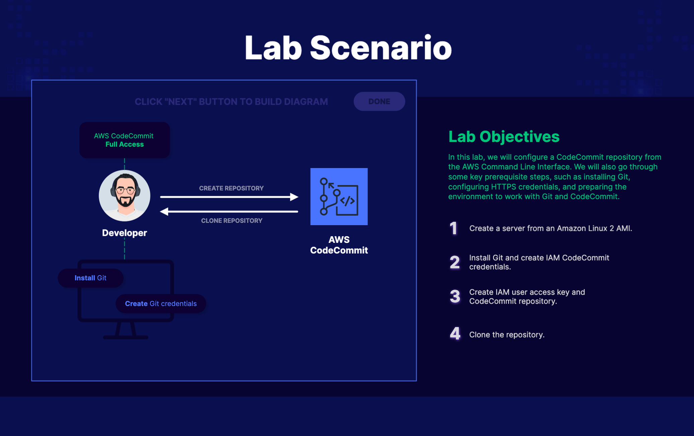
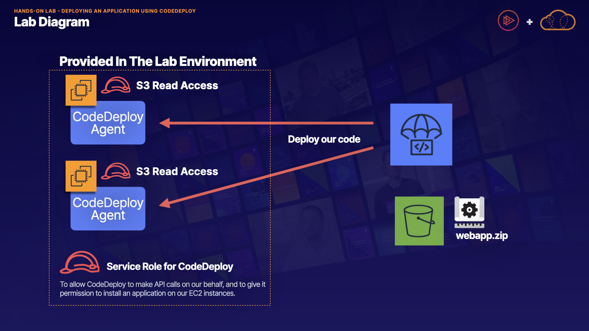
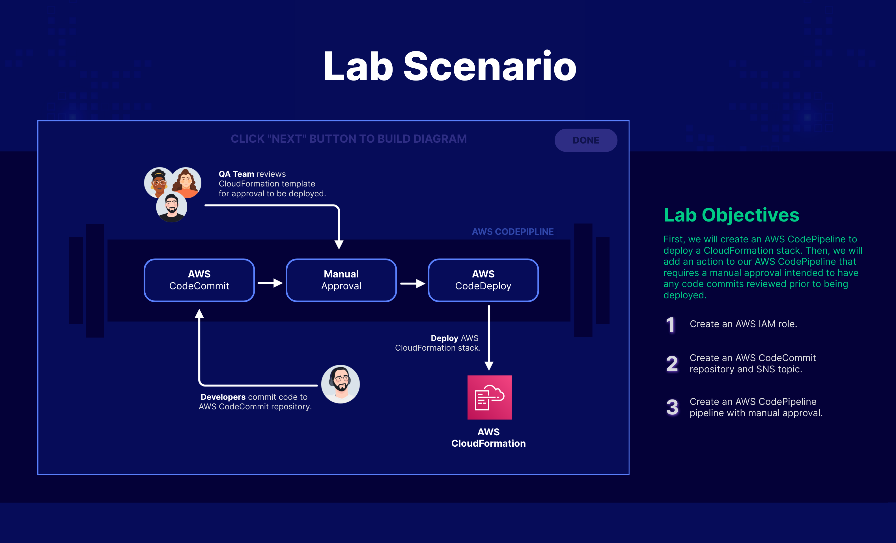
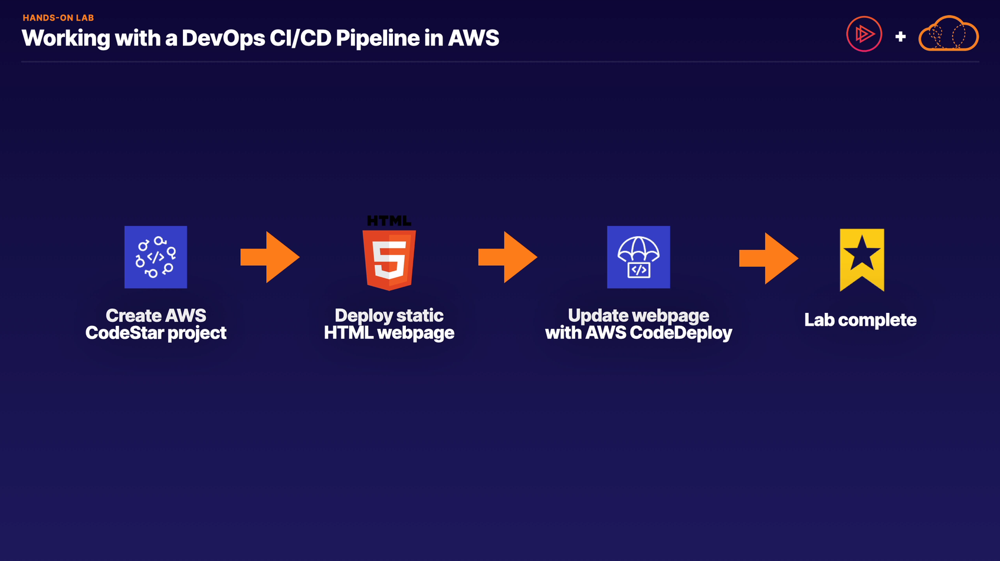
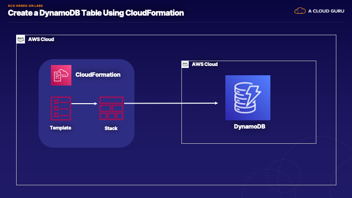
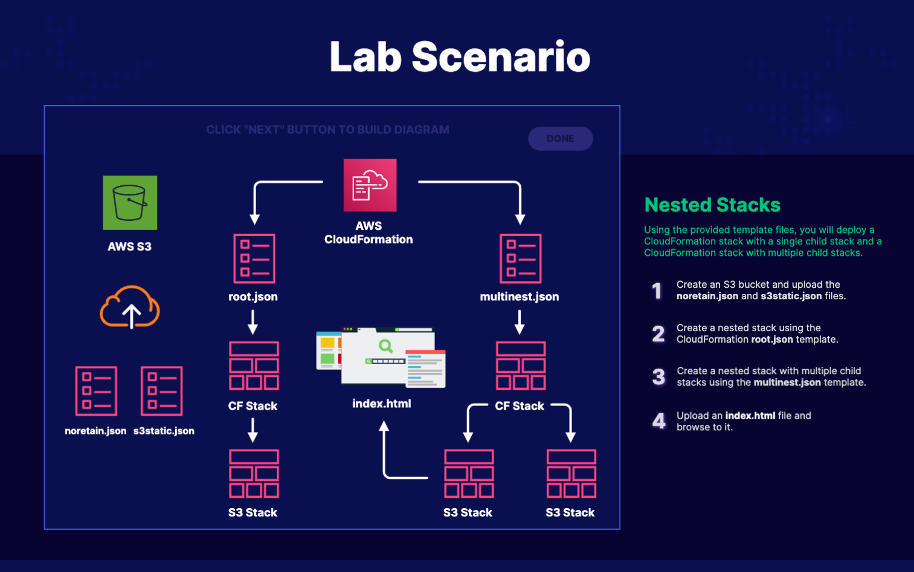

# What is CI/CD?
1. **CI/CD Overview:**
    - CI/CD stands for Continuous Integration and Continuous Delivery/Deployment.
    - It's a software development best practice that involves making small changes, automating everything from integration to deployment, and enabling frequent code releases.
    - Modern companies like AWS, Netflix, Google, and Facebook have successfully adopted CI/CD, allowing them to release thousands of changes per day without impacting production systems.
2. **Benefits of CI/CD:**
    - Automation makes development fast, repeatable, and scalable.
    - Manual processes in software development are slow, error-prone, and unscalable.
    - CI/CD enables consistent, repeatable builds and deployments, making software easier to support and maintain.
    - Small, incremental changes allow for easier bug detection and fixing.
3. **CI Workflow:**
    - Starts with a shared code repository like Git, where developers contribute and frequently merge their code updates.
    - Automated build stage triggers when changes appear in the repository, followed by automated tests before committing to the master repository.
4. **CD Workflow:**
    - After successful testing, code is merged into the master repository and prepared for deployment.
    - Continuous delivery involves a manual decision on when and where to deploy the code.
    - Continuous deployment automatically deploys the code once it's prepared for deployment.
5. **AWS Developer Tools for CI/CD:**
    - **CodeCommit:** Managed source control service for collaboration and version control, similar to a private Git repository.
    - **CodeBuild:** Automated build service that compiles source code, runs tests, and produces deployment-ready packages.
    - **CodeDeploy:** Automated deployment service that works with EC2, Lambda, on-premises systems, etc., for seamless code deployments.
    - **CodePipeline:** End-to-end workflow management tool that orchestrates build, test, and deployment pipelines, integrating with CodeCommit, CodeBuild, and CodeDeploy.
6. **Exam Tips:**
    - CI: Involves frequent code integration, supported by CodeCommit.
    - CD: Automated build, test, and deployment functions, supported by CodeBuild and CodeDeploy.
    - Continuous Deployment: Fully automated release process, supported by CodePipeline.
    - AWS Whitepaper "Practicing Continuous Integration and Continuous Deployment on AWS" provides in-depth insights into CI/CD practices and AWS tooling.

# CodeCommit 101
1. **CodeCommit Overview:**
    - CodeCommit is a central code repository for storing source code, binaries, libraries, images, and other files needed for building applications.
    - It allows multiple developers to work on the code simultaneously, enabling collaboration and tracking and managing changes to the code base.
    - CodeCommit maintains a version history of files, making it a version control system similar to Git.
2. **Using CodeCommit:**
    - Developers create branches from the master branch to work on their code updates.
    - A local copy of the branch is cloned to the developer's machine for making changes and testing locally.
    - Developers merge their changes to the development branch and then to the master branch after resolving any merge conflicts.
3. **Handling Merge Conflicts:**
    - Merge conflicts occur when multiple developers modify the same file or line of code.
    - Developers need to resolve conflicts by deciding which version of the code to keep or merging changes from multiple developers.
4. **Exam Tips for CodeCommit:**
    - CodeCommit is a centralized code repository based on Git.
    - It stores various types of files needed for applications and manages updates from multiple users.
    - CodeCommit enables collaboration, tracks changes, and maintains a version history of files.

# Demo - CodeCommit
1. **Creating a New Repository:**
    - Started by creating a new repository in CodeCommit named "ccrepo" through the AWS Management Console under Developer Tools > CodeCommit.
    - Demonstrated how to add a file to the repository using the console.
2. **Working with Branches:**
    - Created a new branch named "mybranch" from the master branch to work on updates separately.
    - Edited the file in the branch and committed changes.
3. **Merging Changes:**
    - Demonstrated the process of creating a pull request to merge changes from "mybranch" into the master branch.
    - Reviewed the changes visually in the pull request.
    - Merged the pull request into the master branch.
4. **Configuration and Notifications:**
    - Showed how to configure notifications using AWS SNS and CloudWatch for events like pull requests, comments, etc., in the CodeCommit repository.
5. **Exam Tips for CodeCommit:**
    - CodeCommit is a source control system for managing code repositories.
    - It enables collaboration among developers and maintains version control and history of files.
    - CodeCommit supports HTTPS and SSH connections for secure data transmission.

Overall, the lecture provided a practical demonstration of working with CodeCommit, including creating repositories, managing branches, merging changes, and configuring notifications.

# Lab - Configure and Work with CodeCommit from the CLI


# CodeDeploy 101
1. **Introduction to CodeDeploy:**
    - CodeDeploy is an automated deployment service by AWS, supporting EC2 instances, on-premises systems, and Lambda functions.
    - It facilitates quick releases of new features, minimizes downtime during deployments, and reduces risks associated with manual processes.
2. **Deployment Approaches:**
    - **In-place Deployment:** Also known as a rolling update, where the application is stopped on each instance, and a new release is installed.
    - **Blue-Green Deployment:** New instances are provisioned independently (green environment) with the new release, and traffic is routed away from the old environment (blue).
3. **In-Place Deployment Process:**
    - Demonstrated the in-place deployment process where the application is updated on each instance sequentially, causing a temporary reduction in capacity during deployment.
    - Highlighted that rolling back an in-place deployment can be time-consuming as it requires redeploying the previous version.
4. **Blue-Green Deployment Process:**
    - Illustrated the blue-green deployment process where new instances (green environment) are provisioned and the new release is deployed there.
    - Emphasized the ease of rollback in blue-green deployments by switching traffic back to the old environment (blue) if needed.
5. **Exam Tips for CodeDeploy:**
    - Understanding the differences between in-place and blue-green deployments is crucial.
    - In-place deployments are suitable for initial deployments, while blue-green deployments offer advantages like no capacity reduction, easy rollback, and pre-deployment testing.
    - Blue-green deployments are considered safer for production environments due to minimal downtime and quick rollback capabilities.

# The CodeDeploy AppSpec File
1. **Purpose of AppSpec File:**
    - The AppSpec file is a configuration file used by CodeDeploy during deployments.
    - It defines parameters such as the operating system, files to be copied, and lifecycle event hooks for scripts to run during the deployment.
2. **File Structure of AppSpec.yml:**
    - **Version:** Reserved for future use, currently set to 0.0.
    - **OS:** Specifies the operating system (Linux or Windows) for deployment.
    - **Files:** Defines files to be copied during deployment and their source/destination locations.
    - **Hooks (Lifecycle Event Hooks):** Scripts to run at specific points during the deployment lifecycle, such as unzipping files, running tests, or managing load balancer registrations.
3. **Example AppSpec.yml File:**
    - Demonstrated an example of an AppSpec file with version, OS, files, and hooks sections.
    - Highlighted the importance of the specific order in which hooks run during the deployment lifecycle.
4. **Location and Organization:**
    - AppSpec.yml is placed in the root directory of the revision folder containing all deployment files.
    - Recommended folder structure includes separate folders for scripts, config files, and source code.
5. **Exam Tips:**
    - AppSpec.yml defines deployment parameters like OS, files, and lifecycle hooks.
    - It must be in the root directory of the revision folder.
    - Lifecycle event hooks have a specific run order and control when scripts execute during deployment.

Understanding the AppSpec file is crucial for configuring CodeDeploy deployments effectively, including specifying deployment parameters and defining scripts to run at specific deployment lifecycle stages.

# CodeDeploy Lifecycle Event Hooks
1. **Purpose of Lifecycle Event Hooks:**
    - Lifecycle event hooks define scripts and their order of execution during a CodeDeploy deployment.
    - Understanding the run order of lifecycle event hooks is crucial for managing deployments effectively.
2. **Phases of Lifecycle Event Hooks:**
    - **Phase One (De-registering):**
        - **BeforeBlockTraffic:** Tasks before de-registering instances from the Load Balancer.
        - **BlockTraffic:** De-register instances from the Load Balancer.
        - **AfterBlockTraffic:** Tasks after de-registering from the Load Balancer.
    - **Phase Two (Deployment):**
        - **ApplicationStop:** Gracefully stop the application.
        - **DownloadBundle:** Copy application files to a temporary location.
        - **BeforeInstall:** Pre-installation tasks (backup, decryption, etc.).
        - **Install:** Copy application files to final location.
        - **AfterInstall:** Post-installation tasks (configuration updates, permissions, etc.).
        - **ApplicationStart:** Start up services stopped during ApplicationStop.
        - **ValidateService:** Test to validate application functionality.
    - **Phase Three (Re-registering):**
        - **BeforeAllowTraffic:** Tasks before re-registering instances with the Load Balancer.
        - **AllowTraffic:** Re-register instances with the Load Balancer.
        - **AfterAllowTraffic:** Tasks after re-registering with the Load Balancer.
3. **Exam Tips:**
    - Understand the logical flow of lifecycle event hooks during an in-place deployment.
    - Focus on the run order of hooks, which is the specific order in which they execute.
    - Visualize the deployment phases (de-registering, deployment, re-registering) to grasp the sequence of actions.
    - Relate the steps to what you would do manually when updating an application to help understand the sequence better.

Mastering the run order and purpose of each lifecycle event hook is essential for efficiently managing CodeDeploy deployments, ensuring a smooth transition during updates, and validating application functionality post-deployment.

# Lab - Deploying an Application Using CodeDeploy


# CodePipeline 101
1. **Overview of CodePipeline:**
    - CodePipeline is a fully managed CI/CD service that orchestrates the build, test, and deployment stages of your software release process.
    - It triggers the pipeline automatically whenever there's a change in your code repository, such as CodeCommit.
2. **Integration with AWS Tools:**
    - CodePipeline integrates with various AWS developer tools like CodeCommit, CodeBuild, and CodeDeploy.
    - It also integrates with open-source tools such as GitHub and Jenkins, as well as AWS services like Elastic Beanstalk, CloudFormation, Lambda, and Elastic Container Service (ECS).
3. **Example Workflow:**
    - When a change is detected in CodeCommit, CodePipeline triggers the workflow.
    - CodeBuild compiles the source code, runs tests, and creates deployable packages.
    - CodeDeploy deploys the newly built application to staging or production environments automatically.
4. **Exam Tips:**
    - Understand that CodePipeline is a CI/CD service that automates your software release process based on a defined workflow.
    - It can be set up to trigger automatically when changes occur in your source code repository.
    - Know its integration with AWS developer tools like CodeCommit, CodeBuild, and CodeDeploy, as well as third-party tools like GitHub and Jenkins, along with other AWS services.

CodePipeline streamlines the software release process, making it faster, more consistent, and less error-prone by automating build, test, and deployment tasks.

[AWS CodePipeline](https://docs.aws.amazon.com/codepipeline/latest/userguide/welcome.html)

# Demo - CodePipeline
1. **Overview of Steps:**
    - Use CloudFormation to create an EC2 instance.
    - Upload version 1 of the application to an S3 bucket.
    - Deploy the application to the EC2 instance using CodeDeploy.
    - Build a CodePipeline and manually trigger CodeDeploy to update to version 2 of the application.
    - Configure an automated pipeline triggered by adding a new version of the code to the S3 bucket.
2. **Prerequisites:**
    - Download resources provided in the lecture, including CloudFormation commands and application code.
    - Configure an EC2 key pair for troubleshooting.
    - Create two S3 buckets, one for CloudFormation templates and one for storing application code, enabling versioning for the latter.
3. **Steps Covered:**
    - Create an EC2 key pair for SSH access.
    - Create two S3 buckets, one for CloudFormation and one for application code with versioning enabled.
    - Upload the CloudFormation template to the appropriate bucket.
    - Run the CloudFormation command using CloudShell to create the EC2 instance, CodeDeploy agent installation, and IAM permissions.
    - Verify the completion of the CloudFormation job.
    - Log into the EC2 instance and check the successful installation of the CodeDeploy agent.

This part of the demo sets up the infrastructure and initial configuration needed for the CodePipeline demonstration.

4. **Uploading Application Code to S3:**
    - Uploaded version 1 of the application to an S3 bucket.
    - Deployed version 1 using CodeDeploy to an EC2 instance.
    - Uploaded version 2 of the application to the same S3 bucket.
    - Manually triggered a CodeDeploy deployment using CodePipeline for version 2.
    - Tested the deployment to ensure it worked as expected.
5. **Configuring CodePipeline for Continuous Deployment:**
    - Uploaded version 3 of the application to the S3 bucket.
    - CodePipeline automatically detected the new version and triggered a deployment using CodeDeploy.
    - Tested the automatic deployment to confirm it was successful.
6. **Cleanup and Exam Tips:**
    - Provided cleanup steps for deleting resources used in the demo.
    - Exam tips include understanding CodePipeline as a CI/CD service, its automation capabilities, triggering based on code changes, and integration with various AWS and third-party tools.

The demo covered the end-to-end process of setting up CI/CD pipelines using AWS services like CodePipeline, CodeDeploy, S3, and CloudFormation, demonstrating how changes in code can trigger automated deployments.

[Lesson Resources 1](https://github.com/ACloudGuru-Resources/course-aws-certified-developer-associate/tree/main/Code_Pipeline_Demo)

[Connect to your Linux instance from Linux or macOS using SSH](https://docs.aws.amazon.com/AWSEC2/latest/UserGuide/connect-linux-inst-ssh.html)

[EC2 Key Pairs](https://docs.aws.amazon.com/AWSEC2/latest/UserGuide/ec2-key-pairs.html#having-ec2-create-your-key-pair)

[Configuring the AWS CLI](https://docs.aws.amazon.com/cli/latest/userguide/cli-chap-configure.html#cli-quick-configuration)

[Lesson Resources 2](https://github.com/ACloudGuru-Resources/course-aws-certified-developer-associate/tree/main/Code_Pipeline_Demo)

# Lab - Setting Up an AWS CodePipeline with a Manual Approval


# Lab - Working with a DevOps CI/CD Pipeline in AWS


# Introducing CodeArtifact
1. **CodeArtifact Overview:** CodeArtifact is an artifact repository service provided by AWS. It allows developers to securely store, publish, and share artifacts related to their applications, including software packages, documentation, compiled applications, deployable packages, and libraries.
2. **Integration with Public Repositories:** CodeArtifact integrates with public repositories such as npm Registry, Python Package Index, and Maven Central. This integration enables developers to access approved packages from these repositories and manage them efficiently within their organization.
3. **Exam Tips:** For the exam, it's essential to understand how CodeArtifact integrates with external repositories. This involves creating a domain to manage repositories, creating repositories within the domain, setting up upstream repositories to connect to external public repositories, and associating upstream repositories with local repositories to access and manage packages.
4. **Hands-on Demo:** You mentioned a demo after the lecture, which would provide practical insights into working with CodeArtifact and its integration with external repositories.

# Demo - Creating a CodeArtifact Repository
1. **Create Domain:** Start by creating a domain in CodeArtifact. In this example, the domain is named "my-domain."
2. **Create Repository:** Within the domain, create a repository where packages will be stored. This repository is named "my-repo."
3. **Create Upstream Repository:** Set up an upstream repository named "npm-store," which will connect to the public npm registry.
4. **Add External Connection:** Establish an external connection for the "npm-store" repository to connect it to the public npm registry.
5. **Associate Repositories:** Associate the "npm-store" repository as an upstream repository to the "my-repo" repository.
6. **Configure npm Package Manager:** Configure the npm package manager to fetch an authorization token from CodeArtifact using AWS credentials.
7. **Install npm Package:** Use the npm CLI to install an npm package. In this example, the package installed is "Express," a Node.js web application framework.
8. **View Installed Packages:** List the packages in the "my-repo" repository to verify that the installation was successful.
9. **Exam Tips:** Understand the high-level steps of linking an external repository with CodeArtifact, such as creating an upstream repository with an external connection to access packages from public registries.

Overall, the lesson demonstrates how to set up and utilize CodeArtifact effectively for managing and accessing software packages within a development environment.

[Lesson Resources (AWS CLI commands)](https://github.com/ACloudGuru-Resources/course-aws-certified-developer-associate/tree/main/Code_Artifact_Demo)

[Adding an External Connection to a CodeArtifact Repository](https://docs.aws.amazon.com/codeartifact/latest/ug/external-connection.html)

# Elastic Container Service
1. **Containers Overview:** Containers are like virtual operating environments that include everything a software needs to run, such as libraries, system tools, code, and runtime. They are integral to a microservices approach where applications are built using independent, stateless components.
2. **Microservices and 12-Factor App:** Microservices are stateless components that can be scaled independently. AWS promotes microservices architecture with resources like the "Running Containerized Microservices on AWS" whitepaper and the 12-factor app methodology for designing cloud-native applications.
3. **Elastic Container Service (ECS):** ECS is a fully managed container orchestration service on AWS. It supports both Docker and Windows containers and allows for easy deployment and scaling of containerized workloads without managing the orchestration platform.
4. **Advantages of Containers:** Containers offer scalability, fault tolerance, and easier maintenance compared to monolithic applications. They can be scaled individually, making them efficient for managing workload spikes.
5. **ECS Features:** ECS integrates deeply with AWS services like IAM, VPC, and Route 53. It offers the choice between running containers on EC2 instances or using Fargate for a serverless option where AWS manages the infrastructure.
6. **Elastic Container Registry (ECR):** ECR is used to store container images. ECS connects to ECR to deploy Docker containers based on these images.
7. **Services Using ECS:** AWS services like Amazon SageMaker, Amazon Lex, and Amazon.com's recommendation engine run on ECS, showcasing its versatility and scalability.
8. **Exam Tips:** Understand containers as virtual operating environments, ECS as a container orchestration service, the choice between EC2 and Fargate for deployment, and the use of ECR for storing container images.

Overall, ECS simplifies the management and scaling of containerized workloads on AWS, offering flexibility and integration with other AWS services.

[The 12 Factor App](https://12factor.net/)

[Pushing a Docker image](https://docs.aws.amazon.com/AmazonECR/latest/userguide/docker-push-ecr-image.html)

[Using Amazon ECR with the AWS CLI](https://docs.aws.amazon.com/AmazonECR/latest/userguide/getting-started-cli.html)

# Introduction To CloudFormation
1. **What is CloudFormation?**
    - CloudFormation is a service that allows you to manage, configure, and provision your AWS infrastructure using code.
    - Resources are defined using a CloudFormation template in either YAML or JSON format.
    - CloudFormation interprets the template and makes API calls to create the defined resources.
2. **Benefits of CloudFormation:**
    - Provides consistent infrastructure provisioning.
    - Reduces human errors and saves time compared to manual configuration.
    - Supports version control and peer review of templates.
    - Free to use, but charges apply for created resources.
    - Manages updates and dependencies between resources.
    - Enables quick rollback and deletion of entire stacks.
3. **CloudFormation Process:**
    - Create a CloudFormation template in YAML or JSON format.
    - Upload the template to CloudFormation using S3.
    - CloudFormation reads the template, makes API calls, and creates resources, forming a stack.
4. **CloudFormation Template Anatomy:**
    - TemplateFormatVersion: Specifies the template version.
    - Description: Provides a description of the template (optional).
    - Metadata: Additional data about resources (optional).
    - Parameters: Input values provided at stack launch.
    - Conditions: Define conditions for resource creation based on parameters.
    - Mappings: Set user-defined values for resources.
    - Transform: Reference external code snippets stored in S3.
    - Resources: Mandatory section defining AWS resources to create.
    - Outputs: Optional section to output information about created resources.
5. **Exam Tips:**
    - Understand CloudFormation's purpose and benefits.
    - Know the main sections of a CloudFormation template.
    - Parameters, Conditions, Mappings, Transform, Resources, and Outputs are key sections.
    - CloudFormation supports both YAML and JSON formats.
    - Remember the importance of the Resources section for defining AWS resources.
    - Transform section allows referencing external code for reuse.

[Resource attribute reference](https://docs.aws.amazon.com/AWSCloudFormation/latest/UserGuide/aws-product-attribute-reference.html)

[CloudFormation Template Snippets](https://docs.aws.amazon.com/AWSCloudFormation/latest/UserGuide/CHAP_TemplateQuickRef.html)

# Demo - Provisioning Resources Using CloudFormation
1. **Creating and Downloading an SSH Key Pair:**
    - Navigate to the EC2 console.
    - Create a new key pair with RSA type and download it in **`.pem`** format.
    - Remember the name of the key pair as it will be used later to log into the EC2 instance.
2. **Creating a CloudFormation Stack:**
    - Go to the CloudFormation console and select "Create stack with new resources."
    - Upload a CloudFormation template file (in YAML or JSON format) that defines the resources to be provisioned.
    - Specify the key name parameter in the CloudFormation stack creation wizard, matching the SSH key pair created earlier.
    - Review and configure advanced options like rollback behavior, stack policies, notification options, timeout, and termination protection.
    - Submit the stack creation request.
3. **Reviewing CloudFormation Stack and Testing:**
    - Monitor the events in the CloudFormation console to track the progress of stack creation.
    - Once the stack creation is complete, verify the resources created, such as the EC2 instance and security group, in the AWS console.
    - Use the public IP address of the EC2 instance and the SSH key pair to SSH into the instance and verify successful access.
4. **Cleanup:**
    - Optionally, delete the CloudFormation stack to remove all the resources created by the stack.

Key points to remember about CloudFormation:

- It allows defining AWS infrastructure as code using YAML or JSON templates.
- CloudFormation interprets the template, makes API calls, and creates resources, forming a stack.
- Resources, parameters, mappings, and outputs are important sections in a CloudFormation template.
- CloudFormation stacks can be created, updated, and deleted, providing infrastructure management capabilities.

CloudFormation simplifies resource provisioning, ensures consistency, and allows infrastructure management in a programmatic and efficient manner.

```yml
AWSTemplateFormatVersion: 2010-09-09

Description: Template to create an EC2 instance and enable SSH

Parameters: 
  KeyName:
    Description: Name of SSH KeyPair
    Type: 'AWS::EC2::KeyPair::KeyName'
    ConstraintDescription: Provide the name of an existing SSH key pair

Resources:
  MyEC2Instance:
    Type: 'AWS::EC2::Instance'
    Properties:
      InstanceType: t2.micro
      ImageId: ami-0bdb1d6c15a40392c
      KeyName: !Ref KeyName
      SecurityGroups:
       - Ref: InstanceSecurityGroup
      Tags:
        - Key: Name
          Value: My CF Instance
  InstanceSecurityGroup:
    Type: 'AWS::EC2::SecurityGroup'
    Properties:
      GroupDescription: Enable SSH access via port 22
      SecurityGroupIngress:
        IpProtocol: tcp
        FromPort: 22
        ToPort: 22
        CidrIp: 0.0.0.0/0

Outputs: 
  InstanceID:
    Description: The Instance ID
    Value: !Ref MyEC2Instance
```

# Lab - Create a DynamoDB Table Using CloudFormation


# Exporting CloudFormation Stack Values
1. **Scenario and Context:**
    - Imagine deploying a CloudFormation stack called NetworkStack that includes a VPC, subnet, internet gateway, route table, network ACL, and security group.
    - NetworkStack provides SubnetID and SecurityGroupID as outputs.
    - Later, you want to use these values to launch an EC2 instance using CloudFormation.
2. **Exporting Values:**
    - In the CloudFormation template for NetworkStack, use the Outputs section to define variables like SubnetID and SecurityGroupID that you want to export.
    - Example:
    ```json
    "Outputs": {
        "SubnetID": {
            "Description": "ID of the subnet",
            "Value": { "Ref": "PublicSubnet" }
        },
        "SecurityGroupID": {
            "Description": "ID of the security group",
            "Value": { "Ref": "WebServerSecurityGroup" }
        }
    }
    ```
3. **Importing Values:**
    - In another CloudFormation template where you want to use these exported values, use the **`ImportValue`** function.
    - Example:
    ```json
    "Resources": {
        "EC2Instance": {
            "Type": "AWS::EC2::Instance",
            "Properties": {
                "SubnetId": { "Fn::ImportValue": "NetworkStack-SubnetID" },
                "SecurityGroupIds": [{ "Fn::ImportValue": "NetworkStack-SecurityGroupID" }]
            }
        }
    }
    ```
4. **Demo Steps:**
    - Create a CloudFormation stack named NetworkStack with SubnetID and SecurityGroupID as outputs.
    - Create another stack named WebserverStack that imports values from NetworkStack to launch an EC2 instance.
    - Verify that the EC2 instance is created in the correct subnet and associated with the correct security group.
5. **Exam Tips:**
    - Use the Outputs section in CloudFormation to export values.
    - Use the **`ImportValue`** function in another CloudFormation template to import values from a different stack.
    - Ensure correct naming and referencing of exported values and stacks.

By exporting and importing values in CloudFormation, you can efficiently reuse resources and configurations across different stacks, enhancing automation and management of AWS infrastructure.

[Lesson Resources - CloudFormation Templates](https://github.com/ACloudGuru-Resources/course-aws-certified-developer-associate/tree/main/Exporting_CloudFormation_Stack_Values_Demo)

# The Serverless Application Model (SAM)
1. **What is SAM?**
    - SAM is an extension to CloudFormation designed specifically for defining serverless applications.
    - It simplifies the syntax for defining serverless resources like APIs, Lambda functions, DynamoDB tables, etc.
    - SAM comes with its own command-line interface called the SAM CLI, which is used for packaging and deploying serverless applications.
2. **SAM CLI Commands:**
    - **`sam package`**: This command takes a YAML template as input and outputs a SAM-compatible template. It also uploads the deployment package to an S3 bucket specified by you.
    - **`sam deploy`**: This command deploys your serverless applications using CloudFormation. It takes the SAM template created in the previous step, specifies the CloudFormation stack name (e.g., mystack), and uses the **`capabilities`** parameter to create an IAM role for function execution.
3. **Exam Tips:**
    - SAM is an extension to CloudFormation for defining and provisioning serverless applications.
    - It has its own CLI with commands like **`sam package`** and **`sam deploy`** for packaging and deploying serverless applications.
    - **`sam deploy`** requires specifying the CloudFormation stack name and may need **`capabilities`** for IAM role creation.
4. **SAM Lab:**
    - The lecture suggests learning by doing a SAM lab, where you deploy a small Lambda function using SAM and CloudFormation.

Understanding SAM is crucial for working with serverless applications efficiently, as it provides a simplified and streamlined approach to defining and deploying serverless resources within AWS infrastructure.

# Demo - CloudFormation and SAM
1. **Introduction to SAM (Serverless Application Model):**
    - SAM is an extension to CloudFormation for defining serverless applications.
    - It simplifies the syntax for defining serverless resources like Lambda functions, APIs, and DynamoDB tables.
    - SAM comes with the SAM CLI, which is pre-installed in AWS CloudShell.
2. **Files Needed:**
    - The lesson uses two files: **`hello-from-lambda.js`** for the Lambda function code and **`template.yml`** for the SAM template.
    - These files are available in the GitHub repository linked as a resource for the lesson.
3. **Steps in the CloudShell:**
    - Launch AWS CloudShell from the console.
    - Copy the files **`hello-from-lambda.js`** and **`template.yml`** from the GitHub repository to the CloudShell using **`curl`** commands.
    - Create an S3 bucket (**`aws s3 mb s3://cfsambucket`**) to store the packaged code.
4. **Packaging and Deploying with SAM CLI:**
    - Use **`sam package`** command to package the SAM template (**`sam package --template-file template.yml --output-template-file sam-template.yml --s3-bucket <bucket-name>`**).
    - Use **`sam deploy`** command to deploy the packaged code (**`sam deploy --template-file sam-template.yml --stack-name mystack --capabilities CAPABILITY_IAM`**).
5. **Verification:**
    - Verify the successful deployment in the CloudFormation console.
    - Test the Lambda function in the Lambda console.
6. **Summary:**
    - The lesson demonstrates the use of SAM CLI and CloudShell to package and deploy a Lambda function using SAM and CloudFormation.
    - SAM simplifies the deployment of serverless applications by providing a streamlined approach to defining resources and handling deployment tasks.

By following these steps, you can effectively use AWS SAM to deploy serverless applications on AWS CloudFormation.

[Lesson Resources](https://github.com/ACloudGuru-Resources/course-aws-certified-developer-associate/tree/main/CloudFormation_SAM_Demo)

[AWS Guide To Installing the SAM CLI](https://docs.aws.amazon.com/serverless-application-model/latest/developerguide/install-sam-cli.html)

# CloudFormation Nested Stacks
1. **Introduction to Nested Stacks:**
    - Nested stacks in CloudFormation are used to create other stacks within CloudFormation itself.
    - They enable the reuse of CloudFormation code for common use cases, such as load balancer configurations, web servers, or application servers.
2. **Structure of Nested Stacks Template:**
    - Nested stacks are declared within the resources section of the CloudFormation template.
    - They are of type AWS CloudFormation stack.
    - Supported properties include NotificationARN for sending stack event notifications to an SNS topic, parameters for passing values during stack creation, tags for stack description, template URL for specifying the nested stack template stored in an S3 bucket, and an optional timeout for stack completion.
3. **Key Exam Tips:**
    - Nested stacks facilitate the reuse of CloudFormation code, reducing the need for copying and pasting configurations.
    - They are beneficial for frequently used configurations like load balancers, web servers, or application servers.
    - To use nested stacks, create a CloudFormation template defining the resource, store it in S3, and reference it from other CloudFormation templates using the stack resource type.

[CloudFormation Best Practices](https://docs.aws.amazon.com/AWSCloudFormation/latest/UserGuide/best-practices.html)

[Walkthrough: Refer to resource outputs in another AWS CloudFormation stack](https://docs.aws.amazon.com/AWSCloudFormation/latest/UserGuide/walkthrough-crossstackref.html)

# Lab - Working with CloudFormation Nested Stacks


# Introducing The Cloud Development Kit (CDK)
1. **What is CDK?**
    - CDK, or Cloud Development Kit, is an open-source development framework that allows you to build and deploy AWS applications using a programming language of your choice, such as TypeScript, Python, Java, .NET, or Go.
    - It enables you to define and deploy AWS resources using familiar programming languages, abstracting away the CloudFormation syntax.
2. **How Does CDK Work?**
    - You model your application using a supported programming language.
    - The CDK toolkit transforms your code into a CloudFormation template.
    - CDK can then provision your AWS resources using CloudFormation.
3. **CDK Terminology:**
    - App: A container for one or more stacks.
    - Stack: A unit of deployment similar to a CloudFormation stack.
    - Construct: Defines AWS resources within the scope of a stack.
4. **Example Code in TypeScript:**
    - Code examples demonstrate how to define an app, stack, and constructs using TypeScript.
    - CDK allows for defining AWS resources like SQS queues, SNS topics, etc., using classes or types in the chosen programming language.
5. **CDK Process:**
    - Create a new CDK project using **`cdk init`** in an empty directory.
    - Compile the application using **`npm run build`**.
    - Synthesize a CloudFormation template using **`cdk synth`**.
    - Deploy the stack using **`cdk deploy`**.
6. **Exam Tips:**
    - CDK supports multiple programming languages for defining AWS resources.
    - Resources are defined using apps, stacks, and constructs.
    - CDK CLI is used for creating CloudFormation templates from code and deploying stacks.
    - The deployment process involves initializing a project, compiling, synthesizing the template, and deploying the stack.

Understanding CDK allows developers to leverage programming languages they are comfortable with to define and deploy AWS resources, simplifying the development process.

# Demo - CDK
1. **Initialization and Setup:**
    - Install the latest version of CDK and update TypeScript.
    - Initialize a sample app using **`cdk init sample-app --language=typescript`**.
    - Compile the app using **`npm run build`**.
2. **Synthesizing CloudFormation Template:**
    - Check the files created in the directory (**`ls`**) to verify initialization.
    - Manually compile the app using **`npm run build`**.
    - Use **`cdk ls`** to view the name of your stack/app.
    - Synthesize the CloudFormation template using **`cdk synth`**. The template is stored in the **`cdk.out`** folder.
3. **Deployment:**
    - If using CDK for the first time, run **`cdk bootstrap`** to provision required resources like IAM roles and an S3 bucket.
    - Deploy the stack using **`cdk deploy`**. Confirm deployment when prompted.
4. **Verification:**
    - After deployment, check the CloudFormation console to review your stack and resources provisioned.
5. **Exam Tips:**
    - Understand the high-level process of initializing, compiling, synthesizing, and deploying with CDK.
    - CDK simplifies the deployment of AWS resources using programming languages like TypeScript.
    - CDK commands such as **`cdk init`**, **`npm run build`**, **`cdk synth`**, and **`cdk deploy`** are used in sequence for deployment.

This process demonstrates how CDK enables developers to define and deploy AWS resources using familiar programming languages, making the deployment process more efficient and manageable.

[CDK Commands](https://github.com/ACloudGuru-Resources/course-aws-certified-developer-associate/blob/main/CDK_Demo/commands.txt)

# Introducing Amplify
1. **Difference Between Front-end, Back-end, and Full Stack Developers:**
    - Front-end developers focus on user interface (UI) development.
    - Back-end developers work on back-office functionality like business logic, databases, and APIs.
    - Full stack developers can handle both front-end and back-end development.
2. **What is AWS Amplify?**
    - AWS Amplify is a set of tools and services for developing web and mobile applications on AWS.
    - It allows front-end developers to easily create full-stack applications by handling backend configurations.
3. **Advantages of Using Amplify:**
    - Front-end developers can focus on UI while Amplify handles backend functionalities like authentication, storage, Lambda functions, etc.
    - Integrated with AWS services like Cognito, S3, Lambda, and API Gateway for building robust applications.
4. **Amplify Services:**
    - Amplify Hosting: Fully managed web hosting for dynamic and static web applications with CICD functionality.
    - Amplify Studio: A visual interface for creating and configuring front-end UI and backend components like authentication and serverless functions.

In summary, AWS Amplify simplifies the development of full-stack applications on AWS, allowing front-end developers to leverage backend functionalities seamlessly. It integrates with various AWS services and offers both hosting and studio capabilities for application development.

# Demo - Amplify
1. **Creating CodeCommit Repository and Uploading File:**
    - Created a CodeCommit repository named "my-repo."
    - Uploaded an index.html file containing a simple webpage.
2. **Setting Up Amplify:**
    - Opened Amplify Console and started a new app for hosting a web app.
    - Selected CodeCommit as the source and chose the repository.
    - Allowed automatic deployment from the project root directory.
    - Allowed Amplify to create an IAM service role with read-only access to the repository.
    - Saved and deployed the app.
3. **Exploring Amplify Hosting Features:**
    - Discussed additional features of Amplify Hosting like custom domain setup, pull request previews, password protection, and canary testing.
4. **Updating Code and Redeploying:**
    - Edited the index.html file in CodeCommit to change the message.
    - Committed the changes and observed Amplify automatically picking up the change.
    - Amplify provisioned, built, and deployed the updated code.
    - Refreshed the application URL to see the changes reflected.
5. **Exam Tips:**
    - Amplify Hosting is used for hosting web applications.
    - Continuous deployment is implemented, deploying code from the repository whenever a change is detected.

Overall, the demo showcased how to set up Amplify for hosting web applications, upload code from a repository, and leverage continuous deployment for automatic updates.

[GitHub Repository](https://github.com/ACloudGuru-Resources/course-aws-certified-developer-associate/tree/main/Amplify_Demo)

# Developer Theory Summary
1. **Developer Tools Overview:**
    - CodeCommit: Source and version control service for collaboration on code and assets.
    - CodeBuild: Automated build service for compiling code, running tests, and packaging.
    - CodeDeploy: Automated deployment service for deploying code to various environments.
    - CodePipeline: Workflow management tool for build and deployment processes.
2. **Continuous Integration and Continuous Deployment (CI/CD):**
    - Continuous Integration (CI): Frequent integration of code changes, think of CodeCommit.
    - Continuous Delivery (CD): Automated build, test, and deployment, use CodeBuild and CodeDeploy.
    - Continuous Deployment (CD): Fully automated release process, think of CodePipeline.
3. **CodeCommit Details:**
    - Centralized Git repository for storing code, binaries, libraries, etc.
    - Enables collaboration, version control, and management of updates.
4. **CodeDeploy Deployment Types:**
    - In-Place Deployment: Takes instances offline during deployment, not supported for Lambda.
    - Blue-Green Deployment: Creates new environment for deployment, safer and no capacity reduction.
5. **Appspec File in CodeDeploy:**
    - Configuration file defining deployment parameters, files to copy, and lifecycle event hooks.
    - Must be in the root of the deployment folder for CodeDeploy to find it.
6. **Lifecycle Event Hooks in Appspec File:**
    - Scripts to run during deployment phases, follow a specific run order.
    - Important for managing deployment tasks and ensuring smooth deployments.
7. **Logical Flow of In-Place Deployment:**
    - De-register instances from load balancer, install new version, re-register instances.
    - Understand the order of phases for in-place deployment in CodeDeploy.
8. **CodeArtifact:** A repository for software packages, allows access to public repositories via upstream repositories with external connections.
9. **CodePipeline:** A CI/CD service that triggers workflows based on code changes, integrates with various AWS services and third-party tools.
10. **Elastic Container Service (ECS):** Runs containers on clusters of virtual machines, offers EC2 option for more control and Fargate for serverless deployment.
11. **Elastic Container Registry (ECR):** Stores container images for deployment.
12. **CloudFormation:** Manages AWS infrastructure with YAML or JSON code, sections include parameters, conditions, resources, mappings, transforms, and outputs. Also covers SAM (Serverless Application Model) for serverless deployments.
13. **Nested Stacks in CloudFormation:** Reusable CloudFormation code for frequently used configurations, allows exporting and importing values between stacks.
14. **Amplify:** Enables front-end developers to create full-stack web and mobile applications on AWS, integrates with services like Cognito, S3, Lambda, and API Gateway. Includes Amplify Hosting and Amplify Studio for hosting and visual configuration.
15. **Cloud Development Kit (CDK):** Deploys AWS resources using programming languages, defines apps, stacks, and constructs to synthesize CloudFormation templates and deploy stacks.

This summary covers key concepts and services related to developer tools, infrastructure management, container services, CI/CD, and deployment methodologies on AWS.

# Quiz

.png>) 
.png>) 
.png>) 
.png>) 
.png>) 
.png>) 
.png>) 
.png>) 
.png>) 
.png>) 
.png>) 
.png>) 
.png>) 
.png>) 
.png>) 
.png>) 
.png>) 
.png>) 
.png>) 
.png>) 
.png>) 
.png>) 
.png>) 
.png>)