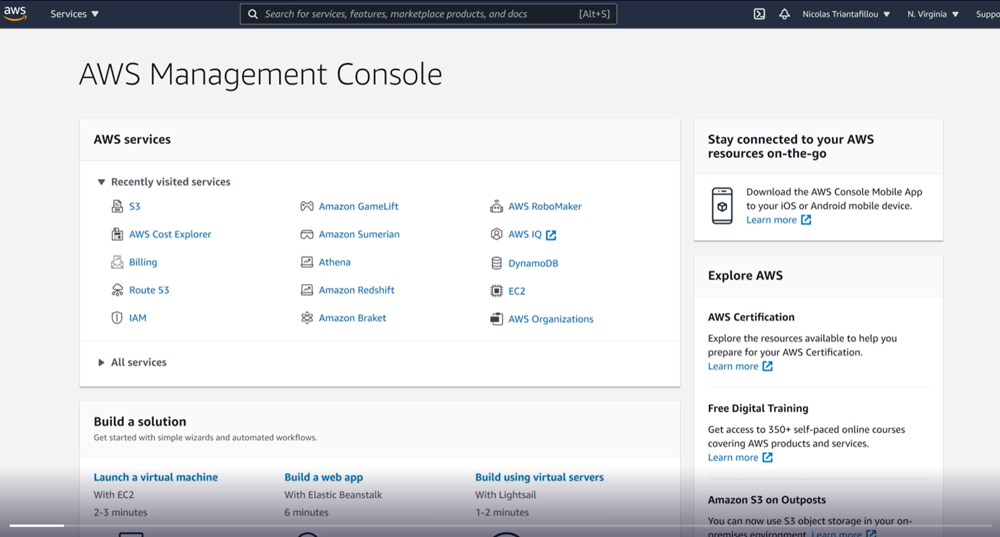

# What is AWS

AWS, holding 32% of the cloud computing market share, is the world’s
most comprehensive cloud platform, offering over 175 services. Its
popularity among startups, enterprises, and government agencies is due
to its pay-as-you-go pricing model and the ability to customize services
to specific needs. AWS’s leadership is attributed to its longevity in
the market and continuous innovation. The choice of a cloud provider
depends on factors like familiarity, education, and organizational
decisions.

1. **Cloud Computing Basics**:
    - The Cloud is a collection of services that create a platform,
    offering virtual servers, data storage, networking, machine learning,
    security, analytics, media services, databases, etc.
    - Cloud services make organization tasks easier by hosting them
    remotely and offering customization options.
2. **AWS Overview**:
    - AWS is described as the world’s most comprehensive cloud platform
    with over 175 services, serving millions of customers including
    startups, enterprises, and government agencies.
    - AWS holds 32% of the cloud computing market share, making it the
    global leader.
3. **Why AWS Leads**:
    - AWS’s leadership is attributed to being the oldest in the market,
    launching services like Amazon EC2 in 2006 and continuously innovating
    with new services.
4. **AWS Services**:
    - AWS offers a wide range of services catering to various
    technologies, industries, and use cases, including unique services like
    AWS Ground Station for satellite control.
5. **Pricing Model**:
    - AWS uses a pay-as-you-go pricing model, charging users based on
    actual usage, sometimes by the second or millisecond, making it
    cost-effective and popular among users.
6. **Cloud Market Share**:
    - AWS holds a significant market share of 32%, followed by Microsoft
    Azure (19%) and Google Cloud (7%), with other providers also thriving in
    the market.
7. **Choosing a Cloud Provider**:
    - Choosing a cloud provider depends on factors like familiarity,
    education, and organizational decisions, with AWS being a popular choice
    among companies.

# Structured Overview

AWS offers a wide range of services including compute, storage,
databases, migration and transfer, networking and content delivery,
developer tools, robotics, blockchain, satellite, quantum technologies,
management and governance, media services, machine learning, analytics,
security, front-end web and mobile, augmented reality and virtual
reality, application integration, cost management, customer engagement,
end user computing, Internet of Things, game development, and
containers. These services will be explored in detail throughout the
course.

1. **Compute**:
    - Virtual servers and serverless computing (Services that are related
    to running applications or processing things with computer power).
2. **Storage**:
    - S3, EFS, Storage Gateway, AWS Backup.
3. **Databases**:
    - RDS, DynamoDB.
4. **Migration and Transfer**:
    - Services for migrating to AWS.
5. **Networking and Content Delivery**:
    - VPC, CloudFront, Route 53. (All services in AWS needs to exist
    inside a network, VPC - where all cloud services exist)
6. **Developer Tools**:
    - Services for code hosting, building, and deployment.
7. **Robotics**:
    - AWS Robot Maker for robotics application development.
8. **Customer Enablement**:
    - Support services for assistance.
9. **Blockchain**:
    - Managed Blockchain for cryptocurrency and blockchain.
10. **Satellite**:
    - Ground Station for satellite control.
11. **Quantum Technologies**:
    - Amazon Bracket for quantum algorithm development.
12. **Management and Governance**:
    - Organizations, CloudWatch, Auto Scaling, CloudFormation,
    CloudTrail.
13. **Media Services**:
    - Streaming, processing, and transcoding media.
14. **Machine Learning**:
    - Services for implementing machine learning algorithms.
15. **Analytics**:
    - Amazon Redshift, Athena for data querying.
16. **Security, Identity, and Compliance**:
    - Services for authentication, security policies, firewalls, etc.
17. **Front-end Web and Mobile**:
    - Services for web and mobile app development.
18. **Augmented Reality and Virtual Reality**:
    - Amazon Samarian for 3D, AR, and VR applications.
19. **Application Integration**:
    - SQS for application messaging.
20. **Cost Management**:
    - Cost Explorer, AWS Budgets for managing expenses.
21. **Customer Engagement**:
    - Services for connecting with customers.
22. **End User Computing**:
    - Workspaces for virtual desktops.
23. **Internet of Things (IoT)**:
    - Services for building and managing IoT devices.
24. **Game Development**:
    - Amazon Gamelift for game server hosting.
25. **Containers**:
    - Services for containerization.

The AWS console provides a comprehensive view of these services,
aiding in navigation and management. Throughout the course, these
services will be covered in detail to demonstrate their functionality
and ease of use.

# History

AWS originated from the idea of separating applications from
infrastructure, leading to the concept of Infrastructure as a Service
(IaaS). The first AWS services, launched in 2006, were Amazon S3 and
SQS, followed by EC2. AWS has since continued to release new services
and updates, such as RDS, Route 53, and DynamoDB, with the pace of
launches accelerating over time. AWS remains highly active in
innovation, as seen in the recent announcement of DevOps Guru at AWS
re:Invent 2020. The future of AWS is expected to continue this trend of
regular service launches and updates.

1. **Origins of AWS**:
    - AWS was not created due to excess computing capacity from Amazon’s
    retail operations, contrary to popular belief.
    - Benjamin Black and Chris Pinkham explored ways to efficiently scale
    up infrastructure to handle peak traffic for websites or
    applications.
2. **Inception of AWS**:
    - They conceived the idea of separating applications from
    infrastructure, leading to the concept of selling infrastructure as a
    service (IaaS).
    - The proposal for AWS made its way to Jeff Bezos, who approved it,
    leading to the development of AWS services.
3. **Early AWS Services**:
    - Amazon S3 (Simple Storage Service) was the first AWS service
    launched in March 2006, followed by Amazon SQS (Simple Queue Service) in
    July.
    - AWS EC2 (Elastic Compute Cloud), a virtual machine service, was
    released in August 2006, marking a significant milestone for AWS.
4. **Subsequent Milestones**:
    - AWS continued to launch new services, such as Amazon RDS (Relational
    Database Service) in October 2009, Route 53 (DNS service) in December
    2010, and DynamoDB (NoSQL database) in January 2012.
    - The pace of service launches accelerated over time, with updates and
    new services announced regularly.
5. **Current State of AWS**:
    - AWS remains highly active in releasing new services and updates,
    with a continuous stream of product launches and improvements.
    - The text mentions AWS re:Invent 2020, where a new service called
    DevOps Guru was announced, highlighting AWS’s ongoing innovation.
6. **Future Outlook**:
    - The text anticipates that AWS will continue to release new services
    and updates, reflecting the dynamic and evolving nature of the
    platform.
7. **Course Coverage**:
    - The course will delve into more detail about important AWS services,
    providing further understanding for learners.

Overall, the history of AWS showcases its evolution from a concept of
separating applications and infrastructure to becoming a leading
provider of cloud services with a wide range of offerings and continuous
innovation.

# Regions and Availability
Zones

AWS has physical locations called regions globally, with multiple
isolated and physically separate availability zones within each region.
Each availability zone has independent power, cooling, and security
measures, and they are connected via redundant, high-speed networks.
This structure allows AWS customers to deploy their infrastructure in a
distributed and resilient manner, ensuring high availability and fault
tolerance.

1. **Regions**:
    - AWS has physical locations called regions around the world where
    they place their data centers.
    - Regions are located in North America, South America, Europe, the
    Middle East, Africa, and the Asia Pacific.
    - Example regions include Ohio, Oregon, North California, North
    Virginia, GovCloud West, GovCloud East, Canada Central, Sau Paulo,
    Frankfurt, London, Paris, Bahrain, Ireland, Milan, Stockholm, Cape Town,
    Singapore, Beijing, Sydney, Tokyo, Seoul, Ningxia, Osaka, Mumbai, Hong
    Kong, and Melbourne (recently announced).

2. **Availability Zones (AZs)**:
    - Within each region, there are multiple isolated and physically
    separate availability zones.
    - Availability zones have independent power, cooling, and security
    measures.
    - They are connected to each other via redundant, high-speed,
    low-latency networks.
    - AWS groups data centers into availability zones, each with a unique
    name not shared between users or accounts.
    - The purpose of availability zones is to provide redundancy and
    protect AWS workloads from issues in a single data center.
    - Redundancy across availability zones helps in mitigating risks such
    as power outages or infrastructure issues.

The combination of regions and availability zones allows AWS
customers to deploy their infrastructure in a distributed and resilient
manner, ensuring high availability and fault tolerance.