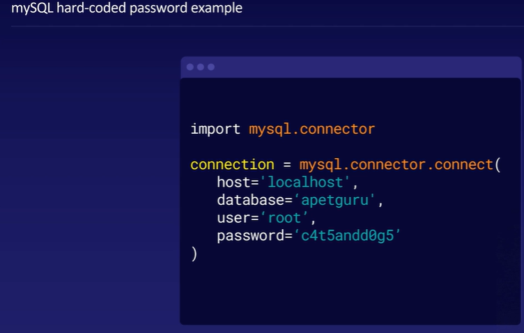
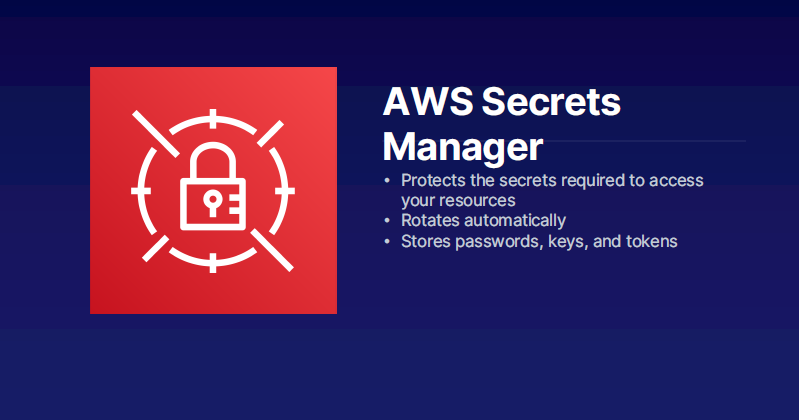

# Security and Identity

AWS offers a comprehensive suite of security and identity services.
These include data protection tools like Amazon Macie and AWS Key
Management Service, infrastructure protection services such as AWS
Shield and AWS Web Application Firewall, threat detection systems like
Amazon GuardDuty and AWS Config, and identity management solutions such
as AWS Identity and Access Management and Amazon Cognito.

1. **Data Protection**:

   - Amazon Macie: Discovers and protects sensitive data.
   - AWS Key Management Service (KMS): Stores and manages encryption
   keys.
   - AWS CloudHSM: Provides hardware-based key storage and regulatory
   compliance.
   - AWS Certificate Manager: Provision, manage, and deploy SSL/TLS
   security certificates.
   - AWS Secrets Manager: Rotate, manage, and retrieve secrets like
   passwords.

2. **Infrastructure Protection**:
   
   - AWS Shield: Protects against denial of service (DoS) attacks.
   - AWS Web Application Firewall (WAF): Filters malicious website
   traffic.
   - AWS Firewall Manager: Centrally manages firewall rules.

3. **Threat Detection**:
   
   - Amazon GuardDuty: Automatically detects threats.
   - Amazon Inspector: Analyzes application security.
   - AWS Config: Records and evaluates configurations of AWS
   resources.
   - AWS CloudTrail: Tracks user activity and API usage in your
   account.

4. **Identity Management**:
    
    - AWS Identity and Access Management (IAM): Securely manage access to
    AWS accounts, services, and resources securely.
    - AWS Single Sign-On (SSO): Implements cloud single sign-on.
    - Amazon Cognito: Manages identity inside applications, such as user
    authentication.
    - AWS Directory Service: Implements and manages Microsoft Active
    Directory.
    - AWS Organizations: Centrally governs and manages multiple AWS
    accounts.

These services provide a comprehensive suite of tools and solutions
for ensuring security, managing access, detecting threats, and
protecting data within AWS environments.

[What
is IAM Identity Center? - AWS IAM Identity Center](https://docs.aws.amazon.com/singlesignon/latest/userguide/what-is.html)

# IAM

IAM in AWS manages access to services and resources, with users
having unique usernames and passwords. Permissions are controlled via
policies, which define actions on resources, and can be applied to
groups of users. Roles, similar to users, can be assumed by users or
services, allowing for delegated access and permissions. IAM’s
complexity provides a robust framework for access control, with roles
enhancing security by allowing temporary specific permissions.

1. **IAM Users**:
    - IAM allows you to manage who can access AWS services and
    resources in your account.
    - Users are created within IAM and are separate from the root user
    login provided with your AWS account.
    - Users have usernames and passwords, and you can set permissions
    (via policies) to control their access to AWS resources.
    - Users can be organized into groups, and policies can be applied
    to groups for easier management.
    
        
2. **IAM Policies**:
    - Policies define what actions users or groups can perform on AWS
    resources.
    - Policies can be created using a visual editor or JSON format in
    the IAM console.
    - Policies consist of an effect (Allow or Deny), actions (e.g.,
    ListBucket, PutObject), and resources (e.g., S3 buckets).
    
    
        
3. **IAM Roles**:
    - Roles in IAM are similar to users but can be assumed by both
    users and services.
    - Roles allow you to delegate access and permissions to users or
    services.
    - Roles are useful for granting access to resources across
    different AWS accounts and enhancing security by limiting access to
    specific resources.
    
        
4. **Complexity and Power**:
    - IAM policies and roles can become complex, offering a wide range of
    functionalities and control over access.
    - Roles add an extra layer of security by allowing users or services
    to assume specific permissions temporarily.

Overall, IAM provides a robust framework for managing access control
and permissions within AWS, allowing for granular control over who can
access what resources and actions.

# Secrets Manager

AWS Secrets Manager is a service that protects sensitive information
like passwords, keys, and tokens. It eliminates the need to hard-code
passwords in application code, enhancing security and reducing exposure
risks. Key features include automatic password rotation, improved
security, time-saving, and seamless integration. The benefits include
enhanced security, simplified management, reduced risk, and time
efficiency. It provides a secure and efficient way to manage and protect
sensitive information within AWS environments.

1. **Background and Problem**:
    
    - Historically, applications stored passwords directly in code, posing
    security risks.
    - Hard-coded passwords are easily accessible to anyone with access to
    the code.
    - Updating or rotating passwords requires manual updates across all
    instances, leading to complexity and potential errors.

2. **AWS Secrets Manager Solution**:
    - AWS Secrets Manager is a service designed to protect sensitive
    information like passwords, keys, and tokens.
    - It eliminates the need to hard-code passwords in application
    code.
    - Instead of storing passwords in code, applications can request
    passwords from Secrets Manager when needed.
    - This approach enhances security by keeping passwords separate
    from code and reducing the risk of exposure.
    
        
3. **Key Features**:
    - Automatic Rotation: Secrets Manager can automatically rotate
    passwords at regular intervals.
    - Improved Security: Automatic rotation reduces the risk of using
    outdated or compromised passwords.
    - Time-Saving: Eliminates the need for manual password updates across
    multiple instances and applications.
    - Seamless Integration: Applications can easily integrate with Secrets
    Manager to retrieve passwords securely.

4. **Benefits**:
    - Enhanced Security: Eliminates the risk of exposing passwords in
    code.
    - Simplified Management: Automates password rotation and updates.
    - Reduced Risk: Minimizes the impact of compromised or outdated
    passwords.
    - Time Efficiency: Saves time and effort in managing passwords across
    applications.

Overall, AWS Secrets Manager provides a secure and efficient way to
manage and protect sensitive information, such as passwords, within AWS
environments, offering both security improvements and operational
benefits.

# Directory Service

Directory services authenticate access to computers and network
resources. Microsoft Active Directory (AD) is a dominant service in this
field, particularly for Windows-based networks. AWS Directory Service is
a managed service that offers directory solutions without server
management. It provides high availability, compatibility with AWS
services, and reduces maintenance overhead. It allows organizations to
manage user authentication, access controls, and security policies
across AWS resources, and enables seamless integration between
on-premises AD environments and AWS services.

1. **Introduction to Directory Services**:
    - Directory services are databases of user login information used to
    authenticate access to computers and network resources.
    - They allow organizations to manage user access, implement security
    policies, and configure computers for specific users.

2. **Microsoft Active Directory and Market Dominance**:
    - Microsoft Active Directory (AD) is a widely used directory service
    for managing Windows-based networks.
    - It has been the dominant directory service for Windows environments
    for over two decades, with a significant market share.

3. **AWS Directory Service Overview**:
    - AWS Directory Service is a managed service offered by AWS that
    provides directory solutions without the need to manage servers.
    - It offers managed Microsoft Active Directory, Simple AD for basic
    directory needs, and AD Connector for integrating on-premises AD with
    AWS applications.

4. **Benefits of AWS Directory Service**:
    - Managed Solution: Eliminates the need for organizations to run their
    own directory servers, reducing maintenance overhead.
    - High Availability: AWS Directory Service ensures high availability
    by automatically replacing failed servers.
    - Compatibility with AWS Services: AWS Managed Microsoft AD integrates
    with various AWS services like Amazon Chime and Amazon RDS, allowing
    users to use their AD credentials across different services.

5. **Use Cases and Applications**:
    - Organizations can use AWS Directory Service to manage user
    authentication, access controls, and security policies across AWS
    resources.
    - It enables seamless integration between on-premises AD environments
    and AWS services, providing a unified authentication experience for
    users.

Overall, AWS Directory Service simplifies directory management,
enhances security, and improves compatibility with AWS services, making
it a valuable solution for organizations using Windows-based
environments and AWS resources.

# Lab - IAM Basics
