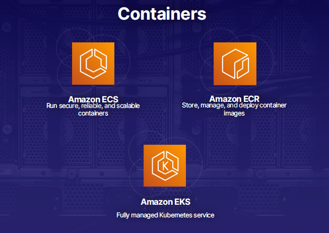
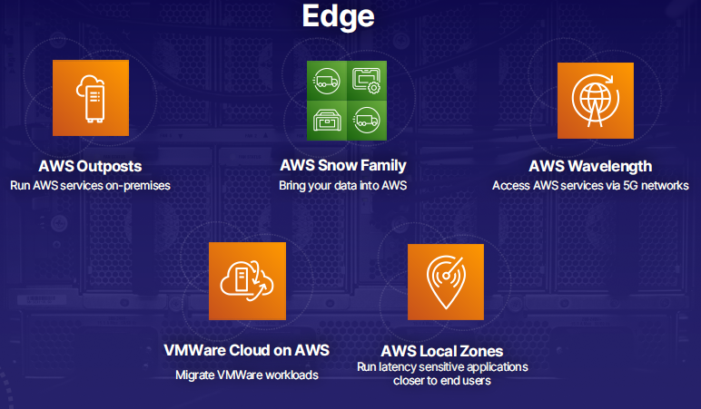
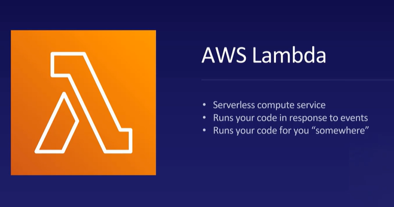

# Compute

AWS provides a comprehensive set of compute services for any
workload. These include instances like Amazon EC2 for secure and
resizable virtual machines, container services like Amazon ECS for
reliable and scalable containers, and serverless computing with AWS
Lambda. Additional services like AWS Outposts, Snow Family, AWS
Wavelength, VMware Cloud on AWS, and AWS Local Zones cater to specific
needs like data transfer, fast access, workload migration, and
low-latency applications.

- AWS offers compute capabilities for any workload, including
instances (virtual machines), containers, and serverless computing.
- Compute involves processing tasks ranging from basic calculations to
hosting complex applications.
- AWS provides various services in this pillar:
    1. **Instances (Virtual Machines):**
        
        - Amazon EC2 (Elastic Compute Cloud): Provides secure and resizable
        virtual machines.
        - Amazon EC2 Spot: Runs fault-tolerant workloads at reduced
        prices.
        - Amazon EC2 Auto Scaling: Automatically adjusts computing capacity
        based on demand.
        - Amazon LightSail: Offers an easy-to-use platform for building
        applications or websites.
    2. **Containers:**
        
        - Amazon ECS (Elastic Container Service): Runs secure, reliable, and
        scalable containers.
        - Amazon ECR (Elastic Container Registry): Stores, manages, and
        deploys container images.
        - Amazon EKS (Elastic Kubernetes Service): Fully managed Kubernetes
        service for container orchestration.
    3. **Serverless Computing:**
        
        - AWS Lambda: Allows running code without managing servers
        directly.
    4. **Edge:**
        
        - **AWS Outposts:**
            - Allows running AWS services on-premises using your own servers,
            extending the AWS infrastructure to local data centers.
            - Provides a hybrid cloud solution for organizations requiring
            on-premises computing capabilities.
        - **Snow Family:**
            - Enables data transfer into AWS by using physical devices (Snow
            devices) to collect and transport data securely.
            - Offers different device sizes, from portable hard disks to large
            storage containers, suitable for various data transfer needs.
        - **AWS Wavelength:**
            - Facilitates accessing AWS services directly from 5G devices without
            going through the internet, ensuring low latency and high-speed
            connectivity.
            - Designed for applications requiring real-time data processing and
            edge computing capabilities.
        - **VMware Cloud on AWS:**
            - Facilitates the migration of VMware workloads to AWS
            infrastructure.
            - Provides a seamless integration between on-premises VMware
            environments and AWS cloud services.
        - **AWS Local Zones:**
            - Enables running latency-sensitive applications closer to end users
            by establishing local AWS infrastructure in specific geographic
            locations.
            - Improves application performance and reduces latency for users
            located near AWS Local Zones.

These services demonstrate AWS’s comprehensive offerings for various
computing needs, including workload migration and optimizing performance
for latency-sensitive applications.

# EC2

EC2, or Elastic Compute Cloud, is a service that allows for renting
virtual computers with various configurations. It offers different
instance types optimized for computing, memory, and storage. Its pricing
model is on-demand, and instances are resizable for flexibility in
resources. EC2 provides cost-effective scalability and the ability to
upgrade immediately. It ranges from low-powered to high-powered
instances, and has had a game-changing impact on computing capabilities.
Its flexibility, scalability, and cost-effectiveness make it a
fundamental service in cloud computing.

- **EC2 Overview:**
    - Stands for Elastic Compute Cloud.
    - Allows renting virtual computers known as EC2 instances.
    - Offers various instance types with different CPU, memory, storage,
    and speed configurations.
- **Instance Types:**
    - Compute optimized: High-performance processes.
    - Memory optimized: Large RAM for data-intensive applications.
    - Storage optimized: Fast read/write to hard disks.
- **Pricing Models:**
    - On-demand: Pay by the hour or second without long-term
    commitments.
- **Elasticity and Resizability:**
    - Instances are resizable, allowing for flexibility in CPU and RAM
    resources. ( we can start by using a low spec instance, if more ram or
    power is required, turn the machine off and select a high spec instance
    and then turn the machine on it will instantly resume the instance)
    
        
- **Benefits of EC2:**
    - Cost-effective scalability: Ability to run multiple instances
    simultaneously for faster processing.
    - Immediate upgrade possibility: Easily switch to higher-spec
    instances as needed.
- **Instance Types and Cost Examples:**
    - Ranges from low-powered T3.nano instances to high-powered X1E
    instances.
    - X1E instance offers 128 virtual CPUs, almost 4,000 GB of RAM, and
    SSDs.
- **Game-Changing Impact:**
    - EC2 was one of AWS’s original services and has revolutionized
    computing capabilities.
- **Conclusion:**
    - EC2’s flexibility, scalability, and cost-effectiveness have made it
    a fundamental service in cloud computing.
    - Continues to be a game changer for organizations across
    industries.

# Containers

Containers package programs, libraries, and dependencies into a
self-contained image, ensuring consistent execution across different
environments. They address issues of library versioning and
compatibility, and facilitate easy deployment and scalability, making
them ideal for cloud services like AWS Elastic Container Service
(ECS).

- **Introduction to Containers:**
    - Explanation using a programmer writing code with libraries.
    - Libraries are pre-written code pieces that save time and effort in
    programming.
- **Issue with Libraries:**
    
    - Updates to libraries create multiple versions, leading to
    compatibility issues.
    - Versions may not be specified in programming languages, causing
    further complications.
- **Container Definition and Purpose:**
    
    - A container packages programs, libraries, and dependencies into an
    image for consistent deployment.
    - Ensures that programs run consistently across different
    environments.
- **Benefits of Containers:**
    - Self-contained packages that guarantee consistent behavior
    regardless of the deployment environment.
    - Facilitates easy deployment and scalability, making it ideal for
    cloud services like AWS ECS.
- **AWS Elastic Container Service (ECS):**
    - Allows deployment of container images to AWS, ensuring consistent
    behavior across different environments.
- **Conclusion:**
    - Containers are self-contained environments for programs, ensuring
    consistent execution across various platforms, which is why they were
    created.
    - Offers benefits such as ease of deployment, scalability, and
    consistent behavior across different environments.

# Lambda

AWS Lambda, a serverless compute service, runs code in response to
events, eliminating server management. It contrasts with traditional
server setups like EC2 due to its simplicity and cost-effectiveness.
Lambda is used in various real-world scenarios for tasks like automatic
photo resizing or video transcoding. Its pricing is based on usage and
memory allocation, making it a cost-effective solution that simplifies
development tasks and reduces infrastructure management overhead.

- **Introduction to Lambda:**
    - AWS Lambda is a serverless compute service that runs code in
    response to events, eliminating the need for managing servers.
    - It triggered the serverless computing trend and offers ease of use
    for developers.
- **Traditional Server vs. Lambda:**
    - Contrasts the traditional server setup (EC2) for running code with
    the simplicity of Lambda.
    - Highlights the complexities and costs involved in managing a virtual
    server compared to Lambda’s serverless approach.
- **Key Features of Lambda:**
    - Lambda runs code in response to events like timers, website visits,
    file uploads, etc., without the need for server management.
    - Users upload code to Lambda, which executes it whenever necessary,
    handling all server-related tasks transparently.
- **Use Cases and Examples:**
    - Examples include automatic photo resizing on an image sharing
    website, video transcoding, and other automated tasks triggered by
    events.
    - Demonstrates how Lambda is used in real-world scenarios to automate
    processes efficiently.
- **Cost and Pricing:**
    
    - Lambda pricing is based on usage (charged by the millisecond) and
    memory allocation, making it cost-effective.
    - Provides a quick cost example to illustrate the affordability of
    Lambda for various workloads.
- **Conclusion:**
    - Lambda is a powerful and cost-effective service that simplifies
    development tasks, saves time, and reduces infrastructure management
    overhead.
    - Its versatility and ease of use make it a popular choice for AWS
    developers.