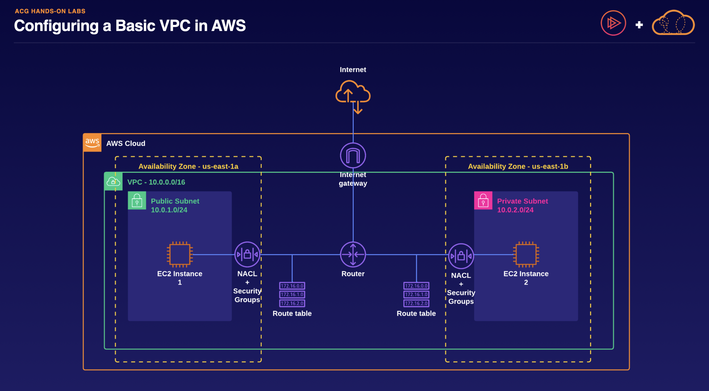

# Networking

1. **Building Cloud Networks:**
    - **Amazon VPC:** Allows you to define and provision
    isolated networks for your AWS resources.
    - **AWS Transit Gateway:** Connects multiple VPCs and
    on-premise networks, simplifying network architecture.
    - **AWS PrivateLink:** Provides private connectivity
    between VPCs and on-premises applications, enhancing security.
2. **Scaling Your Network:**
    - **Elastic Load Balancing (ELB):** Automatically
    distributes incoming network traffic across multiple resources,
    improving fault tolerance and scalability.
    - **AWS Global Accelerator:** Directs traffic through the
    AWS global network to optimize global application performance.
3. **Content Delivery:**
    - **Amazon CloudFront:** Securely delivers data, videos,
    and applications to users globally with low latency and high transfer
    speeds. It uses edge locations to cache content closer to users,
    reducing latency.

These AWS services offer a comprehensive suite of tools for
networking and content delivery, allowing businesses to build scalable,
secure, and high-performing applications and websites in the cloud.

# VPC

- Amazon Virtual Private Cloud (VPC) is a service provided by AWS for
creating isolated virtual networks.
- VPC allows you to define your own IP address range, subnets, route
tables, and network gateways.
- It acts as a private network within AWS, providing a secure
environment for your AWS resources.
- VPC setup involves specifying an IPv4 CIDR block, which represents
the range of IP addresses for your network.
- You can create EC2 instances within a VPC, and they can communicate
with each other if they belong to the same VPC.
- VPCs also support features like NAT gateways for internet access and
network ACLs for traffic control.
- Configuring a VPC is one of the initial steps when setting up your
infrastructure on AWS, either for organizational use or personal
experimentation.

# CloudFront

- Amazon CloudFront is a content delivery network (CDN) that delivers
data, videos, applications, and websites globally with low latency and
high transfer speeds.
- It acts as a cache between your website and visitors, reducing the
need to access your origin server for every request.
- CloudFront uses a global network of more than 225 points of presence
in 88 cities across 45 countries, known as edge locations, to serve
content closer to users.
- When a client requests content, CloudFront redirects the request to
the nearest edge location, where the content is cached for a specified
period.
- CloudFront checks the origin server for updated content and
replicates changes to edge locations as visitors request the
content.
- It provides security against network and denial of service attacks,
protects against sudden traffic spikes, and offers real-time metrics and
logging for monitoring website performance.
- CloudFront’s pricing is pay-as-you-go with no minimum fees, making
it cost-effective for speeding up, securing, and protecting websites
globally.

# Route 53

- Amazon Route 53 is Amazon’s DNS web service that maps domain names
to IP addresses.
- It costs 50 cents per domain per month and offers high availability,
reliability, and flexibility.
- Route 53 has various routing policies for directing traffic to
different IP addresses based on factors like load balancing,
geolocation, latency, failover, and multivalue answer.
- The Simple Routing policy directs traffic to a specified IP
address.
- The Weighted policy allows distributing traffic among multiple IP
addresses based on weight values.
- Geolocation policy directs traffic based on the user’s geographical
location.
- Latency policy directs traffic to IP addresses with the lowest
latency.
- Failover policy points traffic to a backup IP address if the primary
server is offline.
- Multivalue Answer policy replies with multiple healthy IP addresses
for load balancing and availability improvement.
- Route 53 is cost-effective, secure, scalable, and suitable for
various routing needs, making it an essential service for website
availability and speed optimization.

# Lab - Configuring VPC Basics
